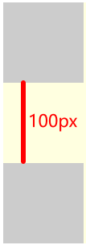
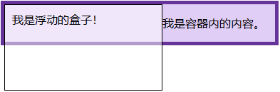
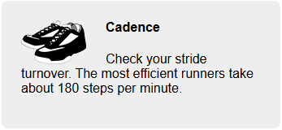
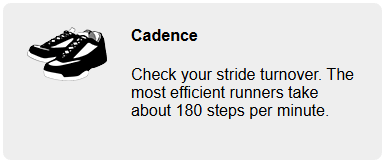
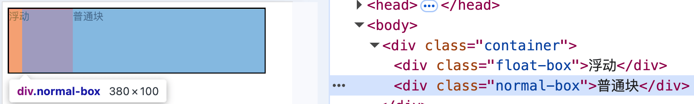
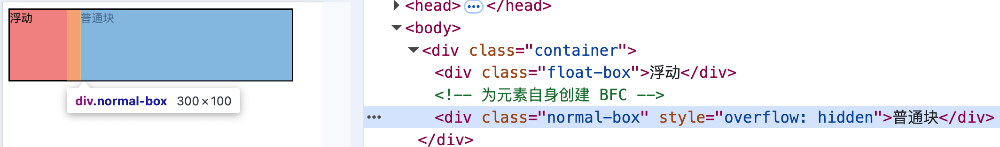

# CSS 专题之BFC


## 前言

> 石匠敲击石头的第 8 次

在上一篇文章中，如何避免外边距重叠的部分有提到，给容器元素添加 `overflow: auto`（或者非 `visible` 的值），可以避免与内部子元素产生嵌套外边距重叠，出现这个效果的原因是因为 **BFC**。

BFC 也是前端面试中必备的知识点，所以就有了这篇文章来梳理一下，如果哪里写的有问题欢迎指出。


## BFC 是什么

BFC 的全称为**块格式化上下文（Block Formatting Context）**，是页面中一块独立的渲染区域，**内部的子元素不会影响外部的元素，外部的元素也同样无法影响内部的子元素。**


## 如何创建 BFC

有以下方法可以创建块级格式化上下文：

- 根元素 `<html>`
- **浮动元素（元素的 `float` 不是 `none`）**
- **绝对定位元素（元素的 `position` 为 `absolute` 或 `fixed`）**
- **行内块元素（元素的 `display` 为 `inline-block`）**
- **`overflow` 值不为 `visible` 的块级元素**
- **`display` 值为 `flow-root` 的元素**
- **弹性元素（`display` 值为 `flex` 或 `inline-flex` 元素的直接子元素）**
- **网格元素（`display` 值为 `grid` 或 `inline-grid` 元素的直接子元素）**
- 表格单元格（元素的 `display` 为 `table-cell`，HTML 表格单元格默认为该值）
- 表格标题（元素的 `display` 为 `table-caption`，HTML 表格标题默认为该值）

更多的可以参考 [MDN](https://developer.mozilla.org/zh-CN/docs/Web/CSS/CSS_display/Block_formatting_context)，上述加粗的是比较常用的，推荐记忆。


## BFC 的规则

在 BFC 中的元素会按照以下规则进行渲染

1. 块级元素会在垂直方向上一个接一个地排列
2. 在**同一个 BFC 区域中**的相邻块级元素的垂直 `margin` 会重叠
3. 计算 BFC 区域高度时，浮动元素也参与计算
4. BFC 区域不会与浮动元素重叠
5. **未创建 BFC 的块级元素**，其左外边距（`margin-left`）始终贴紧包含块的左侧（即父元素的 content 区域左侧），**不会自动避开左浮动元素**，若该将该元素自身创建 BFC，则会避开左浮动元素，左外边距从浮动元素的右侧开始计算
6.  BFC 是独立渲染区域，不受外界影响（内部也不受外部影响）


### 1. 块级元素会在垂直方向上一个接一个地排列

这点没什么好说的，即使没有在 BFC 区域中，在默认文档流中的块级元素也会垂直排列。


### 2. 在**同一个 BFC 区域中**的相邻块级元素的垂直 `margin` 会重叠

我们可以利用这个特性，来阻止外边距重叠，例如下面这个例子

```css
.container {
  overflow: hidden;
  background-color: lightyellow;
}

.box1,
.box2 {
  width: 100px;
  height: 100px;
  background: #ccc;
}

.box1 {
  margin-bottom: 50px;
}

.box2 {
  margin-top: 50px;
}
```

```html
<div class="container">
  <div class="box1"></div>
  <div class="box2"></div>
</div>
```


如果想让两个盒子之间的外间距不重叠，这时可以将其中一个元素放入一个新的 BFC 区域中，**使得两个元素不在同一个 BFC 区域中**。

```html
<div class="container">
  <div class="box1"></div>

  <!-- 创建一个新的BFC区域 -->
  <div style="overflow: hidden;"> 
    <div class="box2"></div>
  </div>
</div>
```




### 3. 计算 BFC 区域高度时，浮动元素也参与计算

默认情况下，浮动元素会脱离标准文档流，不会被父元素的高度计算在内，导致父元素的高度塌陷，例如下面的例子。

```css
.box {
  background-color: rgb(224, 206, 247);
  border: 5px solid rebeccapurple;
}

.float {
  float: left;
  width: 200px;
  height: 100px;
  background-color: rgba(255, 255, 255, 0.5);
  border: 1px solid black;
  padding: 10px;
}
```

```html
<div class="box">
  <div class="float">我是浮动的盒子！</div>
  <p>我是容器内的内容。</p>
</div>
```



如果想要容器 `box` 的高度不塌陷，可以为它添加创建一个 BFC 区域。

```css
<div class="box" style="overflow: hidden;">
  <div class="float">我是浮动的盒子！</div>
  <p>我是容器内的内容。</p>
</div>
```


### 4. BFC 区域不会与浮动元素重叠

例如在开发中经常遇到这样的媒体对象（左边是图片，右边是文字），例如下面的例子。

```css
.media {
  width: calc(50% - 1.5em);
  padding: 1.5em;
  background-color: #eee;
  border-radius: 0.5em;
}

.media-image {
  float: left;
  margin-right: 1.5em;
}

.media-body h4 {
  margin-top: 0;
}
```

```html
<div class="media">
  
  <div class="media-body">
    <h4>Cadence</h4>
    <p>
      Check your stride turnover. The most efficient runners take about 180
      steps per minute.
    </p>
  </div>
</div>
```



上述例子中因为左侧图片是左浮动的，导致右侧区域被图片遮挡，并且出现了文字环绕图片的效果，**如果不想图片遮挡右侧区域，可以为右侧区域创建一个 BFC**

```html
<div class="media">
  
  
  <!-- 创建了一个 BFC 区域 -->
  <div class="media-body" style="overflow: hidden">
    <h4>Cadence</h4>
    <p>
      Check your stride turnover. The most efficient runners take about 180
      steps per minute.
    </p>
  </div>
</div>
```



**⚠️ 注意：** 此处也用到了 BFC 规则中的第 6 点规则：*BFC 是独立渲染区域，不受外界影响（内部也不受外部影响）*，在本例子中，**体现在右侧区域内的文字不会被左侧浮动图片所影响（文字环绕图片效果）**


### 5. **未创建 BFC 的块级元素**，其左外边距（`margin-left`）始终贴紧包含块的左侧（即父元素的 content 区域左侧），不会自动避开左浮动元素，若为该元素自身创建 BFC，则会避开左浮动元素，左外边距从浮动元素的右侧开始计算

例如下面这个例子

```css
.container {
  border: 2px solid black;
  width: 400px;
}

.float-box {
  float: left;
  width: 100px;
  height: 100px;
  background-color: lightcoral;
}

.normal-box {
  margin-left: 20px;
  height: 100px;
  background-color: lightblue;
}
```

```html
<div class="container">
  <div class="float-box">浮动</div>
  <div class="normal-box">普通块</div>
</div>
```



普通块的 `margin-left: 20px;` 紧贴容器的左边，**不会避开浮动元素**。

如果我们想要让它自动避开浮动元素，可以为该元素自身创建 BFC

```html
<div class="container">
  <div class="float-box">浮动</div>
  
  <!-- 为元素自身创建 BFC -->
  <div class="normal-box" style="overflow: hidden;">普通块</div>
</div>
```




### 6. BFC 是独立渲染区域，不受外界影响（内部也不受外部影响）

**BFC 类似于一个独立的 “世界”**，它内部的东西不会受到外部浮动、外边距等的影响，同时它内部的东西也不会影响到外部的布局。

这一点也是前面第 2 点、第 4 点、第 5 点生效的**根本原因，** 这里就不再重复举例子了。


## 实践建议

1. 建议优先使用 `display: flow-root` 来创建 BFC 区域，没有任何副作用，**但是需要考虑兼容性的问题**，具体可以参考 [Can I use](https://caniuse.com/?search=flow-root)

2. 如果浏览器不支持 `display: flow-root`，那么也可以使用 `overflow: auto` 来创建 BFC 区域，副作用比较小（内容超出 BFC 区域时会有滚动条）

**⚠️ 注意：** 除了以上两种创建 BFC 区域的方式外，其它方式可能会改变布局，除非能产生想要的布局，否则不要轻易使用。


## 总结

- **BFC 定义**：块格式化上下文，是一块独立的渲染区域，内部外部互不影响。
- **创建方式**：常用的有 `overflow: auto`、`display: flow-root`、浮动、绝对定位等。
- **常见作用**：
  - 阻止**外边距重叠**
  - 解决**高度塌陷**
  - 避免**浮动元素遮挡内容**
  - 控制元素**是否避开浮动**
- **实践建议**：
  - 优先使用 `display: flow-root`（需注意兼容性）
  - 次选 `overflow: auto`（副作用小）
  - 其它方式慎用，避免引发意外布局变化


## 参考文章

- [《深入解析CSS》Keith J.Grant 4.4 章节](https://book.douban.com/subject/35021471/)
- [你知道KFC但不一定了解BFC什么是BFC 说到BFC大家脑海里会不会第一时间就浮现出KFC啊，此时脑中充满了各种KFC - 掘金](https://juejin.cn/post/7367290539982569510)
- [速通BFC知识点，BFC规则全覆盖，看完全明白！！！引言 本次讨论将深入探讨BFC（Block Formatting C - 掘金](https://juejin.cn/post/7454005481503096847?searchId=20250405165202DFF9581FA8813041338F)
- [今天来尝尝KFC，哦是弄清楚BFC😂看到这个标题，你的脑海第一时间浮现的下面场景吗😂 好了，不给你看饿了😂 回到正 - 掘金](https://juejin.cn/post/7453461981769941031)
- [javascript - 前端内练基础-什么是BFC - 杨老头的小书桌 - SegmentFault 思否](https://segmentfault.com/a/1190000039836437)
- [区块格式化上下文 - CSS：层叠样式表 | MDN](https://developer.mozilla.org/zh-CN/docs/Web/CSS/CSS_display/Block_formatting_context)
