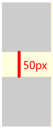

# CSS 专题之BFC


## 前言

> 石匠敲击石头的第 8 次

在上一篇文章中，如何避免外边距重叠的部分有提到，给容器元素添加 `overflow: auto`（或者非 `visible` 的值），可以避免与内部子元素产生嵌套外边距重叠，出现这个效果的原因是因为 **BFC**。

BFC 也是前端面试中必备的知识点，所以就有了这篇文章来梳理一下，如果哪里写的有问题欢迎指出。


## BFC 是什么

BFC 的全称为**块格式化上下文（Block Formatting Context）**，是页面中一块独立的渲染区域，**内部的子元素不会影响外部的元素，外部的元素也同样无法影响内部的子元素。**


## 如何创建 BFC

有以下方法可以创建块级格式化上下文：

- 根元素 `<html>`
- **浮动元素（元素的 `float` 不是 `none`）**
- **绝对定位元素（元素的 `position` 为 `absolute` 或 `fixed`）**
- **行内块元素（元素的 `display` 为 `inline-block`）**
- **`overflow` 值不为 `visible` 的块级元素**
- **`display` 值为 `flow-root` 的元素**
- **弹性元素（`display` 值为 `flex` 或 `inline-flex` 元素的直接子元素）**
- **网格元素（`display` 值为 `grid` 或 `inline-grid` 元素的直接子元素）**
- 表格单元格（元素的 `display` 为 `table-cell`，HTML 表格单元格默认为该值）
- 表格标题（元素的 `display` 为 `table-caption`，HTML 表格标题默认为该值）

更多的可以参考 [MDN](https://developer.mozilla.org/zh-CN/docs/Web/CSS/CSS_display/Block_formatting_context)，上述加粗的是比较常用的，推荐记忆。


## BFC 的规则

在 BFC 中的元素会按照以下规则进行渲染

1. 块级元素会在垂直方向上一个接一个地排列
2. 在**同一个 BFC 区域中**的相邻块级元素的垂直 `margin` 会重叠
3. 计算 BFC 区域高度时，浮动元素也参与计算
4. BFC 区域不会与浮动元素重叠
5. 块级元素在 BFC 中，其左外边距（`margin-left`）始终贴紧包含块的左边（即父元素的 content 区域左侧），**不会自动避开左浮动元素**，除非自身也创建 BFC


### 1. 块级元素会在垂直方向上一个接一个地排列

这点没什么好说的，即使没有在 BFC 区域中，在默认文档流中的块级元素也会垂直排列。


### 2. 在**同一个 BFC 区域中**的相邻块级元素的垂直 `margin` 会重叠

我们可以利用这个特性，来阻止外边距重叠，例如下面这个例子

```css
.container {
  overflow: hidden;
  background-color: lightyellow;
}

.box1,
.box2 {
  width: 100px;
  height: 100px;
  background: #ccc;
}

.box1 {
  margin-bottom: 50px;
}

.box2 {
  margin-top: 50px;
}
```

```html
<div class="container">
  <div class="box1"></div>
  <div class="box2"></div>
</div>
```



如果想让两个盒子之间的外间距不重叠，这时可以将其中一个元素放入一个新的 BFC 区域中，**使得两个元素不在同一个 BFC 区域中**。

```html
<div class="container">
  <div class="box1"></div>
  <div style="overflow: hidden;"> <!-- 创建一个新的BFC区域 -->
    <div class="box2"></div>
  </div>
</div>
```


