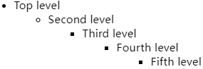

# CSS专题之CSS单位


## 前言

> 石匠敲击石头的第 9 次

我们都知道在 CSS 中有很多的单位，但在我平常开发中用的最多的却只有 `px` 和 `%`，其它的没怎么用到过。

想了一下没用到的原因可能是业务需求对响应式要求不高，或者是对其它单位不够熟悉，所以打算写一篇文章来好好梳理一下，如果哪里写的有问题欢迎指出。


## CSS 单位分类

虽然 CSS 中的单位有很多，但是可以分为以下两大类。


### 固定单位

CSS 支持多种固定单位，我们平常开发中**最常用的就是 `px`（像素）**，不常用的单位还有：`mm`（毫米）、`cm`（厘米）、`in`（英寸）、`pt`（点，印刷术语）、`pc`（派卡，印刷术语）。

它们之间的换算关系： `1in = 25.4mm = 2.54cm = 6pc = 72pt = 96px`

**固定单位的值是固定的，不随其他因素（如父元素、视口、字体大小）变化**，适合精确控制尺寸，但在响应式设计中不够灵活。


### 相对单位

这类单位的值**不是固定的，是基于某个参照基准（如父元素、视口、字体大小等）来计算实际的值**，非常适合用于响应式设计，接下来我将详细讲这类单位。


## em 单位

`em` 单位基于**当前元素的字号 `font-size`** 来计算具体的值。

```css
.box {
  font-size: 18px;
  padding: 1em;
}
```

上述代码中 `padding` 属性实际的值为 `18px`，计算过程为 `1 x 18px = 18px`。


**当前元素的字号 `font-size` 没有指定时，`em` 单位的属性值如何计算**

当前元素会先通过**继承**获取父元素的 `font-size` 值作为自己的字号，再基于自己的字号计算其它 `em` 单位的属性值，例如下面的例子。

```css
body {
  font-size: 16px;
}

.box {
  padding: 1em;
}
```

上述代码中 `padding` 属性值的计算过程如下：

1. 首先继承 `<body>` 元素的 `font-size` 属性值作为当前元素的字号，如果对继承不太熟悉可以看我之前写过的这篇文章。
2. 然后再用当前元素的字号（继承的值为 `16px`）计算 `padding` 属性的值，计算过程为 `16px x 1 = 16px`。


**当前元素的字号 `font-size` 使用 `em` 单位时，其它 `em` 单位的属性值如何计算**

当前元素会先通过**继承**获取父元素的 `font-size` 作为基准值来计算自己的字号，再基于自己的字号计算其它 `em` 单位的属性值，例如下面的例子。

```css
body {
  font-size: 16px;
}

.box {
  font-size: 0.8em;
  padding: 1em;
}
```

上述代码中 `padding` 属性值的计算过程如下：

1. 首先计算当前元素 `font-size` 属性的值，先继承 `<body>` 元素的 `font-size` 属性值，然后再与 `0.8` 相乘，`16px x 0.8 = 12.8px`。
2. 然后再用当前元素的字号（`12.8px`）计算 `padding` 属性的值，计算过程为 `12.8px x 1 = 12.8px`。


**`em` 换算公式**

`想要的像素大小 / 当前元素的字号大小 = em 的值`。

例如：当前元素的字号大小为 `16px`，想设置一个 `8px` 的内边距，但是又想内边距大小会随着当前元素的字号大小的变化而变化，此时可以指定内边距的值为 `0.5em`，计算过程为：`8px / 16px = 0.5em`。


**`em` 指定多重嵌套元素的字号时会出现字体逐渐缩小或放大的问题**

例如下面这段代码。

```css
body {
  font-size: 16px;
}

ul {
  font-size: 0.8em;
}
```

```html
<ul>
  <li>
    Top level
    <ul>
      <li>
        Second level
        <ul>
          <li>
            Third level
            <ul>
              <li>
                Fourth level
                <ul>
                  <li>Fifth level</li>
                </ul>
              </li>
            </ul>
          </li>
        </ul>
      </li>
    </ul>
  </li>
</ul>
```


**原因：** `<ul>` 会继承父级元素的 `font-size` 属性的值进行计算，导致越继承字号越小。

计算过程：

1. Top level 层，字号为 `12.8px`，`<li>` 继承 `<ul>` 的 `font-size` 属性值，`<ul>` 的 `font-size` 属性值继承 `<body>` 的字号进行计算，结果为 `16px x 0.8 = 12.8px`
2. Second level 层，字号为 `10.24px`，`<li>` 继承 `<ul>` 的 `font-size` 属性值，`<ul>` 的 `font-size` 属性值继承 Top level 层 `<ul>` 的字号进行计算，结果为 `12.8px x 0.8 = 10.24px`
3. Third level 层，字号为 `8.192px`，`<li>` 继承 `<ul>` 的 `font-size` 属性值，`<ul>` 的 `font-size` 属性值继承 Second level 层 `<ul>` 的字号进行计算，结果为 `10.24px x 0.8 = 8.192px`

以此类推计算。


该问题的解决方案：

```css
body {
  font-size: 16px;
}

ul {
  font-size: 0.8em;
}

/* 除第一个ul之外的ul都默认继承父级的字号，1em不会缩小和放大字号 */
ul ul {
  font-size: 1em;
}
```



**⚠️ 注意：** 这样的解决方案通过提升选择器的优先级覆盖规则，依旧不好，也可以使用 `rem` 单位来解决这个问题。

```css
:root {
  font-size: 16px;
}

ul {
  font-size: 0.8rem;
}
```


## rem 单位

`rem` 单位是 root em 的缩写，与 `em` 单位类似，但比 `em` 单位的使用简单多了，该单位始终基于**根节点的字号 `font-size`** 来计算具体的值。

使用前先使用 `html` 或者 `:root` 来为 `<html>` 根节点指定默认字号，当然也可以不指定，在大多数浏览器中默认为 `16px`。

```css
/* 等价于使用html {}，但是:root选择器优先级更高(0,1,0) */
:root {
  font-size: 1em;
}

ul {
  font-size: 0.8rem;
}
```

上述代码计算过程：

1. `<html>` 根元素的字号为 `16px`，根节点上的 `em` 是相对于浏览器的默认字号进行计算，默认字号通常是 `16px`，计算过程为 `16px x 1 = 16px`
2. `<ul>` 元素的字号为 `12.8px`，基于根节点的字号进行计算，计算过程为 `16px x 0.8 = 12.8px`


## % 单位

`%` 单位是**基于元素的包含块大小来计算具体的值**，计算规则如下：

- 当元素的 `width` 属性使用 `%` 单位时，是基于元素**包含块的 `width` 值**进行计算
- 当元素的 `height` 属性使用 `%` 单位时，是基于元素**包含块的 `height` 值**进行计算
- 当元素的 `margin` 或 `padding` 属性使用 `%` 单位时，**不论是垂直方向还是水平方向，都是基于元素包含块的 `width` 值进行计算**

**⚠️ 注意：** `border-radius`、`translate`、`background-size` 属性使用 `%` 单位时是**不基于包含块**，是基于自身的大小。


**包含块：** 是一个元素在计算尺寸（如宽度、高度、边距、定位时）所参考的矩形区域。

**初始化包含块：** 如果一个元素没有明确的包含块（如：`<html>` 元素和当元素使用了 `position: fixed` 或 `position: absolute`，并且没有定位祖先元素），则它的包含块为初始包含块，**初始包含块的大小通常等于浏览器视口的大小**。


**包含块的确定规则：**

包含块的确定取决于元素的 `position` 属性。

- **静态定位 `position: static` 和相对定位 `position: relative`**
  - 包含块是最近的**块级祖先元素**的内容区域
  - 如果没有块级祖先元素，则包含块为初始包含块
- **绝对定位 `position: absolute`**
  - 包含块是最近的 **定位祖先元素（即 `position` 为 `relative`、`absolute`、`fixed` 或 `sticky` 的元素）** 的 **padding box**（内容区域 + 内边距）
  - 如果没有定位祖先元素，则包含块是初始包含块
- **固定定位 `position: fixed`**
  - 包含块是初始包含块
- **粘性定位 `position: sticky`**
  - 包含块是最近的 **滚动祖先元素（即 `overflow: auto` 或 `overflow: scroll` 的元素）** 的内容区域
  - 如果没有滚动祖先元素，则包含块是初始包含块


## vw 单位

`vw` 单位的全称是 viewport width，表示视口宽度，该单位**始终基于浏览器视口宽度来计算具体的值**，计算规则如下：

- `1vw` 等价于视口宽度的 `1%`，例如视口宽度为 `750px`，那么 `1vw = 750px x 1% = 7.5px`
- `100vw` 等价于视口宽度的 `100%`，例如视口宽度为 `750px`，那么 `100vw = 750px x 100% = 750px`


## vh 单位

`vh` 单位的全称是 viewport height，表示视口高度，该单位**始终基于浏览器视口高度来计算具体的值**，计算规则如下：

- `1vh` 等价于视口高度的 `1%`，例如视口高度为 `600px`，那么 `1vh = 600px x 1% = 6px`
- `100vh` 等价于视口高度的 `100%`，例如视口高度为 `600px`，那么 `100vh = 600px x 100% = 600px`


## vmin 单位

`vmin` 单位**始终基于浏览器视口的最小边来计算具体的值**，计算规则如下：

- `1vmin` 等价于视口最小边长度的 `1%`，例如：
  - 如果视口尺寸为 `1200px × 600px`（宽 > 高），则 `1vmin = 600px × 1% = 6px`
  - 如果视口尺寸为 `500px × 800px`（宽 < 高），则 `1vmin = 500px × 1% = 5px`
- `100vmin` 等价于视口最小边长度的 `100%`，例如：
  - 如果视口尺寸为 `1200px × 600px`（宽 > 高），则 `100vmin = 600px × 100% = 600px`
  - 如果视口尺寸为 `500px × 800px`（宽 < 高），则 `100vmin = 500px × 100% = 500px`


## vmax 单位

`vmax` 单位**始终基于浏览器视口的最大边来计算具体的值**，计算规则如下：

- `1vmax` 等价于视口最大边长度的 `1%`，例如：
  - 如果视口尺寸为 `1200px × 600px`（宽 > 高），则 `1vmax = 1200px × 1% = 12px`
  - 如果视口尺寸为 `500px × 800px`（宽 < 高），则 `1vmax = 800px × 1% = 8px`
- `100vmax` 等价于视口最大边长度的 `100%`，例如：
  - 如果视口尺寸为 `1200px × 600px`（宽 > 高），则 `100vmax = 1200px × 100% = 1200px`
  - 如果视口尺寸为 `500px × 800px`（宽 < 高），则 `100vmax = 800px × 100% = 800px`


## 实践建议

- **用 `rem` 单位来设置字号（`font-size`）**

  假设你根据设计稿开发一个网页，使用的都是 `px` 单位，等你开发完成后交付给客户或者老板，得到反馈希望页面整体的字号希望再大一点，这时你需要手动调整所有 `px` 单位的值，非常的麻烦。

  但使用 `rem` 单位来设置元素的字号就没有这个问题，**只需要调整根元素的字号就可以调整页面整体的字号**，可维护性非常高。

  **⚠️ 注意：** 使用 `rem` 单位时**不要设置根元素的字号为固定值**，例如：

  ```css
  :root {
    /* 不推荐这样写 */
    font-size: 16px;
  }
  ```

  因为使用固定值导致用户修改浏览器的默认字号**不会影响已经使用 `px` 单位或其它绝对单位的字号**，所以不会修改根元素的默认字号，进而导致了使用 `rem` 单位的字号大小不会发生变化。

  最好使用如下的写法：

  ```css
  :root {
    /* 也可以省略不写，直接使用浏览器的默认字号 */
    font-size: 1em;
  }
  ```

  上述代码中根节点的字号大部分默认情况下是 `16px`，不使用固定值，便于用户可以修改浏览器的默认字号，修改默认字号对部分用户（存在视力障碍）很有需要。

- **用 `px` 单位来设置边框（`border`）**

  边框的大小基本上在所有屏幕尺寸上都是固定的，所以使用固定单位 `px` 即可。

- **用 `em` 单位来设置除字号、边框外其它大部分属性**

  这块其它大部分属性主要指 `border-radius`、`padding`，`margin` 等，让内边距或者外边距基于当前元素的字号大小来动态变化，确保与字号比例协调。


## 总结

- **CSS单位分类**
  - 固定单位（如 `px`）：值固定，适合精确控制
  - 相对单位（如 `em`、`rem`）：基于参照基准动态计算，适合响应式设计
- **常用单位特性**
  - `em`：基于当前元素的`font-size`计算，易受嵌套影响
  - `rem`：基于根元素`font-size`计算，避免嵌套问题
  - `%`：基于包含块尺寸计算，常用于布局
  - `vw/vh`：基于视口宽/高，`vmin/vmax`基于视口最小/最大边
- **实践建议**
  - 字号用 `rem` 单位：便于全局调整，提升可维护性
  - 边框用 `px` 单位：固定尺寸更稳定
  - 除字号、边框外其它大部分属性用 `em` 单位：与字号联动，保持比例协调
  - 避免根元素固定字号：保留用户自定义能力


## 参考文章

-  [《深入解析CSS》Keith J.Grant 2 章节](https://book.douban.com/subject/35021471/)
- [如何决定响应式网站的 CSS 单位？这是我参与8月更文挑战的第14天，活动详情查看：8月更文挑战 很高兴又见面了！😊 - 掘金](https://juejin.cn/post/6996094906326319134)
- [前端响应式布局原理与方案（详细版）响应式布局指的是同一页面在不同屏幕尺寸下有不同的布局。传统的开发方式是PC端开发一套， - 掘金](https://juejin.cn/post/6844903814332432397)