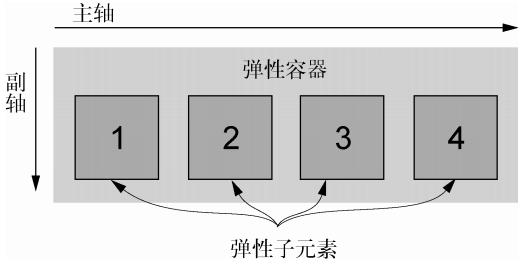
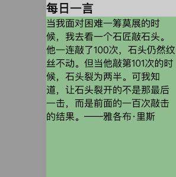
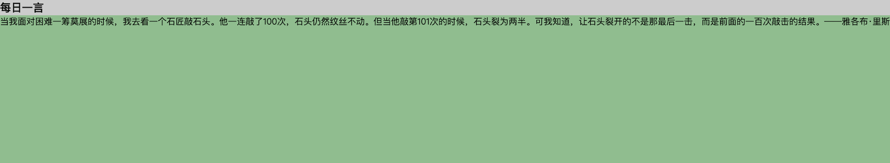
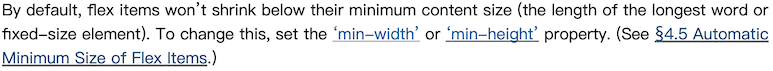
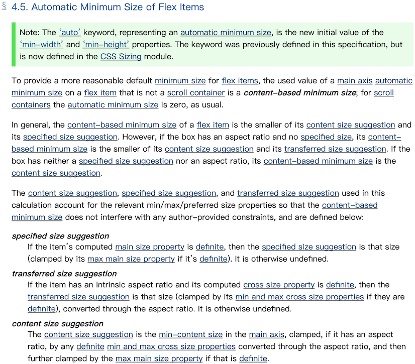
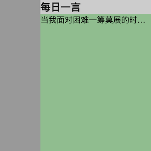
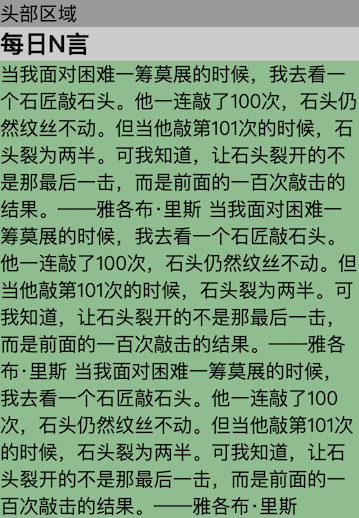

# CSS专题之flex: 1常见问题


## 前言

> 石匠敲击石头的第 14 次

Flex 布局是我们平常开发页面中用的最多的布局，而其中最常见的写法 `flex: 1`，常用于让元素 **自动填满剩余空间**。但在实际使用中可能会遇到下面这些问题：

- 明明写了 `flex: 1`，元素却没有占满该占的空间
- 布局整体被 `flex: 1` 元素撑破
- 设置了 `text-overflow: ellipsis` 却不生效

所以这篇文章尝试梳理这些问题，研究它们产生的原因以及如何避免它们，希望看完后对你有所启发，如果哪里写的有问题欢迎指出，不胜感激。


## 基础回顾

在开始之前，我们先简单回顾一下 `flex` 布局以及 `flex: 1`，对理解后面的问题有帮助。



- **弹性容器（flex container）：** 给一个元素添加 `display: flex`，那么该元素就变成了一个弹性容器

- **弹性子元素（flex item）：** 弹性容器的**直接子元素**

  **⚠️ 注意：** 当给一个弹性子元素添加 `display: flex` 时，那么**它既是弹性容器也是弹性子元素**。
  
- **`flex-basis` 属性：** 用来设置当前弹性子元素在分配多余空间之前所占据主轴的大小，**默认值是 `auto`**

  - 当该属性为 `auto` 时

    如果主轴方向是 `row`（默认）：

    - 浏览器会检查该元素是否设置了 `width` 属性
    - 如果设置了，则 `flex-basis` 的值等于该 `width` 属性值
    - 如果没有设置，则使用元素 **内容的宽度** 作为 `flex-basis`

    如果主轴方向是 `column`：

    - 浏览器会检查元素是否设置了 `height` 属性
    - 如果设置了，则 `flex-basis` 使用该 `height` 属性值
    - 如果没有设置，则使用元素 **内容的高度** 作为 `flex-basis`

  - 当该属性为非 `auto` 值时，元素上的 `width` 或 `height` 将会被忽略，`flex-basis` 优先生效

- **`flex-grow` 属性：** 定义当前弹性子元素如何 **按比例分配剩余空间**，**默认值为 `0`**

  - 当所有弹性子元素的 `flex-basis` 大小计算完成后，如果**总和仍未占满弹性容器**时，会将剩余空间按照 `flex-grow` 的值进行分配
  - `flex-grow` 值越大，分配到的空间越多
  - 如果为 `0`（默认值），表示即使有剩余空间，当前元素也不会放大，大小不会超过其 `flex-basis`

- **`flex-shrink` 属性：** 定义当前弹性子元素在 **弹性容器空间不足时的收缩比例，默认值为 `1`**

  - 当所有弹性子元素的 `flex-basis` 大小计算完成后，如果**总和大于弹性容器的尺寸**时，浏览器会根据每个子元素的 `flex-shrink` 值决定收缩的比例
  - `flex-shrink` 的值越大，元素会被收缩得越多
  - 元素实际的收缩值取决于它的 `flex-basis`，而不是它的最终大小
  - 值为 `1` 时，表示元素需要收缩时，它可以收缩，值为 `0` 时，表示元素不收缩

- **`flex` 属性：** 是三个属性的简写形式

  ```
  flex: <flex-grow> <flex-shrink> <flex-basis>;
  ```

  | 写法              | 完整形式         | 说明                                         |
  | ----------------- | ---------------- | -------------------------------------------- |
  | `flex: 1`         | `flex: 1 1 0%`   | 表示元素能放大也能收缩，初始大小为 `0`       |
  | `flex: auto`      | `flex: 1 1 auto` | 表示元素能放大也能收缩，初始大小为内容或宽高 |
  | `flex: none`      | `flex: 0 0 auto` | 表示元素不放大不收缩，保持内容或宽高设置     |
  | `flex: 2`         | `flex: 2 1 0%`   | 表示元素能放大、收缩，放大时占两倍的比例     |
  | `flex: 0 1 200px` |                  | 表示元素固定初始大小为 200px，可收缩不可放大 |

  **⚠️ 注意： 推荐使用简写属性 `flex`，而不是分别声明 `flex-grow`、`flex-shrink`、`flex-basis`**，因为 `flex` 简写属性会给出有用的默认值，这些默认值在大多数情况下是所需要的值。


## 问题复现

知道了前面这些后，我们来看一下这个例子：



```html
<div class="container">
  <div class="left"></div>
  <div class="main">
    <div class="title">每日一言</div>
    <div class="content">
      当我面对困难一筹莫展的时候，我去看一个石匠敲石头。他一连敲了100次，石头仍然纹丝不动。但当他敲第101次的时候，石头裂为两半。可我知道，让石头裂开的不是那最后一击，而是前面的一百次敲击的结果。——雅各布·里斯
    </div>
  </div>
</div>
```

```css
.container {
  display: flex;
  width: 300px;
  height: 300px;
}

.left {
  width: 80px;
  background: #999;
}

.main {
  display: flex;
  flex-direction: column;
  flex: 1;
  background: #90bd8f;
}

.title {
  font-size: 20px;
  font-weight: bold;
  background: #ccc;
}
```

[在线预览效果](https://codepen.io/wjw020206/pen/PwqYZxw)

从效果上来看，可以看到右侧区域占满了容器中除左侧区域的剩余宽度。


接下来为 content 区域**设置文本超出容器时显示省略号**。

```css
/* 其它样式... */

.content {
  text-overflow: ellipsis;
  overflow: hidden;
  white-space: nowrap;
}
```

但是奇怪的事情发生了，并没有出现预想中的文本超出显示省略号，而是容器被 “撑开” 了，并且左侧区域也因为空间不足而被 “挤压”。



[在线预览效果](https://codepen.io/wjw020206/pen/zxGOVpx)


## 原因分析

在 [CSS 规范](https://www.w3.org/TR/css-flexbox-1/#flex-common) 中有对这种情况进行说明：



简单来说就是默认情况下，**Flex 弹性子元素不会缩小到它的 `minimum content size`（即最长单词或固定尺寸元素的长度）。**


那什么是 `minimum content size` ？[CSS 规范](https://www.w3.org/TR/css-flexbox-1/#min-size-auto) 对此也有进行说明：



简单来说，**`minimum content size`（最小内容尺寸） 是指元素为了完整显示其内容所需的最小宽度或高度**，在不同情况下对应不同的值：

- **当元素是普通 Flex 弹性子元素（不是 scroll 容器）**
  - 它的 `min-width` 默认为 `auto`，意味着使用**内容为基础的最小尺寸（content-based minimum size）**

  - 也就是元素**默认不会被压缩到小于内容的尺寸**

- **当元素是 scroll 容器（`overflow` 属性是非 `visible` 的值）**
  - `min-width: auto` 计算结果为 `0`
  - 表示**可以无限收缩，不被内容撑开**


基于以上规范的说明，我们来分析一下为什么会出现这个问题。

首先，前面例子中的 `.main` 元素**不是 scroll 容器**，并且没有指定的 `width` 属性也没有 `aspect-ratio` 属性，因此根据规范，它的 `min-width` 默认为 `auto`，也就是使用 **基于内容的最小尺寸（content-based minimum size）**，即 **它的最小宽度由内容决定**。

而它内部的子元素 `.content` 是一个**不换行的长文本**（设置了 `white-space: nowrap`），这使得内容的最小宽度变得非常长。

因此，`.main` 默认不会压缩，最终会被这段长文本“撑开”，导致无法触发 `text-overflow: ellipsis` 省略效果。


## 解决方案

出现这个问题的根本原因是因为 `.main` 元素的 `min-width` 的值是 `auto` 导致了这个问题，所以我们**只需要将它设置为 `0` 就可以解决这个问题**。

```css
.main {
  display: flex;
  flex-direction: column;
  flex: 1;
  background: #90bd8f;
  /* 设置最小宽度为 0 */
	min-width: 0;
}
```

[在线预览效果](https://codepen.io/wjw020206/pen/JodPgwv)




**⚠️ 注意：** 

- 这里 `min-width` 使用其它数值也可以，例如：`min-width: 1px`，**但是不推荐这样写**，虽然它同样可以打破 `min-width: auto` 的行为，但是仍然可能 **占用 1 像素空间，建议始终使用 `min-width: 0`**
- `min-width: 0` 的方式属于**直接打破 `min-width: auto` 的行为**，我们也可以使用其它方式来间接打破，例如：
  - 设置 `overflow: hidden`，前面的 CSS 规范中有提到，设置了 `overflow`（特别是非 `visible` 的值）时，浏览器会把 `min-width: auto` 当作 `0` 来处理
  - 设置 `width: 0`，利用了 `width` 参与 `min-width: auto` 计算的机制


从前面的规范中我们可以知道，不止是 `min-width: auto` 有这个问题，**`min-height: auto` 也有这个问题**，当然解决方案也是差不多的。

这里我给大家留了一道练习题，大家可以尝试解决一下底部区域 `overflow-y: auto` 不生效的问题。

[在线查看代码](https://codepen.io/wjw020206/pen/NPqKQmx)




## 总结

本篇文章首先回顾了 Flex 布局和 `flex: 1` 的基础知识，随后对 `flex: 1` 元素撑开容器的问题进行了原因分析，深入剖析了其背后隐藏的核心机制 `min-width: auto` 与 `minimum content size`，最后给出了解决这些问题的多种方法：

- 使用 `min-width: 0` 打破 `min-width: auto` 的行为，**推荐使用这种方式**
- 使用 `overflow: hidden`
- 使用 `width: 0`


## 参考文章

- [探索 flex:1 常见问题与解决方案设置 flex: 1 的元素可以占据父元素的剩余宽度/高度。但 flex: 1 的 - 掘金](https://juejin.cn/post/7265227611671117887)
- [CSS Box Sizing Module Level 3](https://www.w3.org/TR/css-sizing-3/#valdef-width-auto)
- [CSS 弹性框布局模块 1 级 --- CSS Flexible Box Layout Module Level 1](https://www.w3.org/TR/css-flexbox-1/#min-size-auto)
- [CSS Flexible Box Layout Module Level 1](https://www.w3.org/TR/css-flexbox-1/#flex-common)
- [《深入解析CSS》Keith J.Grant 5 章节](https://book.douban.com/subject/35021471/)