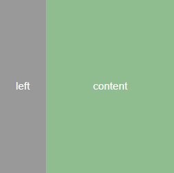

# CSS专题之flex: 1常见问题


## 前言

> 石匠敲击石头的第 14 次

Flex 布局是我们平常开发页面中用的最多的布局，而其中最常见的写法 `flex: 1`，常用于让元素 **自动填满剩余空间**。但在实际使用中可能会遇到下面这些问题：

- 明明写了 `flex: 1`，元素却没有占满该占的空间
- 布局整体被 `flex: 1` 元素撑破
- 设置了 `text-overflow: ellipsis` 却不生效

所以这篇文章尝试梳理这些问题，研究它们产生的原因以及如何避免它们，希望看完后对你有所启发，如果哪里写的有问题欢迎指出，不胜感激。


## 基础回顾

在开始之前，我们先简单回顾一下 `flex` 布局以及 `flex: 1`，对理解后面的问题有帮助。


- **弹性容器（flex container）：** 给一个元素添加 `display: flex`，那么改元素就变成了一个弹性容器

- **弹性子元素（flex item）：** 弹性容器的**直接子元素**

  **⚠️ 注意：** 当给一个弹性子元素添加 `display: flex` 时，那么**它既是弹性容器也是弹性子元素**。


这里的 `flex: 1` 是简写形式，等价于 `flex: 1 1 0%`，这三个值分别表示以下三个属性：

- `flex-grow: 1`
- `flex-shrink: 1`
- `flex-basis: 0%`


我们先实现如下的布局：



```html
<div class="container">
  <div class="left"></div>
  <div class="content"></div>
</div>
```

```css
.container {
  display: flex;
  width: 300px;
  height: 300px;
}

.left {
  width: 80px;
  background: #999;
}

.content {
  flex: 1;
  background: #90bd8f;
}
```

[在线预览效果](https://codepen.io/wjw020206/pen/PwqYZxw)

从效果上来看，可以看到 **content 区域** 占满了 **container** 容器中除 **left 区域** 的剩余宽度。
