# CSS专题之响应式设计(上)


## 前言

> 石匠敲击石头的第 10 次

作为一名前端开发，响应式设计可以说是一定要会的，毕竟前端的一大工作内容就是去兼容页面在不同浏览器、不同设备中能够正常工作。但是这块知识点我认为相比于其它知识点是很有难度，因为涉及前端布局的历史发展以及很多其它的概念。

在看了很多大佬的文章之后打算写一篇文章来好好梳理一下，如果哪里写的有问题欢迎指出。


## 什么是响应式设计

响应式设计英文全称是 Responsive Web Design，简称为 **RWD**。拥有响应式设计的网站理论上可以适配不同设备屏幕的大小。**可以把网页内容比作水，而设备就像装水的容器——无论容器如何变化，水总能随之适应，保持最佳形态。**

这个概念最早是由 Ethan Marcotte 在 2010 年提出的，他还制作了一个示例，让我们可以直观的对响应式设计有一个直观的了解。

当屏幕宽度大于 1300 像素，则 6 张图片并排在一行。

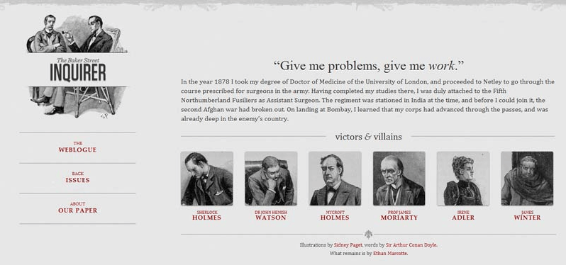

当屏幕宽度在 600 像素到 1300 像素之间，则 6 张图片分成两行。

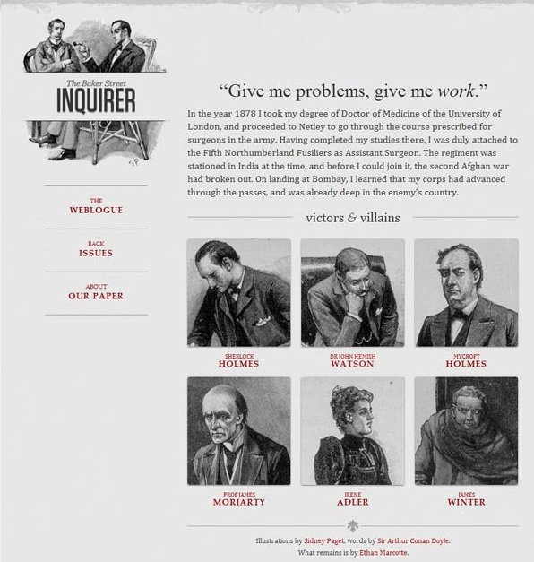

当屏幕宽度在 400 像素到 600 像素之间，则将导航栏移到网页头部。

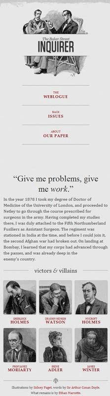

最后当屏幕宽度在 400 像素以下，则 6 张图片分成三行。


## 为什么需要响应式设计

要理解响应式设计的必要性，得从 Web 页面的发展历程说起。在早期的计算机应用程序开发和印刷出版中，开发人员和出版商往往清楚的知道媒介的物理限制，例如程序的窗口大小或页面尺寸都是固定的，因此可以使用固定单位（如像素或英寸）来精确布局。

受此影响，早期 Web 设计沿用了 **"像素级完美"** 理念：通过一个居中的固定宽度容器（通常约 `800px` 宽），在固定范围内进行精确排版，这种方式类似于传统应用和印刷设计，如下图所示：

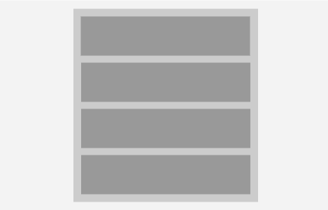

但随着技术发展，高清显示器逐渐普及，此时人们探讨是否可以安全的把网页宽度设计成 `1024px` 宽(而不是 `800px`)，之后又开始讨论 `1280px` 宽，但这样还是难以兼顾不同设备的多样化屏幕尺寸。

直到智能手机的出现，彻底打破了固定布局的可行性，为了适配各种设备尺寸，Web 设计不得不抛弃传统的固定宽度方案，转而采用**响应式设计**的思路。


## 响应式设计的原则

响应式设计大致有以下几个原则：

1. **流式布局（Fluid Grid Layout）**
   - 使用相对单位而非固定单位
   
   - 内容会根据屏幕大小自动伸缩
   
2. **媒体查询（Media Queries）**
   - 根据不同屏幕尺寸加载不同的样式

3. **弹性媒体（Flexible Media）**
   - 图像、视频等媒体内容应能在不同屏幕中自适应大小

4. **内容优先（Content First）**
   - 考虑在各种屏幕上的可读性、可操作性，确保最重要的信息优先展示


## 响应式设计 vs 自适应设计

说到响应式设计，那就不能不提自适应设计，响应式设计是 Responsive Web Design（RWD），但自适应设计是 Adaptive Web Design（AWD）。对于这两者概念，网上很多文章都混淆不清，包括我自己一开始也是分不清楚这两者的区别。


### 两者区别

**响应式设计（RWD）**

这个概念最早是由 Ethan Marcotte 在 2010 年提出的，被大家公认为是 RWD 的起源。他提出的 RWD 方案是通过 HTML 和 CSS 的媒体查询技术，配合流式布局实现。**RWD 更偏向于只改变元素的外观布局，不会大幅度改变内容**，例如：[稀土掘金](https://juejin.cn/)，无论在大屏幕还是小屏幕设备上返回的内容都是一样的，只是布局发生了变化。


**自适应设计（AWD）**

Adaptive Web Design 最早出自 Aaron Gustafson 于 2011 年出版的[书](https://adaptivewebdesign.info/)的标题。他认为 AWD 在包括 RWD 的 CSS 媒体查询技术基础之上，也要使用 JavaScript 来操作 HTML 来更好适应移动设备，所以通常认为，**RWD 是 AWD 的子集**。

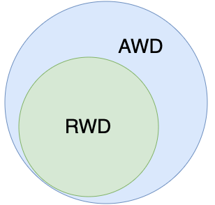

AWD 有可能会针对移动端用户**简化内容和功能**。AWD 可以在服务器端根据用户代理（UA）类型选择布局和大小合适的页面，为不同设备提供**不同版本**的网站，例如：[bilibili](https://www.bilibili.com/)，在大屏幕设备上会访问 `www.bilibili.com`，返回完整的页面内容，但在小屏幕设备上会访问 `www.bilibili.com` 并重定向为 `m.bilibili.com`，返回精简的页面内容。

**相同点：** RWD 和 AWD 都是为了适配各种不同的移动设备，提升用户体验的技术。

**不同点：** 借用 chokcoco 前辈这篇[文章](https://github.com/chokcoco/cnblogsArticle/issues/25)中的图来说明再合适不过了。

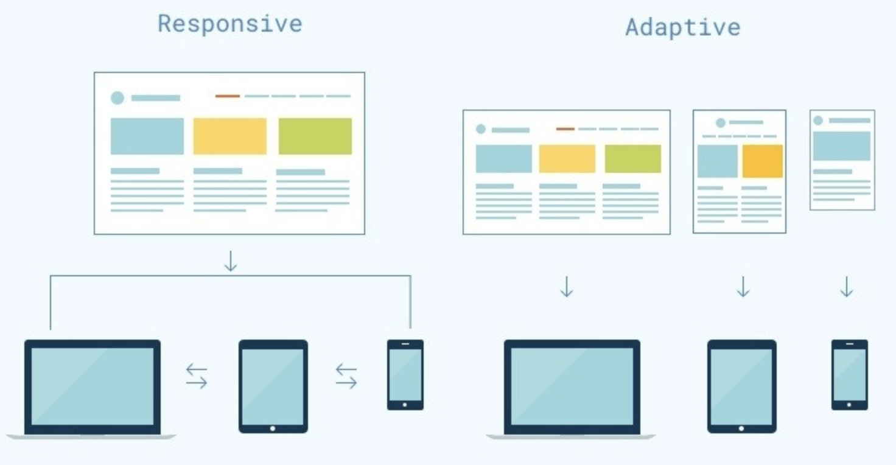

从上图中我们看到 **RWD 偏向于一套代码适配设备，而 AWD 偏向于多套代码适配设备**。


### 如何选择

那我们在平常开发时候应该选择哪一种方案？这里我简单列了一张表来对比一下两个方案。

| 特征     | 响应式设计（RWD）        | 自适应设计（AWD）                   |
| -------- | ------------------------ | ----------------------------------- |
| 页面数量 | 一套页面                 | 多套页面（根据设备选择）            |
| 样式处理 | 使用媒体查询动态调整     | 针对每类设备分别维护                |
| 用户体验 | 一致性好、开发快         | 可定制性强，可精简内容              |
| 技术实现 | 主要依靠 HTML + CSS      | HTML + CSS + JS（或者服务器端判断） |
| 缺点     | 某些复杂页面适配难度较高 | 维护成本高，需开发多套结构          |

之前在看《深入解析 CSS》书中有讲过一句话，**在 CSS 中最好的答案通常是 “这得看情况”**。这句话用在这里也同样适用：RWD 和 AWD 并不是非此即彼的选择，关键要看项目的类型和实际需求。

- 如果你要开发的是内容站、博客、官网类项目（如[稀土掘金](https://juejin.cn/)），这类项目的页面通常不是很复杂，使用响应式设计就足够了。

- 如果要开发的是像[淘宝](https://www.taobao.com/)、[bilibili](https://www.bilibili.com/) 这种页面比较复杂的项目，更适合采用自适应设计来定制不同设备的体验（比如移动端下拉刷新、精简内容等）。


## 渐进增强 vs 优雅降级

在响应式设计的思想演化过程中，还有两个经常提到的开发策略：**渐进增强**和**优雅降级**。


### 两者区别

- **渐进增强（Progressive Enhancement）：** 从最基础的功能出发，优先保证低版本浏览器的可用性，然后再针对高版本的浏览器增强交互和视觉体验。
- **优雅降级（Graceful Degradation）：** 一开始就面向高版本浏览器实现完整的功能，然后再针对低版本浏览器进行兼容。

两者的区别非常明显，简单来说。

- **渐进增强是从简单到复杂的过程**，先保证能用，再去增强体验。
- **优雅降级则是复杂到简单的过程**，先追求体验，再考虑兼容。


### 如何选择

- **适合渐进增强的场景**
  - 你的目标用户的设备可能**老旧**、网络环境差
  - 项目类型如：**政府网站、教育平台、新闻门户、海外项目** 等，通常要求更好的兼容性
  - 如果采用**移动端优先开发**，往往也是渐进增强的体现：**先构建基础样式**，再通过媒体查询对大屏设备做进一步优化
- **适合优雅降级的场景**
  - 项目的主要用户都使用**现代浏览器**，且对交互体验要求比较高
  - 项目类型如：**电商平台、前沿 Web App、富交互站点（如 B 站、淘宝）**
  - 可以一开始就**大胆使用现代技术**（如 Flex、Grid、Vue、React 等），功能完善之后，再考虑对不支持的设备做降级兼容


## 移动优先 vs PC 优先

在响应式设计中，设计的起点是个很现实的问题，到底是先以移动设备为核心来构建页面，还是以桌面设备为主？


### 两者区别

**移动优先（Mobile First）：** 先从小屏幕出发设计界面和功能，再逐步适配到更大的设备。

```css
/* 默认样式：移动端 */
.box {
  font-size: 14px;
  padding: 10px;
}

/* 平板及以上设备 */
@media (min-width: 768px) {
  .box {
    font-size: 16px;
  }
}

/* 桌面设备 */
@media (min-width: 1024px) {
  .box {
    font-size: 18px;
  }
}
```


**PC 优先（Desktop First）：** 先从桌面大屏设计，再去考虑如何缩小、适配到移动设备。

```css
/* 默认样式：桌面端 */
.box {
  font-size: 18px;
  padding: 20px;
}

/* 平板设备 */
@media (max-width: 1024px) {
  .box {
    font-size: 16px;
  }
}

/* 移动端 */
@media (max-width: 768px) {
  .box {
    font-size: 14px;
  }
}
```


### 如何选择

前面的例子我们可以看出不论是移动优先还是 PC 优先，都是当屏幕宽度增大或减小的时候，后面的媒体查询中的样式会覆盖前面的样式。所以**移动优先使用的是 `min-width`**，**PC 优先使用的是 `max-width`**。

在实际开发时，可以参考下面的表来选择设计的起点是移动优先还是 PC 优先。

| 主要用户设备                           | 建议使用                   |
| -------------------------------------- | -------------------------- |
| 手机为主（如：电商、社交、小程序）     | 移动优先                   |
| 桌面为主（如：后台管理系统、数据平台） | PC 优先                    |
| 两者兼顾（如：企业官网、博客、内容站） | 推荐移动优先（适应性更强） |

**⚠️ 注意：** 在实际开发中，**更推荐采用移动优先策略**。因为移动端开发存在更多限制，比如：小屏幕、慢网络、触控交互等。如果一开始就为桌面端开发完整功能，再“削减”功能来适配移动设备，反而更容易出问题。


## 如何实现响应式设计

前面说了那么多，相信你应该想知道如何实现一个拥有响应式设计的网页，我们接下尝试使用几种方案来实现以下这个效果。

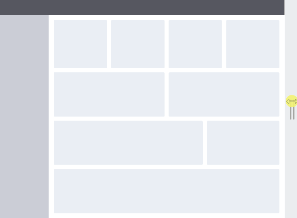


### 百分比布局 + 媒体查询 + 栅格系统

在响应式设计兴起之前，“百分比布局” 是网页适配的核心手段。开发者通过设置元素的宽高为相对于父元素的百分比，让页面内容随浏览器大小而变化。

但只依靠百分比布局还不足以覆盖所有设备，这个时候就需要使用**媒体查询**，通过判断视口宽度，编写不同的样式来适配不同的屏幕。

为了更加的规范化和高效地组织布局，还发明出了**栅格系统（Grid System）**，如 Bootstrap 中的 `.col-md-6`、`.col-sm-12` 就是典型的响应式栅格系统做法，**它本质上就是使用百分比 + 媒体查询组合实现的布局组件化方案**。


**栅格系统**

栅格系统主要是由以下三个部分构成：

- **列（Column）：** 内容区域

  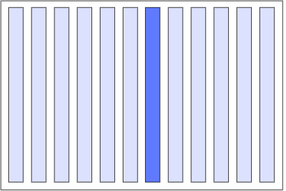

- **水槽（Gutter）：** 列与列之间的间距

  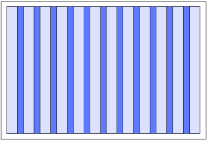

- **页边距（Margin）：** 整体内容与浏览器边缘之间的距离

  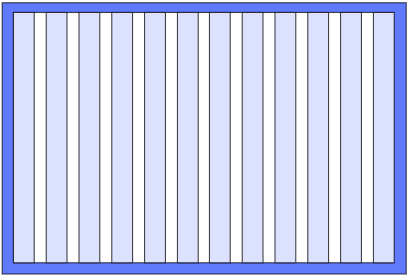


了解了上面这些，我们就要开始先创建一个栅格系统，**PC 端通常采用 12 列栅格**，因为它能很好地支持 1/2、1/3、1/4 等多种常用布局比例。

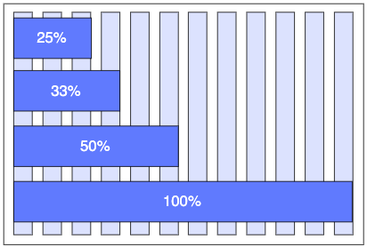

对于页面内容更复杂、布局更精细的场景，也可以使用 **24 列栅格系统**，列数越多，布局的灵活性越高。

以下是实际的栅格系统的 CSS 代码

```css
.column-1 { width: 8.3333%; }
.column-2 { width: 16.6667%; }
.column-3 { width: 25%; }
/* ...依次类推，按照 100% ÷ 12 的倍数增加 */
```

使用 SCSS 的同学也可以使用更加简便的写法。

```scss
@for $i from 1 through 12 {
  .column-#{$i} {
    width: (100% / 12) * $i;
  }
}
```

定义好了栅格系统，我们接下来就要为元素添加相关的样式，这里因为我们要做的页面是类似后台管理的布局，所以**使用 PC 优先策略**，使用百分比布局完成大屏幕下完整的布局。

[在线代码演示](https://codepen.io/wjw020206/pen/GggoemQ)


**如何确定媒体查询的断点**

完成了前面的布局之后，我们接下来需要使用媒体查询来适配中、小屏幕的设备，在此之前我们需要先确定媒体查询的**断点（Breakpoint）**。

确定媒体查询断点有以下两种方法：

1. **基于设备尺寸设断点**
   可以通过选择 `600px`、`900px`、`1200px` 和 `1800px` 作为分割点，可以适配到常见的 14 个机型，至于这四个断点是怎么来的，可以参考 [The 100% correct way to do CSS breakpoints](https://medium.com/free-code-camp/the-100-correct-way-to-do-css-breakpoints-88d6a5ba1862) 这篇文章，这里不再过多赘述。

   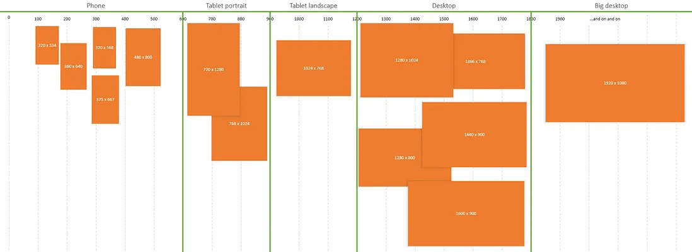

   当然，这只是其中一种分割方案，例如以下是 `Bootstrap` 的断点分割方案

   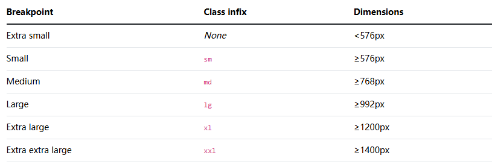

2. **根据内容自然断裂点（推荐）**

   除了前一种方案外，**更加推荐根据内容的自然断裂点来设置断点，而不是盯着设备看**。

   具体实践步骤如下：

   1. 页面设计好之后，**手动拖动浏览器宽度**
   2. **观察什么时候内容开始拥挤或换行**
   3. 在这个点上设一个媒体查询，用于调整排版

**⚠️ 注意：**

- 断点**不需要很多**，一般 2～4 个就足够了
- 尽量使用 `min-width`，更容易维护（配合移动优先）
- 可以设一个**最大宽度限制**，防止内容在超宽屏幕上宽度过长


明白了如何确定媒体查询的断点之后，我们在前面代码的基础之上添加 `1056px`、`672px` 这两个断点来设置媒体查询，当然这里我是**根据内容自然断裂点**来确定的，又因为我们使用的是 **PC 优先策略**，我们需要使用 `max-width` 来设置媒体查询。

```css
/* ...前面的基础样式(默认大屏幕样式) */

/* 中等屏幕时生效 */
@media screen and (max-width: 1056px) {
  /* 相关样式代码 */
}

/* 小屏幕时生效 */
@media screen and (max-width: 672px) {
  /* 相关样式代码 */
}
```

[在线代码演示](https://codepen.io/wjw020206/pen/bNNdZPV)


**百分比布局缺点：**

1. **计算困难：** 如果我们要定义一个元素的宽度和高度，按照设计稿，必须换算成百分比单位，但是 `%` 单位对于元素的不同属性计算的方式是不同的，例如：`height` 属性使用百分比是基于包含块的高度的，而 `left` 属性使用百分比是基于非 `static` 定位父元素的宽度，具体的可以看我之前写的这篇文章。
2. **难以控制间距：** 比如 `3 × 33.33%` 加 `margin` 很容易超出 `100%`。
3. **功能有限：** 不支持复杂的网格场景，不能很方便地对齐行列。

**更加推荐使用更现代的布局方式（如 Flex 和 Grid）**。


### Flexbox layout

**弹性盒子布局（Flexbox）** 相信大家平常开发中使用的最多，我们使用弹性盒子布局结合栅格系统和媒体查询来重写前面的案例，代码会比前面的简化很多。

[在线代码演示](https://codepen.io/wjw020206/pen/bNNeKaw)


弹性盒子布局除了可以结合栅格系统和媒体查询外，它自身就解决了流动布局、弹性布局、排列方式等多个问题，并且代码更加简洁和易维护。

例如要让一个元素水平垂直居中，使用以下代码最为简便。

```css
.container {
  display: flex;
}

.item {
  margin: auto;
}
```


### Grid Layout

说到响应式设计，不能不提到目前为止最强大的布局，**网格布局（Grid Layout）**。

- Flexbox 是一维布局，只能在一条直线上放置内容元素

  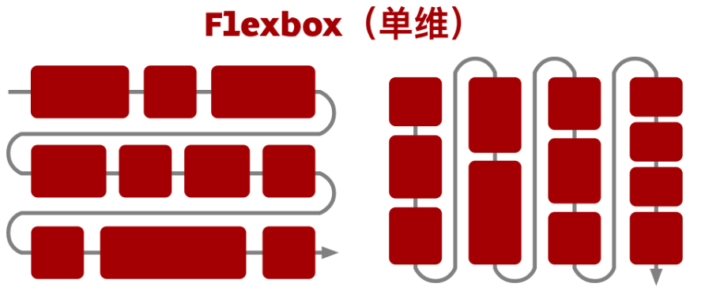

- Grid Layout 则是二维布局，可以灵活的控制水平和垂直方向内容元素的布局

  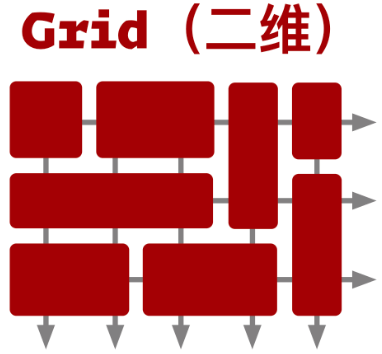

我们使用 Grid Layout 重写前面的例子，代码会比 Flexbox layout 版本的更加简便，[在线代码演示](https://codepen.io/wjw020206/pen/EaagLxa)。


## 总结

本文主要介绍了响应式设计的相关概念以及各种**布局实现方式**，包括传统的浮动+百分比布局、现代的 Flexbox 和 CSS Grid，并结合媒体查询构建了基础的栅格系统。

但响应式设计不仅仅是根据设备显示合适的排版，还有**移动端适配、资源的适配（如图片、字体）也同样重要**，但由于全写一起篇幅过长，所以打算放到下一篇文章中写。


## 参考文章

- [前端响应式布局原理与方案（详细版）响应式布局指的是同一页面在不同屏幕尺寸下有不同的布局。传统的开发方式是PC端开发一套， - 掘金](https://juejin.cn/post/6844903814332432397)

- [前端基础知识概述 -- 移动端开发的屏幕、图像、字体与布局的兼容适配](https://github.com/chokcoco/cnblogsArticle/issues/25)
- [响应式设计 VS 自适应设计现在，移动设备普遍，用户量远超桌面设备，很多用户使用移动设备（手机、平板等）浏览网站。于是， - 掘金](https://juejin.cn/post/6868105073868668936)
- [The 100% correct way to do CSS breakpoints | by David Gilbertson | We’ve moved to freeCodeCamp.org/news | Medium](https://medium.com/free-code-camp/the-100-correct-way-to-do-css-breakpoints-88d6a5ba1862)
- [自适应网页设计（Responsive Web Design） - 阮一峰的网络日志](https://www.ruanyifeng.com/blog/2012/05/responsive_web_design.html)
