# CSS专题之响应式设计(下)


## 前言

> 石匠敲击石头的第 11 次

上一篇文章我们讲了什么是响应式设计以及响应式设计一些相关的概念，并分别用三种方案实现了一个拥有响应式设计的网页。今天这篇文章我将着重讲移动端适配、资源（如图片、字体）适配。


## 什么是移动端适配

移动端发展至今，各种移动设备的尺寸五花八门，但 UI 设计师通常只会提供大小固定的设计稿（例如尺寸为`750px * 1334px` 的设计稿），所以前端不得不面对一个问题，**如何让基于一份设计稿制作的页面，在不同移动设备上保持一致的展示效果？**

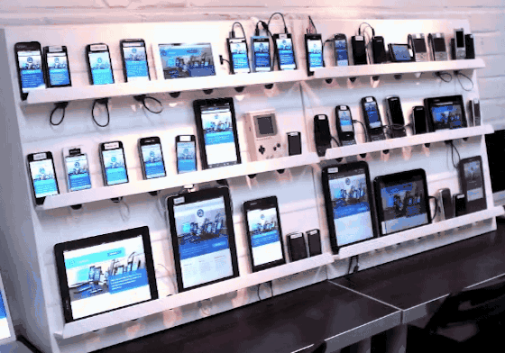

虽然我们上一篇文章中提到了 **CSS 媒体查询**，可以让网页在不同屏幕尺寸下自适应布局，但如果想要在不同设备上**做到像素级别接近设计稿的还原效果**，光靠媒体查询远远不够，所以才有了移动端适配。

**移动端适配就是让网页在不同尺寸、不同分辨率的移动设备上，都能保持良好的布局和视觉效果的一种技术处理。**


## 基础概念

在讲移动端适配方案之前，我们需要先理解一些基础概念。


### 设备独立像素

下图大家应该都很熟悉，就是 Chrome 开发者工具，这里我们选用了 iPhone 6/7/8，可以看到中间部分显示的是 `375 × 667`。

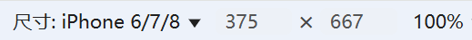

那么这里的 `375 X 667` 到底是什么意思？这里表示的是**设备独立像素（Device Independent Pixel，简称 DIP）**，也可以理解为是 **CSS 像素** 或者 **逻辑像素**。

通常来说，当我们在 CSS 中给一个元素设置尺寸，例如 `width: 100px; height: 100px;`，实际上是设置了它的**设备独立像素大小**。

**设备独立像素 = CSS 像素 = 逻辑像素**


### 物理像素

以苹果官网[iPhone 6 - 技术规格](https://support.apple.com/zh-cn/111954)文档为例，在显示屏一栏中可以看到 `1334 x 750` 像素分辨率。

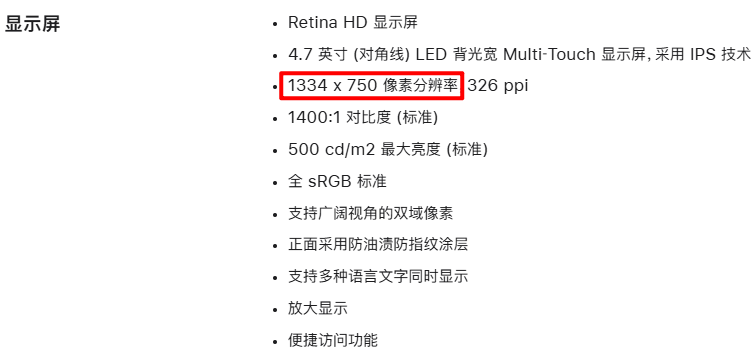

这里的 `1334 x 750` 像素分辨率指的是屏幕的**物理像素（Physical Pixel）**，也可以理解为是 **设备像素**，在同一个设备中，物理像素的固定的，当屏幕从工厂出来那天起，它上面的物理像素点就固定不变了，`1334 x 750` 表示屏幕在垂直和水平上的物理像素点数。

**物理像素 = 设备像素**


###  设备像素比

知道了前面的 **设备独立像素** 和 **物理像素** 的概念后，就可以更好的理解**设备像素比（Device Pixel Ratio，简称 DPR）**。

设备像素比指的是**未缩放状态下**，物理像素和设备独立像素的初始比值关系。

DPR 的计算公式如下：

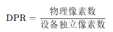

以 iPhone 6 为例：

- 物理像素是 `750 X 1334`
- 设备独立像素是 `375 X 667`

所以它的宽度像素比计算如下：

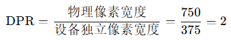

在高度方向上计算也是一样的：

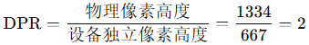

所以我们可以得出 **iPhone 6 的设备像素比（DPR）是 2**。

表示在 iPhone 6 中 **每一个设备独立像素（CSS像素）由 2 × 2 = 4 个物理像素组成**，这也就是我们常说的**视网膜显示屏（Retina Display）。**

视网膜显示屏是苹果公司设计和委托制造的显示屏幕，`DPR > 1` 的屏幕都可以被称为视网膜显示屏。

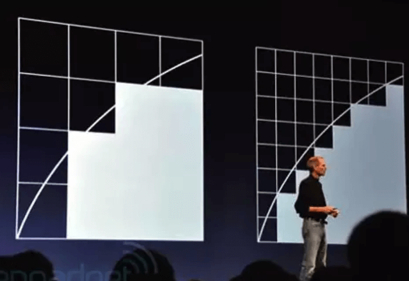

在视网膜屏中，由多个像素来代替原来一个像素，可以使得元素看起来更精致，但元素本身的大小没有改变。

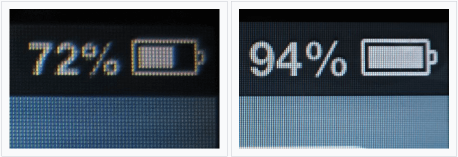

在 Chrome 开发者工具中，我们可以看到设备对应的 DPR。

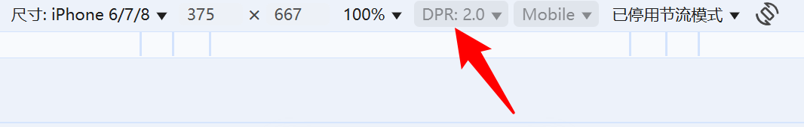

也可以在自适应模式中自定义设备的 DPR。

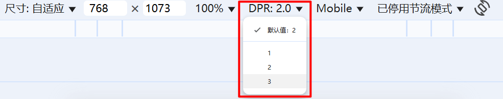


### 像素密度

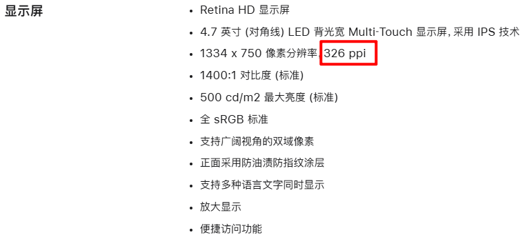

在前面的图中我们还注意到一项重要的参数 `326 ppi`，这就是 **PPI（Pixels Per Inch）**，表示每英寸所包含的像素数量，也叫**像素密度**。**PPI 跟物理像素一样，也是从工厂出来那天起，就固定不变了**。

PPI 的计算公式如下：

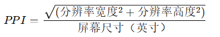

还是以前面的 iPhone 6 为例：

- 分辨率（物理像素）： `750 X 1334`
- 屏幕尺寸：4.7 英寸

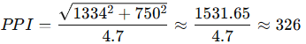

计算结果正好就是 326，与苹果官网参数一致，当时苹果公司给出的视网膜屏幕定义是：只要 PPI 超过了 300，人眼就再也识别不出来屏幕上的像素点了。


以下是相同屏幕大小，但像素密度不同的设备。

- 左边的设备像素较少（PPI 较低），所以文字边缘锯齿明显，看起来较模糊
- 右边的设备像素更多（PPI 较高），文字显示更平滑清晰，视觉体验更好

 **在屏幕大小不变的前提下，像素越密集，图像越清晰**。

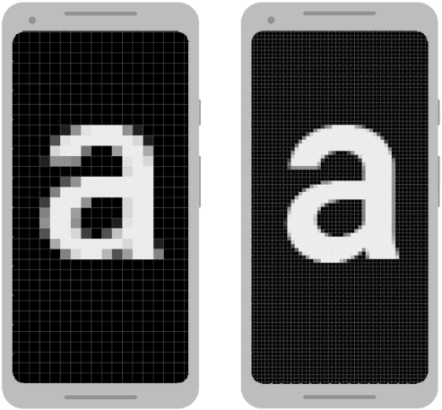


### 视口

**视口（Viewport）** 是浏览器显示页面内容的区域，这个概念最初由苹果公司在推出 iPhone 时引入，目的是为了在移动设备上也能良好展示传统为 PC 设计的网页 —— 即使网页原始尺寸较大，也能自动缩小适配屏幕。

在移动端浏览器中，存在以下三种视口：

- **布局视口（Layout Viewport）**
- **视觉视口（Visual Viewport）**
- **理想视口（Ideal Viewport）**


**布局视口**

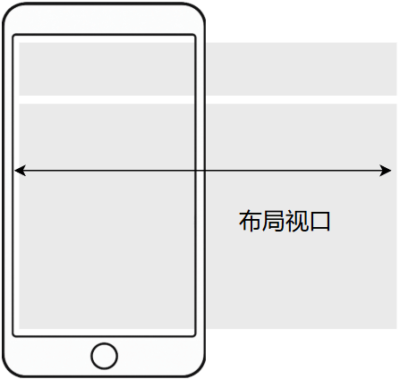

布局视口是浏览器实际用于 CSS 布局的宽度，**当没有添加 `<meta name="viewport" ...>` 时，默认会采用布局视口的规则**，具体表现如下：

- 桌面端浏览器

  - **布局视口宽度默认等于浏览器窗口的宽度**（即 `window.innerWidth`）
  - 当用户调整浏览器窗口大小时，布局视口会同步发生变化

-  移动端浏览器

   -  默认布局视口宽度通常为 **`980px`**（不同浏览器之间略有不同，但普遍在 `800px ~1024px` 之间）

   -  **浏览器会按照 `980px` 的宽度渲染页面，然后再将整个页面缩小来适应手机屏幕宽度（例如 `375px` 的设备独立像素度）**

   -  用户看到的实际内容是缩放的，可能需要手动缩放或横向滚动才能阅读（因为字体被缩小了），就像下面这样

      


**视觉视口**

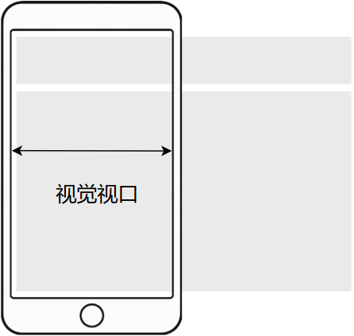

**视觉视口**就是用户当前实际看到的屏幕区域，受缩放和滚动影响。

- 如果用户放大页面，则视觉视口会变小（显示的内容更少）

  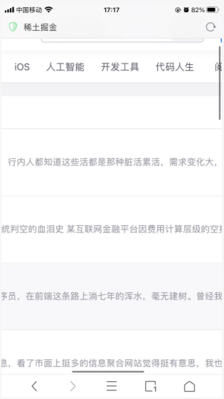

- 如果缩小页面，则视觉视口会变大（显示的内容更多）

  


**理想视口**

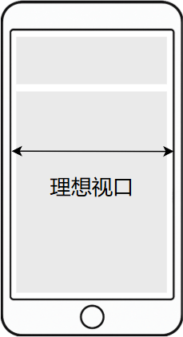


浏览器会根据设备的特性，自动选择一个最合适的“理想布局视口宽度”，这个宽度通常等于该设备的**设备独立像素宽度**，也就是 `device-width`。

可以通过在 `<head>` 中添加如下 `<meta>` 标签，显式告诉浏览器使用理想视口

```html
<meta name="viewport" content="width=device-width, initial-scale=1.0" />
```

**这样一来布局视口的宽度就会等于理想视口的宽度，页面也不会被缩放**，如果对 `<meta>` 标签的用法感兴趣，可以看一下我之前写的这篇文章。

以 iPhone 6 为例，它的物理分辨率为 `750 × 1334`，DPR 为 `2`，那么其理想视口宽度为 `750 / 2 = 375`，即等于它的设备独立像素宽度。

例如掘金在理想视口下的布局

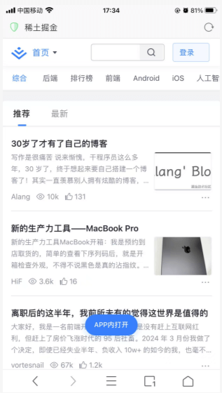


**实践建议**

- 在网页开发的时候建议**始终添加 `<meta name="viewport" ...>` 标签**，这样才能让 `布局视口 = 设备逻辑宽度`，以此确保响应式布局生效
- 不推荐在 `<meta name="viewport" ...>` 标签中添加 `user-scalable=no` 来禁止用户缩放，**可能影响无障碍体验**


## 移动端适配方案

在掌握了设备独立像素、物理像素、DPR 和 PPI 这些基础概念之后，我们终于可以回答一个关键问题：

> **移动端适配到底是在适配什么？**

我认为主要是适配以下两个方面：

- **适配不同屏幕尺寸：** 页面内容在大屏和小屏设备上都能合理展示，不出现溢出或留白
- **适配不同的 DPR：** 即 1 个 设备独立像素对应多少物理像素


### 适配不同屏幕尺寸

适配不同屏幕尺寸需要确保元素大小和屏幕大小保持一定比例，类似于按比例等比缩放元素大小来还原设计稿。

例如我们有标注尺寸为 `375 X 667` 大小的设计稿。

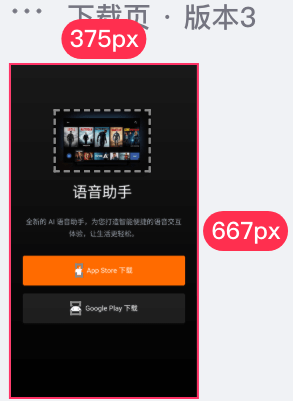

其中一个元素的大小为 `196 X 126`。

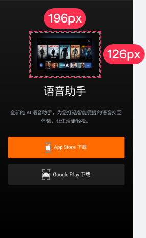

我们根据页面宽度为基准，计算出这个元素的大小在整个页面中的相对比例：

- 元素的宽度：`196 / 375 = 52.26%`
- 元素的高度：`126 / 375 = 33.6%`
- 其他如 `margin`、`padding`、`left` 等也可以用同样的方式换算为相对百分比

但可惜的是，百分比单位并不是万能的。我们在前文中提到过，`%` 在 CSS 中的**基准值依赖于属性和上下文**，并不总是直观或统一的。例如：

- `width` 使用百分比时，是相对于元素包含块的 `width`
- `margin` 和 `padding` 使用百分比时，无论是水平还是垂直方向，**统一都是基于包含块的 `width`**
- `height` 使用百分比时，常常需要父元素有明确的高度
- 某些定位属性如 `top` / `left` 的表现也不总一致……

这些差异会让使用 `%` 单位做响应式布局变得复杂。所以我们需要采用别的方案。


### rem

因为 `rem` 单位是基于 `html` 元素的字体大小来计算具体的值的，所以我们可以通过**动态设置 `html` 元素的 `font-size`** 来实现页面中所有使用 `rem` 单位的元素进行等比缩放。

[flexible](https://github.com/amfe/lib-flexible) 是阿里早期开源的一种移动端适配方案，它的核心思想非常简单：

> **将视口宽度平均分为 10 份，使得 `1rem = 视口宽度 / 10`。**

然后再通过 JavaScript 将计算结果设置给 `html` 元素的 `font-size`。这样我们就可以将设计稿上的 `px` 单位转换为 `rem` 单位。

以前面的设计稿为例：

- 设计稿宽度为 `375`，所以 `1rem = 375 / 10 = 37.5px`

- 元素大小为 `196 X 126`，通过以下计算来转换为 `rem` 单位

  - 宽度：`196 / 37.5 = 5.2267rem`
  - 高度：`126 / 37.5 = 3.36rem`
  - 其他如 `margin`、`padding`、`left` 等也可以用同样的方式换算为 `rem`

[在线预览效果](https://codepen.io/wjw020206/pen/raadELG)

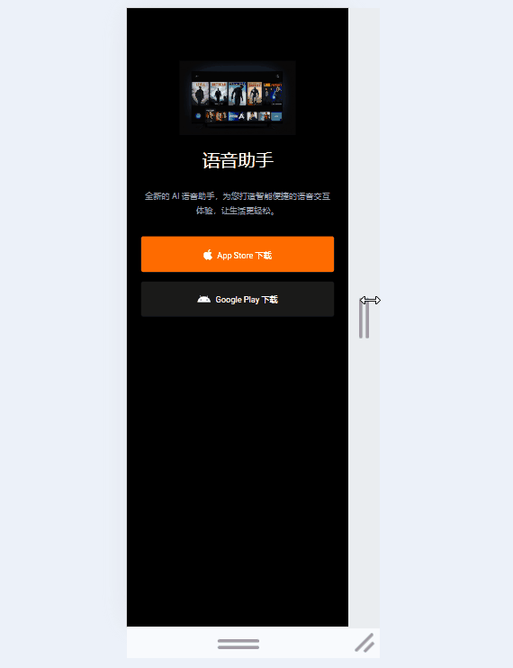

类似的方案还有 [hotcss](https://imochen.github.io/hotcss/)。


### vw

严格来说，使用 `rem` 适配移动端页面是一种 **hack 手段**，因为 `rem` 单位的初衷不是用来进行移动端布局的，就连 [flexible](https://github.com/amfe/lib-flexible) 这个曾经非常流行的适配方案，在它的首页也明确表示**该方案已不再推荐使用，官方建议采用基于 `vw` 的新方案**。

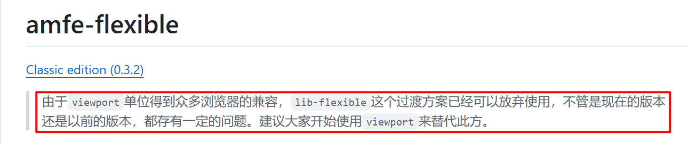

使用 `rem` 适配的方案是不错，但是需要依赖 JavaScript 动态修改根元素的 `font-size`，而 `vw/vh（vmax/vmin）` 的出现很好的弥补了需要 JavaScript 辅助的缺点。

**`1vw` 等于 `window.innerWidth` 的数值的 `1%`**

**`1vh` 等于`window.innerHeight` 的数值的 `1%`**

还是以前面的设计稿为例：

- 设计稿宽度为 `375`

- 元素大小为 `196 X 126`，通过以下计算来转换为 `vw` 单位

  - 宽度：`196 / 375 = 52.2667vw`
  - 高度：`126 / 375 = 33.6vw`
  - 其他如 `margin`、`padding`、`left` 等也可以用同样的方式换算为 `vw`

[在线预览效果](https://codepen.io/wjw020206/pen/qEEKXEL)


### 图片适配及优化

图片通常是**页面中最占流量、加载最慢的资源之一**，在移动端中这种问题尤为明显，既影响加载速度，也影响用户体验。

通常我们有以下优化手段：

1. **去除无用图片资源**：删除冗余图片、避免加载未展示的图像
2. **选择合适的图片格式**：例如 WebP、AVIF 等更高效的现代格式
3. **使用矢量图（SVG/CSS3）代替部分位图**：图标、简单图形建议用 SVG
4. **按 DPR 提供多种分辨率图片**：结合 `srcset` 和 `sizes` 让浏览器自动选择
5. **图片懒加载**：只在用户滚动到时才加载图片，减少首屏体积
6. **使用 CDN 缓存和压缩服务**：提升加载速度，减小文件大小


本文主要聚焦的是第四点：**为不同 DPR 提供合适分辨率的图片资源**。

假设在移动端页面中有一张尺寸为 `200 × 400` 的图片（CSS 像素），在不同设备上由于 DPR（设备像素比）不同，实际需要加载的图片像素尺寸也不同：

- 对于 DPR = 1 的设备，需要加载一张 `200 × 400` 的图片

- DPR = 2 时，需要 `400 × 800`

- DPR = 3 时，则需要 `600 × 1200`

如果我们为了省事，直接统一使用三倍图（`600 × 1200`），虽然能保证在高分屏下足够清晰，但在低分辨率设备上却会**带来不必要的带宽浪费**，影响加载速度和用户体验。

好在现代浏览器支持使用 `` 标签的 `srcset` 和 `sizes` 属性，让我们可以**为不同 DPR 提供不同分辨率的图片**，由浏览器自动选择最合适的图片进行加载。


**使用 srcset 属性适配 DPR**

```html

```

上述代码中的 `1x`、`2x`、`3x` 表示**设备像素比描述符**

- 当屏幕的 DPR = 1 时，使用 `img@1x.jpg` 这张图
- 当屏幕的 DPR = 2 时，使用 `img@2x.jpg` 这张图
- 当屏幕的 DPR = 3 时，使用 `img@3x.jpg` 这张图

**⚠️ 注意：** 如果当前浏览器不支持 `srcset` 属性，则退回使用 `src` 中配置图片，上述代码就是会退回使用 `img@1x.jpg` 这张图。


**使用 srcset 属性的 w 宽度描述符配合 sizes 属性**

`w` 描述符用于表示图片资源的**实际 CSS 像素宽度**，而 `sizes` 属性告诉浏览器在不同的视口条件下，图片将会占据多宽的布局空间。浏览器会基于这些信息，自动选择最合适的图片资源进行加载。

```html

```

上面这段代码，浏览器首先会根据当前视口的宽度来解析 `sizes="(min-width: 600px) 600px, 300px"`，判断图片在当前布局下应该占据多少像素的宽度。

- 当视口宽度大于等于 `600px` 时，则图片的**展示宽度为 `600px` **
- 反之（视口宽度小于 `600px` 时），图片的**展示宽度为 `300px` **

**⚠️ 注意：** 这里的**展示宽度**是浏览器**用于选择资源的参考值**，并不意味着图片的实际宽度会随之改变，如果希望图片在不同视口下真实显示出不同的宽度，还需要通过 CSS 或 JavaScript 显式设置其样式。


接下来就是看 `srcset="img@1x.jpg 300w, img@2x.jpg 600w, img@3x.jpg 1200w"`，里面的 `300w`、`600w`、`1200w` 表示**宽度描述符**，需要结合前面的 `sizes` 属性确定的值进行计算，计算过程如下：

**假设视口宽度为 `375px`，DPR = 2**

1. 浏览器首先根据 `sizes` 属性判断图片在当前视口下的**展示宽度**为 `300px`
2. 然后将 `srcset` 中的每张图片的实际宽度除以展示宽度，计算其**等效 DPR**
   1. `300w / 300px = 1`
   2. `600w / 300px = 2`
   3. `1200w / 300px = 4`
3. 浏览器会选择最接近设备 DPR 的图片（不小于设备 DPR 且尽可能接近），所以会选择 `600w` 对应的 `img@2x.jpg`


**假设视口宽度为 `375px`，DPR = 3**

1. 依然计算出展示宽度为 `300px`
2. 与 `srcset` 中候选资源比值
   1. `300w / 300px = 1`
   2. `600w / 300px = 2`
   3. `1200w / 300px = 4`
3. 因为 `600w` 的 DPR = 2 不足以满足设备 DPR，浏览器会选择**最接近但不小于 3 的图片**，即 `1200w`，也就是 `img@3x.jpg`


**假设视口宽度为 `1280px`，DPR = 1**

1. 先计算出展示宽度为 `600px`
2. 与 `srcset` 中候选资源比值
   1. `300w / 600px = 0.5`
   2. `600w / 600px = 1`
   3. `1200w / 600px = 2`
3. 因为设备 DPR = 1，所以选择 `600w`，即 `img@2x.jpg`


### 字体适配及优化

**字体大小**

浏览器有最小字体的限制：

- 在 PC 上最小 `font-size: 12px`
- 在手机上最小 `font-size: 8px`

**⚠️ 注意：** Chrome 118 版本后字体大小最小限制默认关闭了，支持小于 12px 的字体大小。


**字体选择**

Web 字体是拖慢网页加载时间的主要原因之一，仅次于图片资源。因此，我们**应尽可能使用用户设备上已有的字体，而不是额外下载字体文件**。

使用系统字体不仅可以提升加载速度，还能与操作系统原生界面保持一致，从而获得更好的视觉统一性和用户体验。

目前主流操作系统包括 Windows、macOS、iOS、Android、Linux 等。我们可以参考 [CSS-Tricks](https://css-tricks.com/) 网站使用的一段 `font-family` 配置，看看它是如何兼顾不同平台的：

```css
font-family: Blanco, system-ui, -apple-system, BlinkMacSystemFont, Segoe UI, Roboto, Helvetica, Arial, sans-serif, Apple Color Emoji, Segoe UI Emoji, Segoe UI Symbol;
```

我们来分析下 `font-family` 属性的值类型，它主要可以设置两类字体：

- **具体字体族名**：指定明确的字体名称，例如 `font-family: Microsoft YaHei;` 表示优先使用 “微软雅黑” 字体。

- **通用字体族名**：用于作为最后的兜底字体，当前面指定的具体字体族都不可用时使用。在 [CSS Fonts Module Level 3](https://www.w3.org/TR/2018/REC-css-fonts-3-20180920/#generic-font-families) 规范中定义了如下几个通用字体族名：

  - `serif`：衬线字体族（如 Times New Roman）
  - `sans-serif`：无衬线字体族（如 Arial）
  - `monospace`：等宽字体族（如 Courier New）
  - `cursive`：草书或手写体（如 Comic Sans MS）
  - `fantasy`：具有艺术装饰风格的字体（如 Papyrus）

  新的 CSS 规范 [CSS Fonts Module Level 4](https://www.w3.org/TR/css-fonts-4/#generic-font-families) 中又新增了如下几个通用字体族名：

  - `system-ui`：使用操作系统默认 UI 字体
  - `emoji`：专门用于渲染 emoji 表情符号的字体
  - `math`：用于数学符号或表达式的字体
  - `fangsong`：针对中文仿宋体（仿宋_GB2312）设计，主要用于中文排版中的正式文档或书籍风格


**system-ui**

`font-family: system-ui;` 的目的就是为了在不同的操作系统中自动选择本操作系统下的默认系统字体，**非常推荐在日常开发中使用。**


**-apple-system / BlinkMacSystemFont**

我们发现这两个字体族没有在最新的标准里出现，这是因为 `system-ui` 是新的 CSS 规范 [CSS Fonts Module Level 4](https://www.w3.org/TR/css-fonts-4/#generic-font-families) 新增的，但不是所有平台都支持，例如在 [system-ui value for font-family | Can I use](https://caniuse.com/font-family-system-ui) 就有描述，**在 macOS 和 iOS 上，我们需要使用 `-apple-system` 及 `BlinkMacSystemFont` 来兼容适配 `system-ui` 标准。**

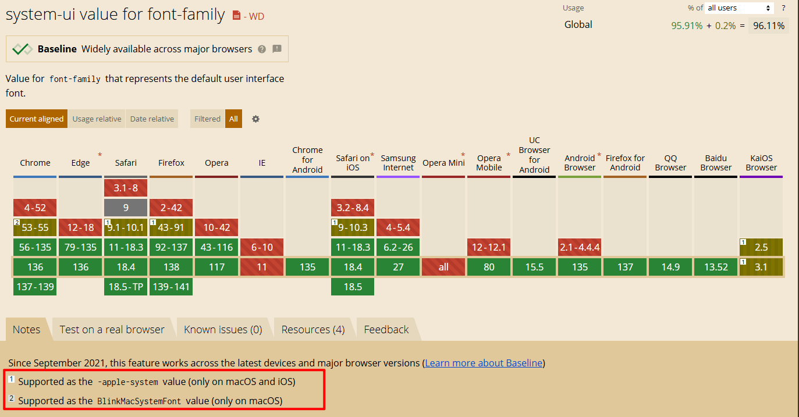


**总结**

知道了上面这些，我们大致上就可以看懂 [CSS-Tricks](https://css-tricks.com/) 网站的 `font-family` 配置

```css
font-family: Blanco, system-ui, -apple-system, BlinkMacSystemFont, Segoe UI, Roboto, Helvetica, Arial, sans-serif, Apple Color Emoji, Segoe UI Emoji, Segoe UI Symbol;
```

1. **Blanco**：网站自定义品牌字体，优先加载显示
2. **system-ui**：使用各支持平台上的默认系统字体
3. **-apple-system**：用于兼容在旧版 macOS/iOS 浏览器上的 `system-ui`
4. **BlinkMacSystemFont**：用于兼容在旧版 macOS/iOS 浏览器上的 `system-ui`
5. **Segoe UI**：Windows 和 Windows Phone 上的系统默认字体
6. **Roboto**：Android 及部分新版 Chrome OS 的系统默认字体
7. **Helvetica**：低版本浏览器中的通用无衬线字体替代方案
8. **Arial**：低版本浏览器中的通用无衬线字体替代方案
9. **sans-serif**：最终兜底字体，确保至少使用无衬线风格
10. **Apple Color Emoji**：macOS/iOS 上的原生彩色 emoji 字体
11. **Segoe UI Emoji**：Windows 上的 emoji 字体
12. **Segoe UI Symbol**：Windows 上的符号字体，含部分 emoji 和图形字符


### 1px 问题与解决方案

`1px` 问题是前端开发中经常遇到、也常出现在面试中的一个细节问题。在移动设备上，尤其是 Retina 屏（即设备像素比 DPR > 1）中，设计稿中标注的 `1px` 细线，**在真实页面中会显得比预期更粗，影响视觉精度**。


**问题原因**

以一台 **DPR = 2** 的设备为例：

- 设计稿中的 `1px` 是**物理像素**

- 而 CSS 中写的 `1px` 是**设备独立像素（CSS 像素）**

- 在 DPR 为 2 的设备中，`1 设备独立像素 = 2 × 2 = 4 个物理像素`

- 所以就导致在 CSS 中写的 `border-top: 1px solid red`，浏览器会用 **2 条物理像素宽的线来渲染它**

例如下面这个例子：

  ```html
  <div class="box"></div>
  ```

  ```css
  .box {
    width: 50px;
    height: 50px;
    background: #ccc;
    border-top: 1px solid red;
  }
  ```
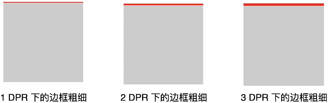


**解决方案**

我们可以通过 CSS 的媒体查询来为高 DPR 的屏幕单独调整边框粗细。

```css
@media only screen and (-webkit-min-device-pixel-ratio: 2), only screen and (min-resolution: 192dpi) {
  /* 调整边框粗细 */
}
```

**⚠️ 注意：** 基于分辨率的媒体查询因为比较新，浏览器支持得不好，在部分老的浏览器（比如 IE9~11 和 Opera Mini 等）不支持 `dppx` 单位，所以使用  `dpi`（每英寸的像素点数）单位代替（比如用 `192dpi` 代替 `2dppx`）

`dpi` 是 **物理单位**，指每英寸包含的物理像素点数量，CSS 中的 `1in`（英寸）= `96px`（设备独立像素）

- `96dpi` ≈ **DPR = 1** = `1dppx`
- `192dpi` ≈ **DPR = 2** = `2dppx`
- `288dpi` ≈ **DPR = 3** = `3dppx`

或者也可以通过 JavaScript 的 `window.devicePixelRatio` 来获取当前屏幕的 DPR，并动态调整边框粗细。

```js
if (window.devicePixelRatio && window.devicePixelRatio > 1) {
  /* 调整边框粗细 */
}
```


可能会有人想到使用如下方式解决高 DPR 屏幕下边框粗细的问题。

```css
.box {
  border-top: 1px solid #999;
}

@media only screen and (-webkit-min-device-pixel-ratio: 2), only screen and (min-resolution: 192dpi) {
  .box {
    border-top: 0.5px solid #999; /* DPR = 2 时使用 0.5 CSS 像素的边框 */
  }
}

@media only screen and (-webkit-min-device-pixel-ratio: 3), only screen and (min-resolution: 288dpi) {
  .box {
    border-top: 0.33px solid #999; /* DPR = 3 时使用 0.33 CSS 像素的边框 */
  }
}
```

**⚠️ 注意：** 这个方式在现代浏览器中（比如新版本的 Safari、Chrome）是可行的，**但在 iOS 7 以下或部分 Android 浏览器中，小于 `1px` 的单位会被当作 `0px` 处理，所以不推荐使用这种方式**。


下面推荐四种实际可行的方式

- **使用渐变实现**

  ```html
  <div class="box"></div>
  ```
  
  ```css
  .box {
    width: 50px;
    height: 50px;
    background: #ccc;
    border-top: 1px solid red;
  }
  
  @media only screen and (-webkit-min-device-pixel-ratio: 2), only screen and (min-resolution: 192dpi) {
    .box {
      /* 使用线性渐变生成一条视觉上的 1px 红色线：
      从元素底部向顶部方向，前 50% 是透明的，后 50% 是红色 */
      background-image: linear-gradient(to top, transparent 50%, red 50%);
  
      /* 设置背景图的尺寸为：宽度 100%（铺满元素），高度仅为 1px */
      background-size: 100% 1px;
      background-repeat: no-repeat;
      background-position: top center;
      /* 移除默认的 border-top，避免和渐变重复 */
      border-top: none;
  
      /* 添加 1px 顶部内边距，为那条背景模拟线提供显示空间（占位） */
      padding-top: 1px;
    }
  }
  
  @media only screen and (-webkit-min-device-pixel-ratio: 3), only screen and (min-resolution: 288dpi) {
    .box {
      background-image: linear-gradient(to top, transparent 66.66%, red 66.66%);
      background-size: 100% 1px;
      background-repeat: no-repeat;
      background-position: top center;
      border-top: none;
      padding-top: 1px;
    }
  }
  ```
  
  
  
- **使用伪元素 + 缩放**

  ```css
  .box {
    width: 50px;
    height: 50px;
    background: #ccc;
    border-top: 1px solid red;
  }
  
  @media only screen and (-webkit-min-device-pixel-ratio: 2), only screen and (min-resolution: 192dpi) {
    .box {
      /* 设置元素为相对定位作为伪元素定位的基准 */
      position: relative;
  
      /* 隐藏原本的边框 */
      border-top: none;
  
      /* 添加 1px 顶部内边距，为定位的伪元素边框占位 */
      padding-top: 1px;
    }
  
    .box::before {
      content: '';
      position: absolute;
      top: 0;
      left: 0;
      /* 因为进行 0.5 倍缩放，所以宽度会缩小一半，故使用 200% 宽度 */
      width: 200%;
      border-top: 1px solid red;
  
      /* 对 1px 边框进行 0.5 倍缩放 */
      transform: scale(0.5);
      transform-origin: 0 0;
      box-sizing: border-box;
    }
  }
  
  @media only screen and (-webkit-min-device-pixel-ratio: 3), only screen and (min-resolution: 288dpi) {
    .box {
      position: relative;
      border-top: none;
      padding-top: 1px;
    }
  
    .box::before {
      content: '';
      position: absolute;
      top: 0;
      left: 0;
      width: 300%;
      border-top: 1px solid red;
      transform: scale(0.33);
      transform-origin: 0 0;
      box-sizing: border-box;
    }
  }
  ```
  
  

- **使用图片实现（base64）**

  1. 首先使用 Photoshop 等图片绘制工具，制作一张 `1 X 2` 像素大小的图片，并设置边框颜色。

     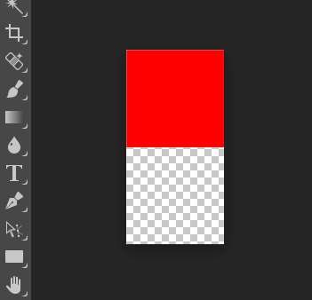

     

  2. 导出为 PNG 图片并转换为 Base64 编码

     ```
     data:image/png;base64,iVBORw0KGgoAAAANSUhEUgAAAAEAAAACAQMAAACjTyRkAAAAAXNSR0IB2cksfwAAAAlwSFlzAAAOxAAADsQBlSsOGwAAAAZQTFRF/wAAAAAAQaMSAwAAAAJ0Uk5T/wDltzBKAAAADElEQVR4nGNkYGwAAACKAIOERterAAAAAElFTkSuQmCC
     ```

     **⚠️ 注意：** 这里使用 Base64 编码是为了避免浏览器额外的网络请求，从而提升加载性能。

     

  3. 使用如下方式使用图片

     ```css
     .box {
       width: 50px;
       height: 50px;
       background: #ccc;
       border-top: 1px solid red;
     }
     
     @media only screen and (-webkit-min-device-pixel-ratio: 2), only screen and (min-resolution: 192dpi) {
       .box {
         /* 添加 1px 顶部内边距，为背景图片边框占位 */
         padding-top: 1px;
     
         /* 隐藏原本的边框 */
         border-top: none;
         background-image: url(data:image/png;base64,iVBORw0KGgoAAAANSUhEUgAAAAEAAAACAQMAAACjTyRkAAAAAXNSR0IB2cksfwAAAAlwSFlzAAAOxAAADsQBlSsOGwAAAAZQTFRF/wAAAAAAQaMSAwAAAAJ0Uk5T/wDltzBKAAAADElEQVR4nGNkYGwAAACKAIOERterAAAAAElFTkSuQmCC);
         background-position: 0 0;
     
         /* 设置背景图片 X 轴方向平铺 */
         background-repeat: repeat-x;
     
         /* 背景图片的显示尺寸缩放为 宽 1 像素、高 1 像素 */
         background-size: 1px 1px;
       }
     }
     ```
     
**⚠️ 注意：** 这种方法**无法动态修改边框的颜色**，不推荐使用。
     

- **使用 SVG 实现**

  ```css
  .box {
    width: 50px;
    height: 50px;
    background: #ccc;
    border-top: 1px solid red;
  }
  
  @media only screen and (-webkit-min-device-pixel-ratio: 2), only screen and (min-resolution: 192dpi) {
    .box {
      /* 隐藏原本的边框 */
      border-top: none;
  
      /* 使用 url 引用 SVG，并设置 SVG 的高度为 0.5，并且 y 轴设置为 0.5 居中对齐*/
      background-image: url("data:image/svg+xml,%3Csvg xmlns='http://www.w3.org/2000/svg' width='100%25' height='1'%3E%3Crect fill='red' x='0' y='0.5' width='100%25' height='0.5'/%3E%3C/svg%3E");
      background-position: 0 0;
      background-repeat: no-repeat;
    }
  }
  
  @media only screen and (-webkit-min-device-pixel-ratio: 3), only screen and (min-resolution: 288dpi) {
    .box {
      border-top: none;
      background-image: url("data:image/svg+xml,%3Csvg xmlns='http://www.w3.org/2000/svg' width='100%25' height='1'%3E%3Crect fill='red' x='0' y='0.67' width='100%25' height='0.33'/%3E%3C/svg%3E");
      background-position: 0 0;
      background-repeat: no-repeat;
    }
  }
  ```
  
  **⚠️ 注意：** 在 `background-image: url()` 中使用**未经编码的 SVG 字符串**很容易出错导致没效果，建议转码后使用。

上述四种方法最终效果如下：

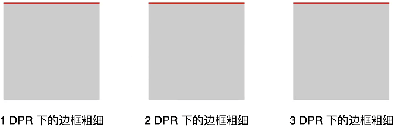


## 简化计算

在实际开发中，我们如果每次都手动将 `px` 转换为 `rem` 或者 `vm`，肯定会影响开发效率，有以下三种方式简化计算步骤：

1. **使用代码编辑器扩展**，例如 VS Code 上的扩展 [px to rem & rpx & vw (cssrem)](https://marketplace.visualstudio.com/items/?itemName=cipchk.cssrem) 或者 JetBrains IDE 上的扩展 [px2rem](https://plugins.jetbrains.com/plugin/11187-px2rem)

   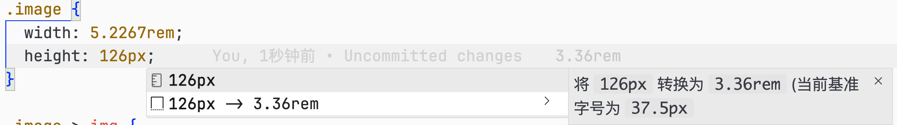

2. **使用 CSS 预处理器**，如：Scss 或者 Less

   - `rem` 方案

     ```scss
     // 假设设计稿的宽度是 375px，假设取设计稿宽度下 1rem = 37.5px （375px 平分为 10 份）
     $baseFontSize: 37.5;
     
     @function px2rem($px) {
       @return $px / $baseFontSize * 1rem;
     }
     ```

   - `vw` 方案

     ```scss
     // 假设设计稿的宽度是 375px
     $baseWidth: 375;
     
     @function px2vw($px) {
       @return $px / $baseWidth * 100vw;
     }
     ```

3.  **使用 PostCSS 插件（推荐）**

   - [postcss-pxtorem](https://github.com/cuth/postcss-pxtorem) 插件：会自动将 CSS 文件中的 `px` 单位转换为 `rem` 单位
   - [postcss-px-to-viewport](https://github.com/evrone/postcss-px-to-viewport) 插件：会自动将 CSS 文件中的 `px` 单位转换为 `vw` 单位


## 总结

- **移动端适配的目标：** 让网页在不同尺寸和分辨率的移动设备上，都能保持一致且良好的展示效果
- **基础概念：**
  - **设备独立像素（DIP）：** CSS 中的逻辑像素
  - **物理像素：** 设备硬件上的真实像素点
  - **设备像素比（DPR）：** 物理像素与逻辑像素的比值
  - **像素密度（PPI）：** 每英寸所包含的像素点数，决定显示清晰度
  - **视口（Viewport）：** 分为布局视口、视觉视口、理想视口，用于控制页面渲染与显示
- **适配方案详解**
  - **百分比布局：** 按设计稿的比例换算为 `%`，但存在兼容性问题
  - **rem 方案：** 通过设置 `html` 的 `font-size` 实现相对单位适配（如 flexible.js）
  - **vw 方案：** 使用视口宽度单位 (`vw`) 实现自适应布局，**推荐替代 rem**
  - **meta viewport 设置：** 设定 `width=device-width` 是实现理想视口适配的关键
- **资源适配优化：** 优先推荐使用系统字体，并且不无脑统一使用多倍图，而是根据 DPR 动态加载图片
- **1px 问题：** 通过以下四种方案解决高 DPR 屏幕下的 `1px` 边框线的显示问题
  - 渐变实现
  - 使用缩放实现
  - 使用图片实现
  - 使用 SVG 实现


## 参考文章

- [前端基础知识概述 -- 移动端开发的屏幕、图像、字体与布局的兼容适配 · Issue #25 · chokcoco/cnblogsArticle](https://github.com/chokcoco/cnblogsArticle/issues/25)
- [使用Flexible实现手淘H5页面的终端适配 - 前端开发者学堂 (fedev.cn) - 前端开发社区](https://fedev.cn/mobile/lib-flexible-for-html5-layout.html)
- [超详细讲解H5移动端适配移动互联网发展至今，各种移动设备应运而生，但它们的物理分辨率可以说是五花八门，还不了解H5移动端 - 掘金](https://juejin.cn/post/7085931616136069156?searchId=202504280803533C31E001609097AF9274)
- [谈谈 H5 移动端适配原理前言 H5 移动端 开发的必不可少的一个环节就是 移动端网页的适配，因为 UI 通常只会提供 - 掘金](https://juejin.cn/post/7266671630025031699)
- [支持不同的像素密度  | Compatibility  | Android Developers](https://developer.android.com/training/multiscreen/screendensities?hl=zh_cn)
