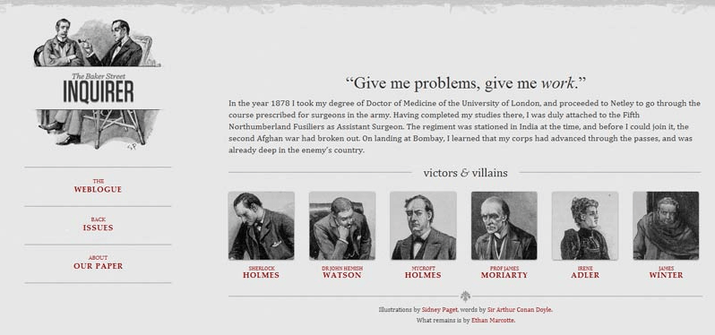
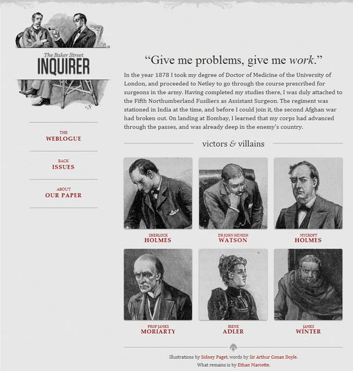

# CSS专题之响应式设计

## 前言

> 石匠敲击石头的第 10 次

作为一名前端开发，响应式设计可以说是一定要会的，毕竟前端的一大工作内容就是去兼容页面在不同浏览器、不同设备中能够正常工作。但是这块知识点我认为相比于其它知识点有一点点难度，因为涉及前端布局的历史发展以及很多其它的概念。

在看了很多大佬的文章之后打算写一篇文章来好好梳理一下，如果哪里写的有问题欢迎指出。

## 什么是响应式设计

响应式设计英文全称是 Responsive Web Design，简称为 **RWD**。拥有响应式设计的网站理论上可以适配不同设备屏幕的大小。**可以把网页内容比作水，而设备就像装水的容器——无论容器如何变化，水总能随之适应，保持最佳形态。**

这个概念最早是由 Ethan Marcotte 在 2010 年提出的，他还制作了一个示例，让我们可以直观的对响应式设计有一个直观的了解。

当屏幕宽度大于 1300 像素，则 6 张图片并排在一行。

当屏幕宽度在 600 像素到 1300 像素之间，则 6 张图片分成两行。

当屏幕宽度在 400 像素到 600 像素之间，则将导航栏移到网页头部。

最后当屏幕宽度在 400 像素以下，则 6 张图片分成三行。

### 为什么需要响应式设计

