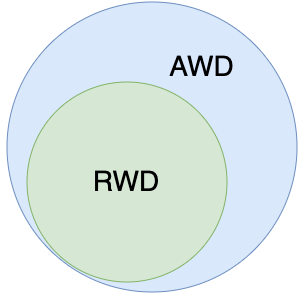
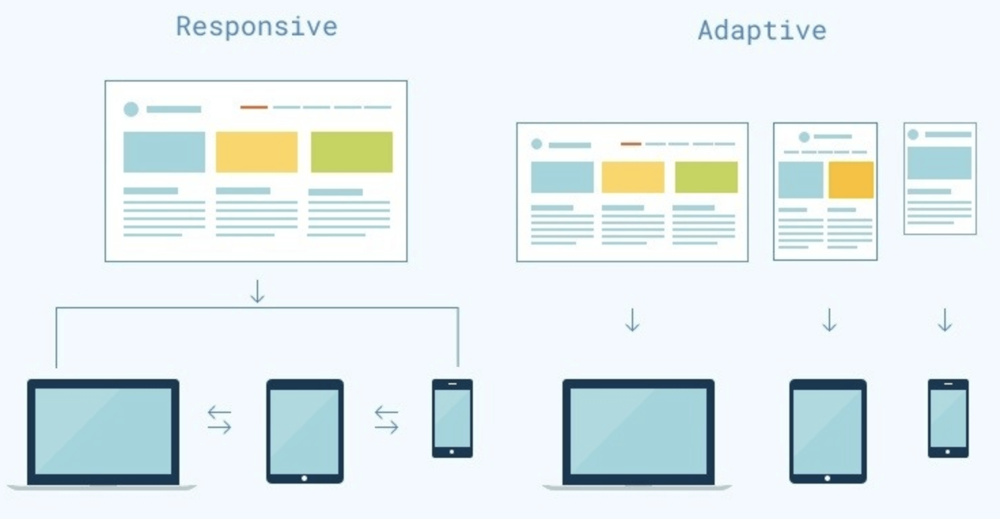

# CSS专题之响应式设计

## 前言

> 石匠敲击石头的第 10 次

作为一名前端开发，响应式设计可以说是一定要会的，毕竟前端的一大工作内容就是去兼容页面在不同浏览器、不同设备中能够正常工作。但是这块知识点我认为相比于其它知识点是很有难度，因为涉及前端布局的历史发展以及很多其它的概念。

在看了很多大佬的文章之后打算写一篇文章来好好梳理一下，如果哪里写的有问题欢迎指出。

## 什么是响应式设计

响应式设计英文全称是 Responsive Web Design，简称为 **RWD**。拥有响应式设计的网站理论上可以适配不同设备屏幕的大小。**可以把网页内容比作水，而设备就像装水的容器——无论容器如何变化，水总能随之适应，保持最佳形态。**

这个概念最早是由 Ethan Marcotte 在 2010 年提出的，他还制作了一个示例，让我们可以直观的对响应式设计有一个直观的了解。

当屏幕宽度大于 1300 像素，则 6 张图片并排在一行。

当屏幕宽度在 600 像素到 1300 像素之间，则 6 张图片分成两行。

当屏幕宽度在 400 像素到 600 像素之间，则将导航栏移到网页头部。

最后当屏幕宽度在 400 像素以下，则 6 张图片分成三行。

## 为什么需要响应式设计

要理解响应式设计的必要性，得从 Web 页面的发展历程说起。在早期的计算机应用程序开发和印刷出版中，开发人员和出版商往往清楚的知道媒介的物理限制，例如程序的窗口大小或页面尺寸都是固定的，因此可以使用固定单位（如像素或英寸）来精确布局。

受此影响，早期 Web 设计沿用了**"像素级完美"**理念：通过一个居中的固定宽度容器（通常约 `800px` 宽），在固定范围内进行精确排版，这种方式类似于传统应用和印刷设计，如下图所示：

但随着技术发展，高清显示器逐渐普及，此时人们探讨是否可以安全的把网页宽度设计成 `1024px` 宽(而不是 `800px`)，之后又开始讨论 `1280px` 宽，但这样还是难以兼顾不同设备的多样化屏幕尺寸。

直到智能手机的出现，彻底打破了固定布局的可行性，为了适配各种设备尺寸，Web 设计不得不抛弃传统的固定宽度方案，转而采用**响应式设计**的思路。

## 响应式设计的原则

响应式设计大致有以下几个原则：

1. **流式布局（Fluid Grid Layout）**
   - 使用相对单位而非固定单位
   
   - 内容会根据屏幕大小自动伸缩
   
2. **媒体查询（Media Queries）**
   - 根据不同屏幕尺寸加载不同的样式

3. **弹性媒体（Flexible Media）**
   - 图像、视频等媒体内容应能在不同屏幕中自适应大小

4. **内容优先（Content First）**
   - 考虑在各种屏幕上的可读性、可操作性，确保最重要的信息优先展示

## 响应式设计 vs 自适应设计

说到响应式设计，那就不能不提自适应设计，响应式设计是 Responsive Web Design（RWD），但自适应设计是 Adaptive Web Design（AWD）。对于这两者概念，网上很多文章都混淆不清，包括我自己一开始也是分不清楚这两者的区别。

### 两者区别

**响应式设计（RWD）**

这个概念最早是由 Ethan Marcotte 在 2010 年提出的，被大家公认为是 RWD 的起源。他提出的 RWD 方案是通过 HTML 和 CSS 的媒体查询技术，配合流式布局实现。**RWD 更偏向于只改变元素的外观布局，不会大幅度改变内容**，例如：[稀土掘金](https://juejin.cn/)，无论在大屏幕还是小屏幕设备上返回的内容都是一样的，只是布局发生了变化。

**自适应设计（AWD）**

Adaptive Web Design 最早出自 Aaron Gustafson 于 2011 年出版的[书](https://adaptivewebdesign.info/)的标题。他认为 AWD 在包括 RWD 的 CSS 媒体查询技术基础之上，也要使用 JavaScript 来操作 HTML 来更好适应移动设备，所以通常认为，**RWD 是 AWD 的子集**。

AWD 有可能会针对移动端用户**简化内容和功能**。AWD 可以在服务器端根据用户代理（UA）类型选择布局和大小合适的页面，为不同设备提供**不同版本**的网站，例如：[bilibili](https://www.bilibili.com/)，在大屏幕设备上会访问`www.bilibili.com`，返回完整的页面内容，但在小屏幕设备上会访问 `www.bilibili.com` 并重定向为 `m.bilibili.com`，返回精简的页面内容。

**相同点：** RWD 和 AWD 都是为了适配各种不同的移动设备，提升用户体验的技术。

**不同点：** 借用 chokcoco 前辈这篇[文章](https://github.com/chokcoco/cnblogsArticle/issues/25)中的图来说明再合适不过了。

从上图中我们看到 **RWD 偏向于一套代码适配设备，而 AWD 偏向于多套代码适配设备**。

### 如何选择

那我们在平常开发时候应该选择哪一种方案？这里我简单列了一张表来对比一下两个方案。

| 特征     | 响应式设计（RWD）        | 自适应设计（AWD）                   |
| -------- | ------------------------ | ----------------------------------- |
| 页面数量 | 一套页面                 | 多套页面（根据设备选择）            |
| 样式处理 | 使用媒体查询动态调整     | 针对每类设备分别维护                |
| 用户体验 | 一致性好、开发快         | 可定制性强，可精简内容              |
| 技术实现 | 主要依靠 HTML + CSS      | HTML + CSS + JS（甚至服务器端判断） |
| 缺点     | 某些复杂页面适配难度较高 | 维护成本高，需开发多套结构          |

之前在看《深入解析 CSS》书中有讲过一句话，**在 CSS 中最好的答案通常是 “这得看情况”**。这句话用在这里也同样适用：RWD 和 AWD 并不是非此即彼的选择，关键要看项目的类型和实际需求。

- 如果你要开发的是内容站、博客、官网类项目（如[稀土掘金](https://juejin.cn/)），这类项目的页面通常不是很复杂，使用响应式设计就足够了。

- 如果要开发的是像[淘宝](https://www.taobao.com/)、[bilibili](https://www.bilibili.com/) 这种页面比较复杂的项目，更适合采用自适应设计来定制不同设备的体验（比如移动端下拉刷新、精简内容等）。

## 渐进增强 vs 优雅降级

在响应式设计的思想演化过程中，还有两个经常提到的开发策略：**渐进增强**和**优雅降级**。

- **渐进增强（Progressive Enhancement）：** 从最基础的功能出发，优先保证低版本浏览器的可用性，然后再针对高版本的浏览器增强交互和视觉体验。
- **优雅降级（Graceful Degradation）：** 一开始就面向高版本浏览器实现完整的功能，然后再针对低版本浏览器进行兼容。

### 两者区别

两者的区别非常明显，简单来说。

- **渐进增强是从简单到复杂的过程**，先保证能用，再去增强体验。
- **优雅降级则是复杂到简单的过程**，先追求体验，再考虑兼容。

### 如何选择

## 移动端优先 vs PC 端优先

在响应式设计中，设计的起点是个很现实的问题，到底是先以移动设备为核心来构建页面，还是以桌面设备为主？

## 如何实现响应式设计

前面说了那么多，相信你应该想知道如何实现一个拥有响应式设计的网站，我们接下尝试使用几种方案来实现以下这个效果。

