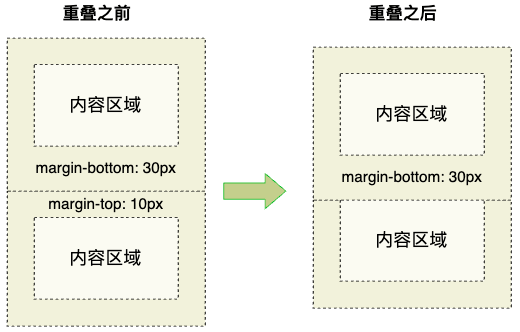
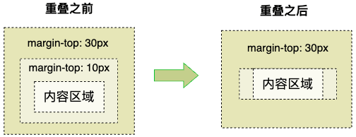
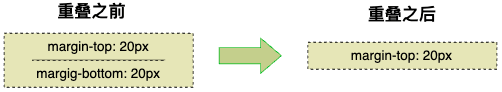
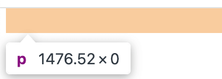
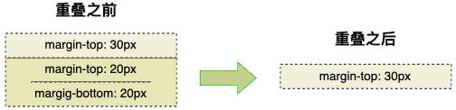
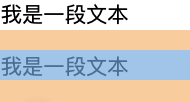

# CSS 专题之外边距重叠


## 前言

> 石匠敲击石头的第 7 次

在上一篇文章中有提到块级盒子有一个特点，垂直方向相邻的外边距（`margin`）会产生 **重叠（合并）** 现象，这也是在开发中会经常遇到的，所以就有了这篇文章，如果哪里写的有问题欢迎指出。


## 什么是外边距重叠

当**块级盒子的垂直方向外边距相邻**时，就会发生外边距 **重叠（合并）** 现象。

- 如果两个值都为正值，则取其中最大的外边距。
- 如果一个正一个负，则取差值作为外边距。
- 如果两个都为负，则取两个之中绝对值最大的作为外边距。




 **⚠️ 注意：** 

- 只有垂直方向的外边距会产生重叠，**水平方向的外边距不会重叠。**
- 行内盒子垂直方向的外边距会被浏览器忽略，所以也就不会重叠。


## 嵌套外边距重叠

嵌套元素的垂直方向的外边距也会发生重叠。




## 自身外边距重叠

当一个高度为 `0px` 的块级元素有上下的外边距时，顶部的外边距也会与底部的外边距发生重叠。




这也就解释了为什么页面中有设置了垂直方向上的外边距的元素，内容为空时依旧会占用外边距空间的原因。

```html
<p></p>
```




在上面的基础上如果与另外一个块级元素的垂直外边距相邻时，外边距会继续重叠。




## 为什么会有外边距重叠

**外边距重叠是 CSS 规范中特意设计的行为**，目的是为了简化布局计算，让相邻的块级元素垂直方向上的间距更自然。

```html
<p>我是一段文本</p>
<p>我是一段文本</p>
```

例如上述这段 HTML 代码，`<p>` 元素是块级元素，浏览器的默认样式（用户代理样式）会为 `<p>` 元素添加上下的外边距，此时它们之间垂直方向上的间距是相同的（因为外边距重叠的原因）。



可以想象，如果没有外边距重叠这个特性，还需要另外写代码来处理。


## 避免外边距重叠

在某些情况下，我们不希望块级元素垂直方向的外边距发生重叠，这时可以采用以下几种方法：

- 给容器元素添加 `overflow: auto`（或者非 `visible` 的值 ），可以避免与内部子元素产生嵌套外边距重叠，**该方法副作用最小。**
- 给容器元素添加边框或者内边距，以此来隔开内部子元素的外边距，避免产生嵌套外边距重叠。
- 如果容器元素为浮动（`float`）、行内块（`inline-block`）、绝对定位或固定定位时，内部子元素不会和外部容器元素产生嵌套外边距重叠。
- 当使用 Flexbox 布局或 Grid 布局时，内部的子元素之间不会发生垂直方向上的外边距重叠。
- **当元素设置为 `display: table-cell` 时，外边距通常不会起作用，所以也不会发生垂直方向上的外边距重叠。**像 `table-row` 和大多数表格相关的显示类型也是这样。但 `table`、`inline-table` 和 `table-caption` 除外，它们的外边距还是会生效的。

**⚠️ 注意：** 这些方法部分会改变布局，除非能产生想要的布局，否则不要轻易使用。


## 总结

- 外边距重叠是指相邻的块级元素垂直方向的外边距会重叠，重叠值计算逻辑如下
  - 如果两个值都为正值，则取其中最大的外边距
  - 如果一个正一个负，则取差值作为外边距
  - 如果两个都为负，则取两个之中绝对值最大的作为外边距
- 有如下外边距重叠发生的条件
  - 相邻块级元素的垂直外边距
  - 嵌套块级元素的外边距
  - 同一元素的上下外边距（自身重叠）
- 外边距重叠是出于 CSS 规范的设计，**简化布局计算**，让内容间距更自然
- 有如下方法可以避免外边距重叠
  - 父元素设置 `overflow` 为非 `visible`（如 `auto`）
  - 父元素添加边框或内边距
  - 使用浮动、绝对定位、`inline-block` 等布局方式
  - 使用 Flex 或 Grid 布局
- 注意事项
  - 只有**垂直方向**外边距会重叠
  - 行内元素的垂直 margin 会被忽略，因此不会发生重叠


## 参考文章

- [《深入解析CSS》Keith J.Grant 3.4 章节](https://book.douban.com/subject/35021471/)
- [速通BFC知识点，BFC规则全覆盖，看完全明白！！！引言 本次讨论将深入探讨BFC（Block Formatting C - 掘金](https://juejin.cn/post/7454005481503096847?searchId=20250405165202DFF9581FA8813041338F)
