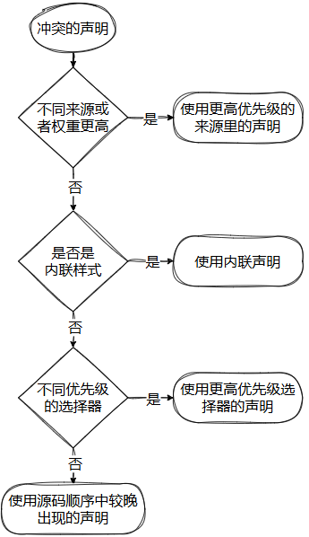

# CSS专题之层叠

## 前言

> 石匠敲击石头的第 4 次

CSS 英文全称为 Cascading Style Sheets，中文翻译为 **“层叠样式表”**，那究竟什么是层叠？我却说不出个所以然，所以打算写一篇文章来梳理一下，如果哪里写的有问题欢迎指出。

## 层叠是什么

层叠是指多个样式规则同时作用于同一个元素时，浏览器通过一套明确的优先级规则来决定最终生效的样式。

简单来说就是**层叠就是浏览器应用样式的优先级规则**。

下图是层叠优先级规则判断的流程。

