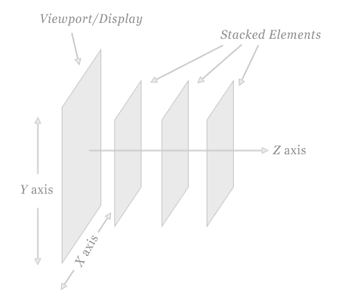
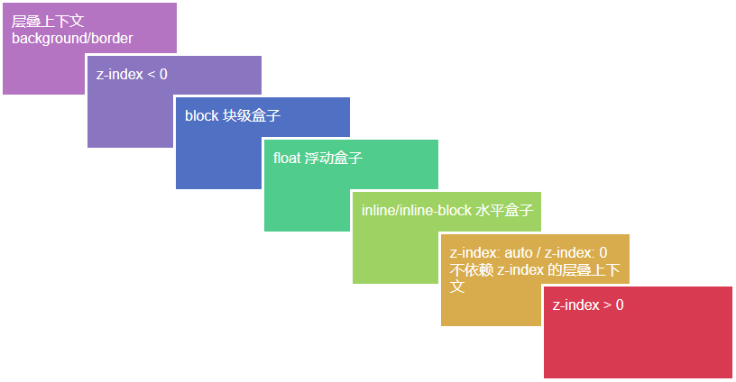
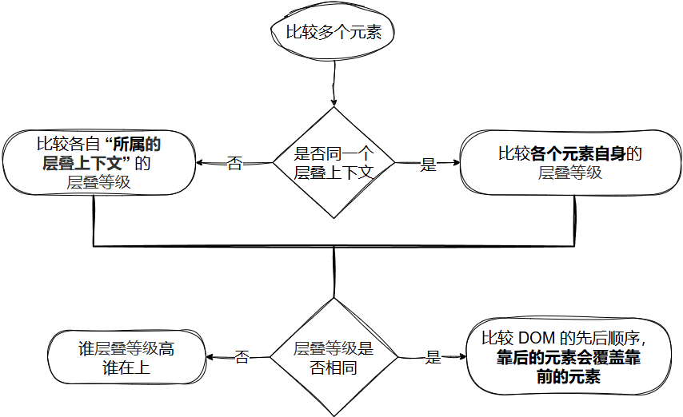
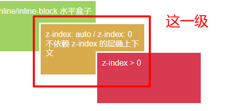
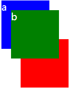
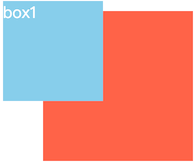

# CSS专题之层叠上下文


## 前言

> 石匠敲击石头的第 15 次

在平常开发的时候，有时候会遇到使用 `z-index` 调整元素层级没有效果的情况，究其原因还是因为对层叠上下文不太了解，看了网上很多前辈的文章，决定打算写一篇文章来梳理一下，如果哪里写的有问题欢迎指出，不胜感激。


## 什么是层叠上下文

层叠上下文（**Stacking Context**）是 HTML 中的三维概念，它决定了元素在 **Z 轴（垂直于电脑屏幕的方向）**上的显示顺序。简单来说，**层叠上下文是浏览器用来组织元素 Z 轴方向堆叠顺序的一个独立的 “视觉区域” 或 “作用域”**。



层叠上下文的概念有点类似于块级格式化上下文（BFC），都是在特定条件下由元素创建的独立作用区域，并且区域内遵循各自的规则，**但它作用在视觉层级（`z-index`）而非布局流**。


## 什么是层叠水平

在一个层叠上下文中，**层叠水平（Stacking Level，也叫层叠等级）** 用于确定其**子元素**在 Z 轴方向上的显示优先级，简单来说，**层叠水平决定了同一层叠上下文内的元素谁在上、谁在下**。

**⚠️ 注意：** 

- **元素的层叠水平是由其所属的层叠上下文来决定的**，也就是说**层叠水平的比较只有在同一个层叠上下文中才有意义**，所以不同层叠上下文之间的元素不会互相影响
- 某些情况下（Flex 子元素和定位元素） `z-index` 确实可以影响元素的层叠水平，但层叠水平**不等于** `z-index`，**所有元素都有层叠水平**


##  什么是层叠顺序

层叠上下文和层叠顺序这两个终究只是抽象的概念，但元素具体是按照什么规则层叠的，这就不得不提**层叠顺序（Stacking Order）**。

简单来说，层叠顺序就是指当多个元素在 Z 轴方向发生**重叠**时，**浏览器决定哪些元素显示在上、哪些元素被遮挡**的一套规则。



上图展示了在**不考虑 CSS3  新特性（如 `flex`、`grid`、`isolation` 等）的前提下**，浏览器在**同一层叠上下文中**渲染元素的顺序，从下往上堆叠。

**⚠️ 注意：**

- 左上角的层叠上下文 ` background` / `border` 是指层叠上下文元素的边框和背景颜色，是最低的层叠等级

- `inline` 和 `inline-block` 元素是相同的层叠等级，**并且要高于 `block` 和 `float` 元素**

- 之所以文字相关元素（通常是 `inline`）层叠等级更高，是出于网页设计初衷：**优先保障文字可见性**，避免被大面积背景或容器遮挡

- `z-index: 0` 和 `z-index: auto` **从层叠等级上看相同的，但实际上两个属性值有着根本的区别**，具体区别可以看下表

  | 属性值          | 是否创建层叠上下文                           | 说明                                                         |
  | --------------- | -------------------------------------------- | ------------------------------------------------------------ |
  | `z-index: auto` | **不会**创建新的层叠上下文                   | 元素仍处于父级的层叠上下文中                                 |
  | `z-index: 0`    | **会创建**层叠上下文（前提是元素是定位元素） | `position` 为 `relative`、`absolute`、`fixed` 或 `sticky` 时生效 |


## 层叠准则

知道了前面这些，我们还需要掌握：当多个元素发生重叠时，**到底谁在上，谁在下**？

其实只需要遵循这套**判断准则**就可以判断，为此我画了一张流程图：



**⚠️ 注意：**

- 元素的层叠等级可以**参考前面的 “层叠顺序图”**，谁的层叠等级高，谁就显示在上方
- 如果你发现调整 `z-index` 无效，极有可能是因为你**正试图比较不在同一层叠上下文**的元素


## 层叠上下文特性

跟 BFC 一样，层叠上下文也是一种**独立作用域机制**，具备以下特性：

- 层叠上下文元素的层叠水平要比**普通元素（没有创建层叠上下文的元素）**高
- 层叠上下文元素可以阻断元素的混合模式
- 层叠上下文可以嵌套，**内部层叠上下文元素及其所有子元素均受制于外部的层叠上下文**
- **层叠上下文是一个独立的渲染区域，其内部的层叠顺序只在自身作用范围内起作用**
- 层叠上下文元素**不会和它同级的 “兄弟元素” 或 “兄弟上下文” 互相干扰彼此内部的层叠顺序**


## 如何创建层叠上下文

前面说了那么多，那应该如何让一个元素变成层叠上下文元素呢？

大致有如下几种方式可以创建：

- 根元素 `<html>` 本身就是一个层叠上下文元素，称为 **“根层叠上下文”**

- 元素的 `position` 属性为**非 `static` 值，并设置 `z-index` 属性值为非 `auto` 值**，就可以创建层叠上下文

  **⚠️ 注意：** 在早期版本的 Firefox 和 IE 浏览器中，使用 `position: fixed` 也需要显式设置 `z-index` 为非 `auto` 值才能触发层叠上下文的创建，但在现代浏览器中，**`position: fixed` 本身就能自动创建层叠上下文**，即使没有设置 `z-index`，这时元素的层叠等级在 “层叠顺序图” 的 `z-index:0/auto` 一级。

  
  
- **`z-index` 值不为 `auto` 的 `flex` 子元素**（父元素的 `display` 属性值为 `flex` 或者 `inline-flex` 的元素）

- 元素的 `opacity` 值不为 `1`

- 元素的 `transform` 值不为 `none`

- 元素的 `mix-blend-mode` 值不为 `normal`

- 元素的 `filter` 值不为 `none`

- 元素的 `isolation` 值不为 `isolate`

- 元素的 `will-change` 值为前面提到的任意一个属性（例如：`will-change: opacity;`）

- 元素的 `-webkit-overflow-scrolling` 值为 `touch`


## 案例演示

正所谓实践出真知，接下来我们通过几个典型案例，来验证和巩固前面讲到的层叠上下文知识。


### 案例 1

```css
.box {
  position: relative;
}

.a {
  position: absolute;
  background-color: blue;
  z-index: 1;
}

.b {
  position: absolute;
  background-color: green;
  z-index: 2;
}

.c {
  position: absolute;
  background-color: red;
  z-index: 3;
}

/* 其它样式... */
```

```html
<div class="box">
  <div class="item a">a</div>
  <div class="item b">b</div>
</div>
<div class="box">
  <div class="item c">c</div>
</div>
```


[在线预览效果](https://codepen.io/wjw020206/pen/EajjpxR)

上面这段代码中大家可以先想一下 `a`、`b`、`c` 元素它们的层叠上下文分别是由哪个元素创建的？


**答案是：**

- `a`、`b`、`c` 三个元素的父元素 `.box` 虽然设置了 `position: relative;`，但没有设置 `z-index`，所以不会产生层叠上下文，所以三个元素就都处于 `<html>` 标签产生的 **“根层叠上下文”** 中
- 所以在同一层叠上下文中 `c` 元素的 `z-index` 值最大，自然就出现在最前面


### 案例 2

```css
.box1 {
  position: relative;
  z-index: 2;
}

.box2 {
  position: relative;
  z-index: 1;
}

.a {
  position: absolute;
  background-color: blue;
  z-index: 1;
}
.b {
  position: absolute;
  background-color: green;
  z-index: 2;
}
.c {
  position: absolute;
  background-color: red;
  z-index: 3;
}

/* 其它样式... */
```

```html
<div class="box1">
  <div class="item a">a</div>
  <div class="item b">b</div>
</div>
<div class="box2">
  <div class="item c">c</div>
</div>
```



[在线预览效果](https://codepen.io/wjw020206/pen/vEOOaGB)

上述代码的主要结构跟案例 1 类似，只是对 `a`、`b`、`c` 三个元素的父元素增加了 `z-index`，使之产生层叠上下文。

大家可以想一下，为什么明明 `c` 元素的 `z-index` 值最大，却被比它小的 `a`、`b` 元素给盖住？


**答案是：**

- **`a`、`b` 元素在同一个层叠上下文中，而 `c` 元素单独在另外一个层叠上下文中**

- 此时根据层叠准则，**会进行 “所属的层叠上下文” 的层叠等级比较**

  - `a`、`b` 元素 “所属的层叠上下文” 元素 `box1` 的 `z-index` 为`2`
  - `c` 元素 “所属的层叠上下文” 元素 `box2` 的 `z-index` 为 `1`

  所以 `c` 元素被 `a`、`b` 元素盖住

- `a`、`b` 元素因为是在同一个层叠上下文中，它们之间比较则是根据自身的 `z-index` 值，`b` 元素的值比 `a` 元素的大，所以 `b` 元素盖住了 `a` 元素


### 案例 3

在过去 CSS 2.1 的时代，`z-index` 通常必须和定位元素一起使用才有效果，但现在 CSS3 中非定位元素也可以使用 `z-index`。

```css
.container {
  display: flex;
}

.box1 {
  background-color: skyblue;
  width: 100px;
  height: 100px;
  margin: 20px;
  z-index: 2;
}

.box2 {
  background-color: tomato;
  width: 150px;
  height: 150px;
  margin: 30px 0 0 -80px;
  z-index: 1;
}

/* 其它样式... */
```

```html
<div class="container">
  <div class="box1">box1</div>
  <div class="box2">box2</div>
</div>
```



[在线预览效果](https://codepen.io/wjw020206/pen/Qwbydxp)

我们可以看到 `box2` 元素被 `box1` 元素所盖住，**所以我们在使用 Flex 布局的时候，可以无需将 Flex 子元素设置为定位元素就可以使用 `z-index`。**

**⚠️ 注意：**

- 由于 `.box1` 和 `.box2` 是 **flex 子元素**，并且都设置了 `z-index`，**此时它们都是层叠上下文元素，同时 ` z-index` 生效**
- `.box` 和 `.box2` 在同一个层叠上下文中，因为父元素 `.container` 不是层叠上下文元素，所以都处于 `<html>` 标签产生的 **“根层叠上下文”** 中


## 总结

- 层叠上下文是浏览器用来组织元素 Z 轴方向堆叠顺序的一个独立的 “视觉区域” 或 “作用域”
- 层叠水平决定了同一层叠上下文内的元素谁在上、谁在下
- 层叠上下文和层叠顺序这两个是概念，而层叠顺序是指当多个元素在 Z 轴方向发生**重叠**时，**浏览器决定哪些元素显示在上、哪些元素被遮挡**的一套规则
- 在遇到需要判断多个元素重叠时，可以参考层叠准则中的流程图来判断谁在上，谁在下
- 创建层叠上下文的方式有很多，**并非只有定位元素 + `z-index` 可以创建**


## 参考文章

- [彻底搞懂CSS层叠上下文、层叠等级、层叠顺序、z-index最近，在项目中遇到一个关于CSS中元素z-index属性的问 - 掘金](https://juejin.cn/post/6844903667175260174)
- [深入理解CSS中的层叠上下文和层叠顺序 « 张鑫旭-鑫空间-鑫生活](https://www.zhangxinxu.com/wordpress/2016/01/understand-css-stacking-context-order-z-index/)
