# CSS专题之常见布局


## 前言

> 石匠敲击石头的第 13 次

作为一名前端开发，在日常开发中，写页面是必不可少的工作，但有时候发现很多的页面结构都是类似的，所以打算写一篇文章来梳理一下日常开发中常见的布局，如果哪里写的有问题欢迎指出。


## 单列布局

单列布局日常开发中常见的有以下两种：

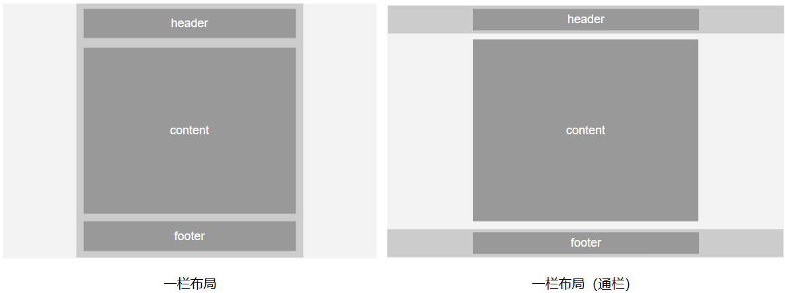

- **一栏布局：** `header`、`content`、`footer` 区域单列等宽，都居中显示
- **一栏布局（通栏）：** `header`、`footer` 区域与视口宽度等宽，仅中间 `content` 区域固定宽度，并居中显示

下面我们来分别看看两种单列布局的实现方式。


### 一栏布局

这个布局结构比较简单，`header`、`content`、`footer` 都居中显示。

**使用场景：** 如博客文章详情页等。

```html
<div class="container">
  <div class="header">header</div>
  <div class="content">content</div>
  <div class="footer">footer</div>
</div>
```

```css
.container {
  max-width: 1000px;
  margin: 0 auto;
}
/* ...其它样式 */
```

这里使用了 `max-width: 1000px;` 为三个区域的父级容器设置最大宽度，以此来确保三个区域等宽。

[在线预览效果](https://codepen.io/wjw020206/pen/azzXpyM)

**⚠️ 注意：** 这里也可以使用 `width: 1000px;`，效果是差不多的，唯一的区别就是当屏幕小于 `1000px` 的时候表现不一样（`width: 1000px;` 会出现横向滚动条，`max-width: 1000px` 则不会，宽度会收缩）。


### 一栏布局（通栏）

`header`、`footer` 区域宽度设置为 `100%`，也可以不设置宽度，因为这两个区域都是块级元素，默认在·会占满整个视口宽度。不过 `header`、`footer` 区域中的内容区域的宽度要和 `content` 区域的宽度保持一致。

**使用场景：** 如企业官网等。

```html
<div class="header">
  <div class="header-content">header</div>
</div>
<div class="content">content</div>
<div class="footer">
	<div class="footer-content">footer</div>
</div>
```

```css
.header,
.footer {
  width: 100%;
}

.header-content,
.footer-content {
  max-width: 1000px;
  margin: 0 auto;
}

.content {
  margin: 0 auto;
  max-width: 1000px;
}

/* ...其它样式 */
```

[在线预览效果](https://codepen.io/wjw020206/pen/qEEvzwG)


## 两列布局

两列布局也是日常开发中常见的布局，通常由**一个固定宽度的侧边栏（`sidebar`）** 和 **一个自适应宽度的主内容（`main`）**区域组成。

**使用场景：** 如后台管理页面、文档导航页面、博客主页等。

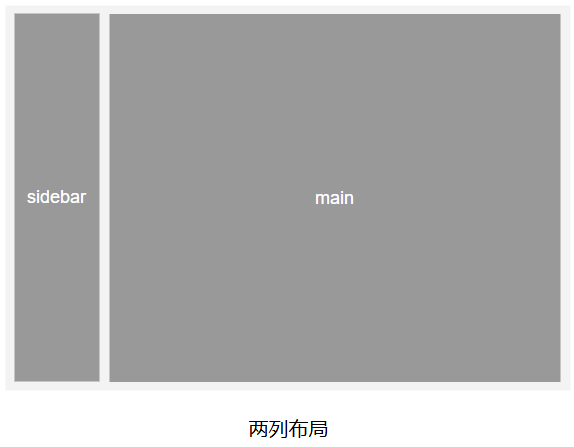

### Float 实现

在过去，没有 Flex 和 Grid 的时候，通常使用 Float 实现两列布局。

```html
<div class="container">
  <div class="sidebar">sidebar</div>
  <div class="main">main</div>
</div>
```

```css
.container {
  overflow: hidden; /* 清除浮动，防止高度坍塌 */
  zoom: 1; /* 兼容 IE6/IE7，用来触发 hasLayout, 确保元素正确渲染和包含其内部浮动元素 */
}

.sidebar {
  float: left;
  width: 240px;
  margin-right: 20px;
}

.main {
  overflow: hidden; /* 触发 BFC，使其不会与 sidebar 重叠 */
  height: 100%;
  zoom: 1; /* 兼容 IE6/IE7，用来触发 hasLayout, 确保元素正确渲染和包含其内部浮动元素 */
}

/* ...其它样式 */
```

[在线预览效果](https://codepen.io/wjw020206/pen/ByybXLZ)

**⚠️ 注意：** 

- 该代码兼容 IE6 及以上的浏览器版本，对于维护老项目仍存在价值，**对于新项目更加建议优先使用 Flex 或 Grid 来实现两列布局**

- 如果 `sidebar` 区域要放右边，**需要注意渲染顺序，先写侧边栏，后写主内容**

  ```html
  <div class="container">
    <!-- 依旧保证先写侧边栏 -->
    <div class="sidebar">sidebar</div>
    <div class="main">main</div>
  </div>
  ```

  ```css
  .container {
    overflow: hidden;
    zoom: 1;
  }
  
  .sidebar {
    float: right; /* 调整浮动方向 */
    width: 240px;
    margin-left: 20px; /* 调整外边距方向 */
  }
  
  .main {
    overflow: hidden;
    height: 100%;
    zoom: 1;
  }
  
  /* ...其它样式 */
  ```


### Flex 实现

```css
/* HTML 部分同上 */
.container {
  display: flex;
}

.sidebar {
  width: 240px;
  margin-right: 20px;
}

.main {
  flex: 1;
}

/* ...其它样式 */
```


### Grid 实现

Grid 实现方式相比 Flex 方式代码更加简洁。

```css
/* HTML 部分同上 */
.container {
  display: grid;
  grid-template-columns: 240px 1fr;
  gap: 20px;
}

/* ...其它样式 */
```


## 三列布局

三列布局通常是由**一个自适应宽度的主内容（`main`）**夹在**左右两个固定宽度的 `left`、`right` 区域**的中间组成。

**使用场景：** 如门户首页、资讯平台、后台系统页面等。

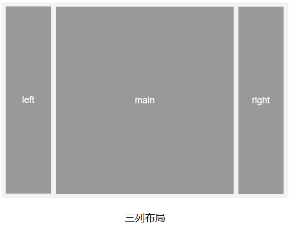


### 圣杯布局

通过 Float 实现三列布局通常有两种方式，最经典的就是 “圣杯布局” 和 “双飞翼布局”，我们先来看看 “圣杯” 布局。

“圣杯（Holy Grail）” 布局最早出自于国外的 Matthew Levine 前辈在 2006 年写的一篇文章 《[In Search of the Holy Grail](https://alistapart.com/article/holygrail/)》中。

在常规情况下，我们都是按从上到下，从左到右的顺序写页面。

```html
<div class="container">
  <div class="left">left</div>
  <div class="main">main</div>
  <div class="right">right</div>
</div>
```

这样布局的效果是没有什么问题，但如果我们希望 `main` 区域的内容优先加载出来，就需要进行布局优化。

**浏览器的渲染引擎在构建和渲染渲染树是异步的（谁先构建好谁先显示）**，所以我们只需要将 `main` 区域放到提前的位置就可以优先渲染。

```html
<div class="container">
  <!-- 将 main 区域放到提前的位置，确保优先渲染 -->
  <div class="main">main</div>
  <div class="left">left</div>
  <div class="right">right</div>
</div>
```

所以就提出了 “圣杯” 布局，目的是通过 CSS 的方式配合上面的 DOM 结构，优化 DOM 渲染，以下是具体 CSS 相关的代码。

```css
/* 为容器设置左右内边距，给左右栏腾出空间 */
.container {
  padding-left: 116px;
  padding-right: 116px;
  overflow: hidden;
}

.main {
  float: left;
  width: 100%;
  height: 800px;
}

.left {
  float: left;
  position: relative;
  left: -116px;
  margin-left: -100%;
  width: 100px;
  height: 800px;
}

.right {
  float: left;
  position: relative;
  right: -116px;
  margin-left: -100px;
  width: 100px;
  height: 800px;
}

/* ...其它样式 */
```

它的原理很简单，我们简单来分析一下：

1. **首先给容器设置一个左右的内边距**，并清除浮动

   - `padding-left` 的值等于 `左侧区域宽度(100px) + 与主区域的间隔(16px)`，所以上述例子的值为 `116px`
   - `padding-right` 的值也是同理

2. **将容器内部的三个区域都设置为左浮动，并且设置宽度**，例如上面例子中的我们设置了如下宽度：

   - `left` 区域宽度：`100px`
   - `main` 区域宽度：`100%`
   - `right` 区域宽度：`100px`

   此时的界面效果应该是这样的

   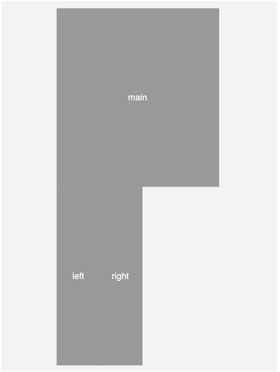

3. 通过 `margin-left: -100%;` **移动 `main` 区域所占的 `100%` 宽度**，就可以将 `left` 区域移动到 `main` 区域的最左侧

   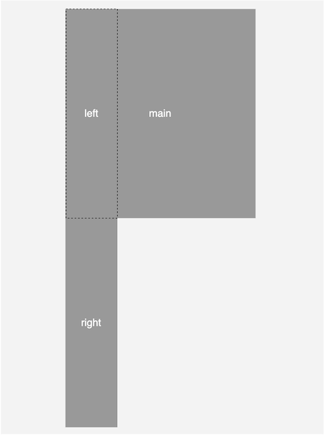

4. 再通过 `position: relative;` 相对定位，**向左**偏移到之前第一步容器 `padding-left: 116px;` 内边距所占的位置，这样就完成了 `left` 区域位置的调整

   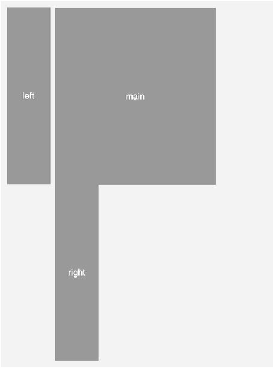

5. 再然后是 `right` 区域，具体步骤跟 `left` 区域一样，不过需要注意不是使用 `margin-left: -100%;`，而是通过 `margin-left: -100px;` 移动**跟自身宽度一样的距离**就可以调整到 `main` 区域的最右侧

   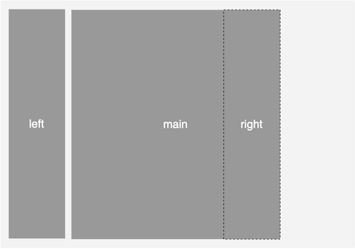

6. 最后就是通过 `position: relative;` 相对定位，将 `right` 区域**向右**偏移到之前第一步容器 `padding-right: 116px;` 内边距所占的位置

   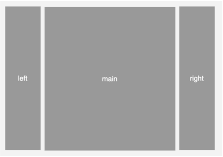

[在线预览效果](https://codepen.io/wjw020206/pen/azzMepg)


**圣杯布局的问题**

圣杯布局中的 `container` 容器的宽度不能小于 `left` 区域的宽度，否则会导致布局发生错乱。


### 双飞翼布局

“双飞翼” 布局是 “圣杯” 布局的改进方案，起源于淘宝 UED 的实践，据说最早由玉伯前辈提出的，解决了 “圣杯” 布局的缺点。

1. 首先是调整页面结构

   ```html
   <div class="container">
     <div class="main">
       <!-- 增加了一个内层元素 -->
       <div class="inner">main</div>
     </div>
     <div class="left">left</div>
     <div class="right">right</div>
   </div>
   ```

2. 去除容器左右的内边距，并且设置最小宽度

   ```css
   .container {
     min-width: 300px;
     overflow: hidden;
   }
   ```

   这里 `300px` 的值是通过 `2倍 left 区域的宽度 + right 区域的宽度` 得来的，以此确保 `main` 中的内容可以显示出来。

3. 去除 `left` 区域和 `right` 区域中的 `position: relative;` 相关的代码

   ```css
   .left {
     float: left;
     width: 100px;
     margin-left: -100%;
   }
   
   .right {
     float: left;
     width: 100px;
     margin-left: -100px;
   }
   ```

4. 最后给 `main` 区域中的 `inner` 区域添加左右的外边距

   ```css
   .main .inner {
     margin: 0 116px;
   }
   ```

   这边左外边距的值等于 `左侧区域宽度(100px) + 与主区域的间隔(16px)`，右外边距的值也同理。

   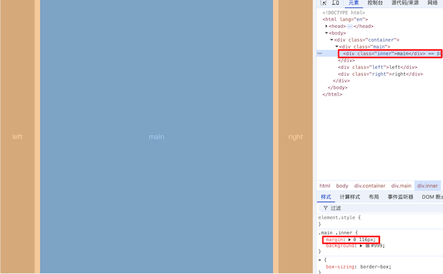

上述步骤合在一起代码如下：

```css
.container {
  min-width: 300px;
  overflow: hidden;
}

.main {
  float: left;
  width: 100%;
  height: 800px;
}

.main .inner {
  margin: 0 116px;
}

.left {
  float: left;
  margin-left: -100%;
  width: 100px;
  height: 800px;
}

.right {
  float: left;
  margin-left: -100px;
  width: 100px;
  height: 800px;
}

/* ...其它样式 */
```

[在线预览效果](https://codepen.io/wjw020206/pen/MYYRgbY)

**⚠️ 注意：** 该方案兼容 IE 浏览器，对于维护老项目仍存在价值，**对于新项目更加建议优先使用 Flex 或 Grid 来实现三列布局**。


### Flex 实现

```css
/* HTML 部分同上 */
.container {
  display: flex;
}

.left,
.right,
.main {
  width: 100px;
  height: 800px;
}

.main {
  flex: 1;
  margin: 0 16px;
}

.left {
  /* 通过 CSS 调整左侧区域的位置 */
  order: -1;
}

/* ...其它样式 */
```

**⚠️ 注意：上述代码 HTML 页面结构部分依旧是 `main` 区域在最前面**，只是通过 CSS 改变了视觉上的位置，依旧是中间部分先加载。


### Grid 实现

```css
/* HTML 部分同上 */
.container {
  display: grid;
  grid-template-columns: 100px 1fr 100px;
  gap: 16px;
}

.left,
.right,
.main {
  height: 800px;
  /* 三列都设置在同一行中 */
  grid-row: 1;
}

.main {
  /* 设置主区域在第二列中 */
  grid-column: 2;
}

.left {
  /* 设置 left 区域在第一列中 */
  grid-column: 1;
}

.right {
  /* 设置 right 区域在第三列中 */
  grid-column: 3;
}

/* ...其它样式 */
```

**⚠️ 注意：** 也是通过 CSS 改变了视觉上的位置，但写法上相比 Flex 有些繁琐，**推荐优先使用 Flex 布局实现三列布局**。


## 等高列布局

**等高列布局**是指在一个容器中，多个并排的元素（列）即使内容不一样多，其高度也始终保持一致，从而实现底部对齐的视觉效果。

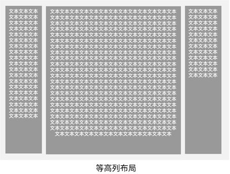

例如前面 “圣杯” 布局和 “双飞翼” 布局的案例的高度都是统一写死 `800px`，**但在实际开发中往往不会指定元素固定的高度**。


### 正 padding + 负 margin

在 Flex 和 Grid 出现之前，这是一种比较常用的方法。

例如我们把前面 “双飞翼” 布局的代码修改一下，去除固定高度，只用内容撑开高度。

```html
<div class="container">
  <div class="main">
    <div class="inner">
      文本<br />
      文本<br />
      文本<br />
      文本<br />
      文本<br />
      文本<br />
      文本<br />
    </div>
  </div>
  <div class="left">
    文本<br />
    文本<br />
  </div>
  <div class="right">
    文本<br />
    文本<br />
    文本<br />
    文本<br />
  </div>
</div>
```

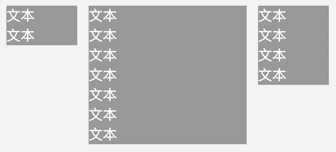

接下来介绍如何让它实现等高列。

1. 首先给容器内的并排元素（列）**统一设置一个大数值的 `padding-bottom`，再设置一个相同数值的负的 `margin-bottom`**

   ```css
   .left,
   .right,
   .main {
     /* 其它样式... */
     padding-bottom: 10000px;
     margin-bottom: -10000px;
   }
   ```

   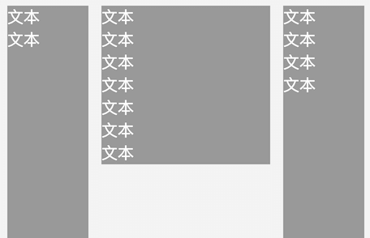

   通过 `padding-bottom: 1000px` 人为的把元素高度撑的很高，再通过 `margin-bottom: -1000px` 将多出的部分拉回来，让布局不会真的变高。

   **虽然真实高度没有变，但背景色、边框等视觉效果会从上到下延伸到相同的位置**。

   

2. 再**给并排元素（列）外部的容器设置 `overflow:hidden`**，通过触发 BFC 来包含浮动元素真实高度，并把溢出的背景截断

   ```css
   .container {
     /* 其它样式... */
     overflow: hidden;
   }
   ```

   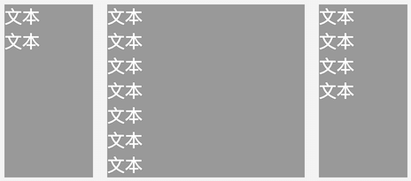

   [在线预览效果](https://codepen.io/wjw020206/pen/RNNOPoQ)

   **⚠️ 注意：** 该方案兼容 IE 浏览器，对于维护老项目仍存在价值，**对于新项目更加建议优先使用 Flex 或 Grid 来实现等高列布局**。


### 模拟表格布局

我们也可以使用 `display: table;` CSS 的模拟表格来实现等高列。

```html
<div class="container">
  <div class="row">
    <div class="left">
      文本<br />
      文本<br />
    </div>
    <div class="main">
      文本<br />
      文本<br />
      文本<br />
      文本<br />
      文本<br />
      文本<br />
      文本<br />
    </div>
    <div class="right">
      文本<br />
      文本<br />
      文本<br />
      文本<br />
    </div>
  </div>
</div>
```

```css
.container {
  display: table;
  width: 100%;
}

.left,
.right,
.main {
  display: table-cell;
  background: #999;
  color: #fff;
  font-size: 20px;
}

.row {
  display: table-row;
}
```

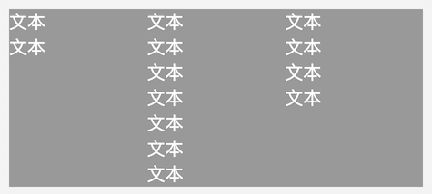

**⚠️ 注意：** 

- **该方案兼容 IE8+，不支持 IE6 ~7**
- 该方案只适用于常规的三列布局实现等高列，**不适用于传统的 “圣杯” 布局和 “双飞翼” 布局**

