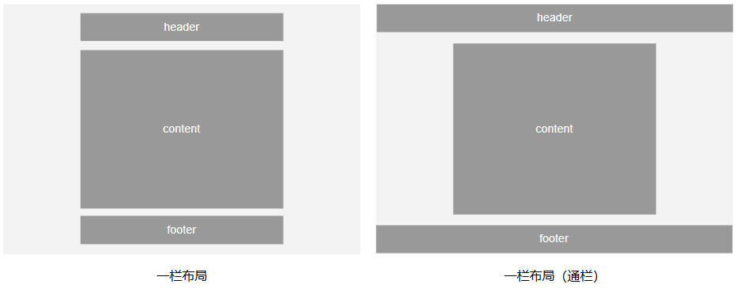

# CSS专题之常见布局


## 前言

> 石匠敲击石头的第 13 次

作为一名前端开发，在日常开发中，写页面是必不可少的工作，但有时候发现很多的页面结构都是类似的，所以打算写一篇文章来梳理一下日常开发中常见的布局，如果哪里写的有问题欢迎指出。


## 单列布局

单列布局日常开发中常见的有以下两种：



- **一栏布局：** `header`、`content`、`footer` 区域单列等宽，都居中显示
- **一栏布局（通栏）：** `header`、`footer` 区域与视口宽度等宽，仅中间 `content` 区域固定宽度，并居中显示


### 一栏布局

这个布局结构比较简单，`header`、`content`、`footer` 都居中显示，适合内容宽度有限的页面，如博客文章详情页。

```html
<div class="container">
  <div class="header">header</div>
  <div class="content">content</div>
  <div class="footer">footer</div>
</div>
```

```css
.container {
  max-width: 1000px;
  margin: 0 auto;
}
/* ...其它样式 */
```

这里使用了 `max-width: 1000px;` 为三个区域的父级容器设置最大宽度，以此来确保三个区域等宽。

[在线预览效果](https://codepen.io/wjw020206/pen/azzXpyM)

**⚠️ 注意：** 这里也可以使用 `width: 1000px;`，效果是差不多的，唯一的区别就是当屏幕小于 `1000px` 的时候表现不一样（`width: 1000px;` 会出现横向滚动条，`max-width: 1000px` 则不会，宽度会收缩）。


### 一栏布局（通栏）

`header`、`footer` 区域不设置宽度，因为这两个区域都是块级元素，默认会占满整个视口宽度。不过 `header`、`footer` 区域中的内容区域的宽度要和 `content` 区域的宽度保持一致。