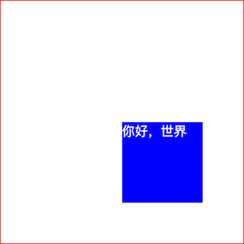
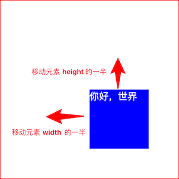
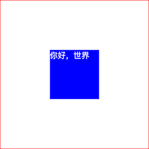
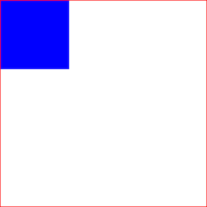
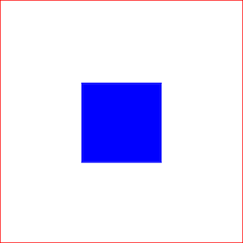
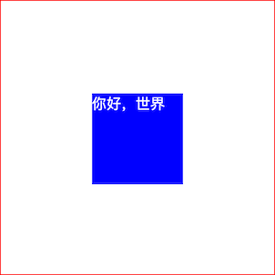
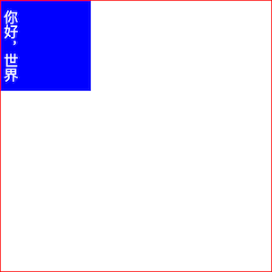
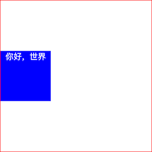

# CSS专题之水平垂直居中


## 前言

> 石匠敲击石头的第 16 次

在日常开发中，经常会遇到水平垂直居中的布局，虽然现在基本上都用 Flex 可以轻松实现，但是在某些无法使用 Flex 的情况下，又应该如何让元素水平垂直居中呢？这也是一道面试的必考题，所以打算写一篇文章来好好梳理一下，如果哪里写的有问题欢迎指出，不胜感激。


## 分类

实现元素水平垂直居中的方法有很多，大致可以分为以下两类：

- **固定宽高元素**适用的方法
- **不固定宽高元素**适用的方法

我们先实现基础的布局，然后再分别讲每一类具体的方案。
```css
.container {
  border: 1px solid red;
  width: 300px;
  height: 300px;
}

.box {
  background: blue;
  color: #fff;
}

.size {
  width: 100px;
  height: 100px;
}
```

```html
<div class="container">
  <div class="box size">你好，世界</div>
</div>
```


## 固定宽高元素


### absolute + 负 margin

```css
.container {
  /* 其它的基础样式... */
  position: relative;
}

.box {
  /* 其它的基础样式... */
  position: absolute;
  top: 50%;
  left: 50%;
  margin-left: -50px;
  margin-top: -50px;
}
```

该方案的原理非常简单，可以分为两步来看：

1. 先通过**绝对定位**的 `top: 50%` 和 `left: 50%` 使**元素的左上角**定位在 `.container` 容器元素的中心位置

   

2. 再通过 `margin-top` 和 `margin-left` 设置为**负值**，具体值为元素宽度和高度的一半，例如这里元素的宽高都是 `100px`，所以一半就是 `50px`

   

   最终的效果如下

   

[在线查看效果](https://codepen.io/wjw020206/pen/KwpVRYr)

**✅ 优点：** 兼容性好，适用于 IE 等老版本浏览器。

**⚠️ 缺点：** 

- 需要提前知道元素大小，并且需要手动计算元素大小的一半
- 每次修改元素大小都需要同步修改 `margin` 值


### absolute + margin: auto

```css
.container {
  /* 其它的基础样式... */
  position: relative;
}

.box {
  /* 其它的基础样式... */
  position: absolute;
  top: 0;
  left: 0;
  right: 0;
  bottom: 0;
  margin: auto;
}
```

该方案和前一个方案最终效果是一样，该方案的步骤如下：

1. 通过设置**绝对定位** `top:0; bottom:0; left:0; right:0;`，让浏览器知道元素被限制”在父容器内四边，这样有了一个**明确的空间范围**
2. 再通过设置 `margin: auto`，浏览器就可以根据 `父容器大小 - 元素大小 = 剩余空间`，把剩余空间平分给 `margin: auto`，实现水平垂直方向上的居中

[在线查看效果](https://codepen.io/wjw020206/pen/vEOLrPa)

**✅ 优点：** 

- 兼容性好，适用于 IE 等老版本浏览器
- 每次修改元素大小**不需要同步修改 `margin` 值，无需手动计算元素大小的一半**

**⚠️ 缺点：** 只能用于**固定尺寸**的元素，不适合宽高不确定的情况。


### absolute + calc

```css
.container {
  /* 其它的基础样式... */
  position: relative;
}

.box {
  /* 其它的基础样式... */
  position: absolute;
  top: calc(50% - 50px);
  left: calc(50% - 50px);
}
```

该方案与**前面的 absolute + 负 margin 方案**原理相同，使用了 `calc` 函数替代了 `margin` 负值来计算居中的位置。

[在线查看效果](https://codepen.io/wjw020206/pen/pvJgZyb)

**⚠️ 缺点：**

- 该方案依赖 `calc` 函数的兼容性，具体兼容性可以参考 [Can I use](https://caniuse.com/calc)
-  需要提前知道元素大小，修改元素大小**需要同步修改 `calc` 函数中减去的值**
- 相比前两个方案，该方案既缺乏兼容性（IE9+），又需要手动计算元素大小的一半，**不推荐使用**


## 不固定宽高元素


### absolute + transform

```css
.container {
  /* 其它的基础样式... */
  position: relative;
}

.box {
  /* 其它的基础样式... */
  position: absolute;
  left: 50%;
  top: 50%;
  transform: translate(-50%, -50%);
}
```

该方案与**前面的 absolute + 负 margin 方案**原理相同，使用了 `transform` 替代了 `margin` 负值来计算居中的位置。

因为`translate(-50%, -50%)` 的百分比是**相对于元素本身的宽高**，所以不需要提前知道元素的具体尺寸。

[在线查看效果](https://codepen.io/wjw020206/pen/pvJgZNE)

**✅ 优点：** 无需提前知道元素大小，修改元素大小**不需要同步修改相关的值**

**⚠️ 缺点：** 该方案依赖 `transform()` 函数的兼容性，具体兼容性可以参考 [Can I use](https://caniuse.com/transforms2d)


### line-height

```css
.container {
  /* 其它的基础样式... */
  line-height: 300px;
  text-align: center;
}

.box {
  /* 其它的基础样式... */
  display: inline-block;
  vertical-align: middle;
  line-height: initial;
}
```

该方案的实现步骤如下：

1. 首先给 `.container` 容器设置一个与高度相同的行高，例如这里容器的高度为 `300px`，所以设置 `line-height: 300px`，并给容器设置 `text-align: center;` 水平居中对齐

   

2. 然后再给 `.box` 元素设置为**行内块（inline-block）元素**，并设置 `vertical-align: middle;` 垂直居中对齐

   

3. 居中效果有了，但是文字却不见了，因为 `.container` 容器的 **`text-align` 和 `line-height` 默认是会被继承给 `.box` 元素**，这时我们需要通过 `line-height: initial` 和 `text-align: initial` 重置为初始值

   

[在线查看效果](https://codepen.io/wjw020206/pen/QwbyBXg)

**✅ 优点：** 无需提前知道元素大小，修改元素大小**不需要同步修改相关的值**

**⚠️ 缺点：** 需要**重置**内部元素的文字样式


### writing-mode

```css
.container {
  /* 其它的基础样式... */
  writing-mode: vertical-lr;
  text-align: center;
}

.inner {
  width: 100%;
  display: inline-block;
  writing-mode: horizontal-tb;
}

.box {
  /* 其它的基础样式... */
  display: inline-block;
  text-align: initial;
}
```

```html
<div class="container">
  <div class="inner">
    <div class="box">你好，世界</div>
  </div>
</div>
```

该方案主要利用 `writing-mode` 属性，`writing-mode` 属性可以改变文字的显示方向

- `writing-mode: vertical-lr` 让元素文字垂直方向显示
- `writing-mode: horizontal-tb` 让元素文字水平方向显示

该方案实现的步骤如下：

1. 首先将 `.container` 容器的**文字显示方向调整为垂直方向**，并设置文字水平居中对齐，用来实现**垂直居中**

   

2. 添加一个 `.inner` 包装元素，设置为**行内块（inline-block）元素**，并将宽度设置为 `100%`，并设置**文字显示方向为水平方向**，此时 `.container` 容器的 `text-align: center;` 被继承，变成了**水平居中**

   

3. 最后将 `.inner` 包装元素内部的 `.box` 元素调整为**行内块（inline-block）元素**，并重置继承的 `text-align` 属性的值为初始值

   


[在线查看效果](https://codepen.io/wjw020206/pen/ByNjvLW)

**✅ 优点：** 

- 兼容性好，适用于 IE 等老版本浏览器
- 无需提前知道元素大小，修改元素大小**不需要同步修改相关的值**

**⚠️ 缺点：** 

- 需要**重置**内部元素的文字样式
- 实现和理解起来有点复杂
- 需要额外的 DOM 元素


### table

```css
.container {
  /* 其它的基础样式... */
  text-align: center;
}

.box {
  /* 其它的基础样式... */
  display: inline-block;
  text-align: initial;
}
```

```html
<table>
  <tbody>
    <tr>
      <td class="container">
        <div class="box">你好，世界</div>
      </td>
    </tr>
  </tbody>
</table>
```

该方案利用了 `<table>` 标签中 `<td>` 单元格内容天然是垂直居中的特性，所以只需要再添加一个水平居中就可以实现水平垂直居中。

[在线查看效果](https://codepen.io/wjw020206/pen/xbGZmJK)

**✅ 优点：** 

- 兼容性好，适用于 IE 等老版本浏览器
- 无需提前知道元素大小，修改元素大小**不需要同步修改相关的值**

**⚠️ 缺点：** 

- 代码冗余，需要额外的 DOM 元素
- 不符合 `<table>` 标签正确语义用法
- 需要**重置**内部元素的文字水平居中样式


### display: table-cell

```css
.container {
  /* 其它的基础样式... */
  display: table-cell;
  text-align: center;
  vertical-align: middle;
}

.box {
  /* 其它的基础样式... */
  display: inline-block;
  text-align: initial;
}
```

该方案通过将 `.container` 容器变成 `table` 单元格显示效果，因为表格单元格的内容默认是垂直居中，在这基础上再加一个 `text-align: center;` 水平居中即可实现水平垂直居中效果。

[在线查看效果](https://codepen.io/wjw020206/pen/zxGreeN)

**✅ 优点：** 

- 兼容性好，适用于 IE 等老版本浏览器
- 无需提前知道元素大小，修改元素大小**不需要同步修改相关的值**
- 相比 `<table>` 实现没有多余的 DOM 元素

**⚠️ 缺点：** 需要**重置**内部元素的文字水平居中样式


### Flex

```css
.container {
  /* 其它的基础样式... */
  display: flex;
  justify-content: center;
  align-items: center;
}
```

上面这段代码相信大家用的比较多了，我就不详细介绍了。不过 Flex 还有另外一种**更加简便的实现方法**：

```css
.container {
  /* 其它的基础样式... */
  display: flex;
}

.box {
  /* 其它的基础样式... */
  margin: auto;
}
```

这个方案利用了 Flex 布局中，Flex 子元素的 `margin` 被设置为 `auto`，浏览器会将**剩余空间**平均分配的特性。
[在线查看效果](https://codepen.io/wjw020206/pen/pvJgYdR)

**✅ 优点：** 

- 无需提前知道元素大小，修改元素大小**不需要同步修改相关的值**
- 实现简单，代码量少

**⚠️ 缺点：** 只适合在现代浏览器中使用。


### Grid

```css
.container {
  /* 其它的基础样式... */
  display: grid;
}

.box {
  /* 其它的基础样式... */
  align-self: center;
  justify-self: center;
}
```

[在线查看效果](https://codepen.io/wjw020206/pen/OPVMqdM)

**✅ 优点：** 

- 无需提前知道元素大小，修改元素大小**不需要同步修改相关的值**
- 实现简单，代码量少

**⚠️ 缺点：** 只适合在现代浏览器中使用，**更加推荐使用 Flex**。


##  总结

元素水平垂直居中的方案主要可以分为以下两类：

**固定宽高元素适用的方案**

| 方案                      | 兼容性           | 备注                         |
| ------------------------- | ---------------- | ---------------------------- |
| `absolute + 负 margin`    | ✅ 非常好（IE6+） | 最老牌的方案，手动计算偏移量 |
| `absolute + margin: auto` | ✅ 非常好（IE8+） | 语义清晰，适合固定尺寸元素   |
| `absolute + calc()`       | ⚠️ 一般（IE9+）   | 不推荐，既不方便也不通用     |

**宽高不固定元素适用的方案**

| 方案                     | 兼容性                  | 备注                                     |
| ------------------------ | ----------------------- | ---------------------------------------- |
| `absolute + transform`   | ✅ 较好（IE9+）          | 最常用，推荐优先考虑                     |
| `line-height`            | ✅ 非常好（IE6+）        | 适合单行文字，有继承问题需手动处理       |
| `writing-mode`           | ✅ 非常好（IE6+）        | 实现和理解起来比较复杂，不推荐           |
| `<table>` + `text-align` | ✅ 非常好（IE6+）        | 结构语义不合理，适合邮件模板等场景       |
| `display: table-cell`    | ✅ 非常好（IE6+）        | 替代表格结构，语义更合理                 |
| `flex`                   | ⚠️ 一般（IE10+）         | **推荐使用，现代项目首选**               |
| `flex + margin: auto`    | ⚠️ 一般（IE10+）         | 更简洁，但仅适合单元素居中               |
| `grid`                   | ⚠️ 较差（IE11 部分支持） | 简单强大，但需注意兼容性，不如 Flex 普遍 |

- 如果项目**兼容性要求低**，首选 `flex + align/justify-center` 或 `absolute + transform` 方案
- 如果需要兼容 **IE9 及以下浏览器**，首选 `absolute + 负 margin` 或 `table-cell` 方案


## 参考文章

- [CSS实现水平垂直居中的10种方式划重点，这是一道面试必考题，很多面试官都喜欢问这个问题，我就被问过好几次了 要实现上图 - 掘金](https://juejin.cn/post/6844903679242305544)
- [实现元素水平+垂直居中的方法（持续更新）1. 父元素：flex flex这个东西简直就是一个神器... 这个时候子元素就 - 掘金](https://juejin.cn/post/6947563556598448158)
- [元素水平垂直居中常用方法汇总行内元素 line-height + text-align 行内块状元素 line-heig - 掘金](https://juejin.cn/post/6992508779753373703)
- [如何让一个元素水平垂直居中？(代码实例+方案总结) 超详细！！！！在日常的开发中，我们经常会面对这样一个问题：如何实现居 - 掘金](https://juejin.cn/post/7014309900390154254)
