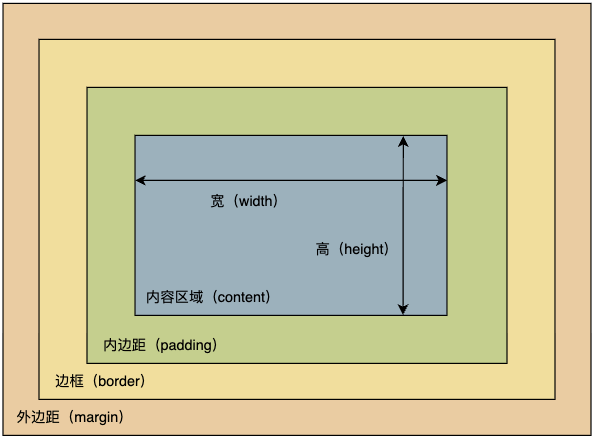
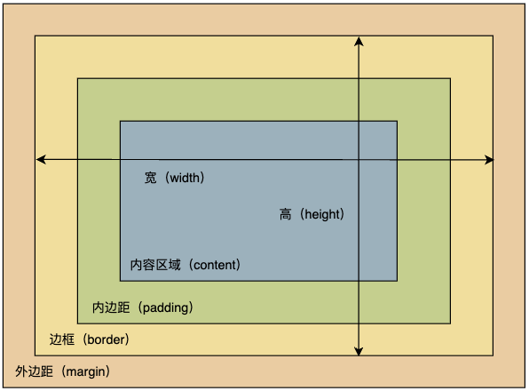
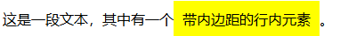
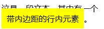

# CSS专题之盒模型


## 前言

> 石匠敲击石头的第 6 次

CSS 盒模型是前端面试常问的知识点，所以打算写一篇文章来好好梳理一下，如果哪里写的有问题欢迎指出。


## 什么是盒模型

CSS 盒模型用于描述 HTML 元素尺寸的计算方式和布局规则，决定了浏览器如何计算元素总大小和其在页面中的位置，网页中的任何元素都可以看做是一个盒子。

一个盒模型的实际大小主要由以下三个属性来决定：

- **content（内容）：** 元素的实际内容，如元素中的文本、图像或其他媒体内容。
- **padding（内边距）：** 盒子内容与边框之间的空白区域。
- **border（边框）：** 盒子的边框大小。


**⚠️ 注意：margin 外边距不影响盒子的实际大小，但会影响盒子在页面上的占位空间。**


## 盒模型的类型

盒模型分为两种，分别是标准盒模型和怪异盒模型。


### 标准盒模型

W3C 规范制定的标准盒模型，也叫 W3C 盒模型，如果不指定元素是什么盒模型，**默认就是标准盒模型（`box-sizing: content-box`）。**

**在标准盒模型中，`width` 和 `height` 设置的是盒子内容区域（content）的大小**，盒子最终的实际大小需要加上内边距（padding）和边框（border）的大小

**盒子实际宽度 = `元素内容宽度 + 左右内边距大小 + 左右边框大小` **

**盒子实际高度 = `元素内容高度 + 上下内边距大小 + 上下边框大小` **



  

举个例子

```css
.box {
  width: 100px;
  height: 100px;
  border: 1px solid #ccc;
  padding: 10px;
}
```

上述代码盒子实际宽度和高度都为 `122px`

- **总宽度** = 内容宽度 + 左右 padding + 左右 border

  `= 100px + 10px + 10px + 1px + 1px = 122px`

- **总高度** = 内容高度 + 上下 padding + 上下 border

  `= 100px + 10px + 10px + 1px + 1px = 122px`


### 替代盒模型

也叫**IE盒模型（怪异盒模型）**，之所以叫 IE 盒模型，因为该盒模型最早 Internet Explorer（IE）浏览器引入的，并且在 IE5 及更早版本中是默认行为。

后来在 IE6 中允许在标准模式下使用 W3C 盒模型，但在怪异模式（Quirks Mode）中仍然使用 IE 盒模型，所以也叫怪异盒模型。

如今替代盒模型已经是 W3C 规范的一部分，**给元素设置 `box-sizing: border-box;`  即可改变元素的盒模型。**

**在替代盒模型中 `width` 和 `height` 设置的是盒子最终的实际大小**，内容区域（content）的大小会根据内边距（padding）和边框（border）的大小**自动收缩**，以此来保证盒子最终的实际大小不变。

**盒子实际宽度 = 设定的 `width` =（`收缩的元素内容宽度 + 左右内边距大小 + 左右边框大小`）**

**盒子实际高度 = 设定的 `height` = （`收缩的元素内容高度 + 上下内边距大小 + 上下边框大小`） **




举个例子

```css
.box {
  width: 100px;
  height: 100px;
  border: 1px solid #ccc;
  padding: 10px;
  box-sizing: border-box;
}
```

上述代码盒子实际宽度和高度都为 `100px`


## 块级盒子与行内盒子

盒模型定义了每个 HTML 元素的结构（包括 content、padding、border、margin），但是这些盒子在页面中如何进行排列，还需要看它是**块级盒子（Block Box）**还是**行内盒子（Inline Box）。**


### 块级盒子

浏览器会将块级元素（如 `div`、`p`、`h1`、`section` 等这些默认 `display: block` 的元素）在页面中渲染为一个**块级盒子（Block box）。**

块级盒子有以下几个特点：

- **单独占一行**，上下排列，即使宽度没有占满当前行
- 可以通过 CSS 明确指定 `width` 和 `height`
- 如果不设置 `width`，**默认宽度为父容器的 `100%`**
- 盒模型完整生效，`margin`、`padding`、`border` 在**垂直和水平方向都能影响布局**
- 垂直方向相邻的 `margin` 可能发生**外边距合并（margin collapse）**


### 行内盒子

浏览器会将行内元素（如 `span`、`a`、`strong` 等这些默认 `display: inline` 的元素）在页面中渲染为一个**行内盒子（Inline box）。**

行内盒子有以下几个特点：

- **不会单独占一行**，而是**与其它行内元素共享一行**，在水平方向上排列
- **无法设置 `width` 和 `height`**，这些属性对行内元素无效，元素的宽度由内容决定
- **上下的 `margin` 和 `padding` 不会影响布局，但上下的 `padding` 会影响视觉效果**。左右的 `margin` 和 `padding` 会生效，影响元素间的间距
- 垂直方向相邻的 `margin` **不会发生外边距合并（margin collapse）**

**⚠️ 注意：** 这里说的上下的 `padding` 会影响视觉效果，是指如下情况。

```css
.inline-padding {
  /* 给行内盒子添加四周的内边距 */
  padding: 10px;
  background-color: yellow;
}
```

```html
<p>
  这是一段文本，其中有一个<span class="inline-padding">带内边距的行内元素</span>。
</p>
```



上述代码似乎看起来没什么问题，但是当文字换行时会出现被遮挡的问题。



这就是所说的上下的 `padding` 会影响视觉效果。


## 实践建议

> 想象一个场景，假设你根据设计稿给页面中的元素（已经设置了 `wdith` 和 `height` ）添加了内边距，默认情况下，元素的最终大小比你预期要大，然后为了元素不变大你需要自己进行计算来减少内容区域的大小。

但其实你只需要给元素 `box-sizing: border-box;` 就可以解决这个问题，省去了自己计算的麻烦。

我们在实际开发中页面会有很多的元素，如果一个一个添加 `box-sizing: border-box;` 也是个麻烦事，**所以在开发中建议将如下代码放在样式表的开头**，以此调整全局元素的盒模型为替代盒模型。

```css
:root {
  box-sizing: border-box;
}

*,
::before,
::after {
  box-sizing: inherit;
}
```

 **⚠️ 注意：**

- `*` 选择器不会选中伪元素，所以这里需要加上 `::before` 和 `::after` 选择器。

- 这里之所以使用 `inherit` 继承的方式是便于调整第三方组件的盒子模型。

  如果使用的第三方组件的盒子模型**不是替代盒模型**，会导致第三方组件的所有元素都是 `border-box`，大小出现问题，如果不使用继承的方式想要调整第三方组件的盒子模型非常麻烦（需要将所有组件元素的 `box-sizing` 都设置为 `content-box`），而**使用继承的方式，只需要修改第三方组件根元素的盒模型即可**。

  ```css
  /* 调整第三方组件根元素的盒子模型 */
  .third-party-component {
    box-sizing: content-box;
  }
  ```


## 总结

- 盒模型决定了 HTML 元素的尺寸计算方式，影响元素在页面中的布局，主要包括：内容区域（content）、内边距（padding）、边框（border）和外边距（margin）。
- 盒模型的类型
  - **标准盒模型**：`box-sizing: content-box`，`width` 和 `height` 只设置内容区域的大小，内边距和边框会额外增加到总尺寸。
  - **替代盒模型**：`box-sizing: border-box`，`width` 和 `height` 设置元素的总尺寸，内容区域 （content）的大小会根据内边距（padding）和边框（border）的大小**自动收缩**，以此来保证盒子最终的实际大小不变。
- 块级盒子与行内盒子
  - **块级盒子**：占一整行，可以设置宽度和高度，垂直方向的 `margin` 可能会合并。
  - **行内盒子**：不会占用一整行，宽度和高度由内容决定，只有左右的 `padding` 和 `margin` 会影响布局。
- 实践建议：将全局元素的盒模型调整为替代盒模型，省去了自己计算的麻烦。


## 参考文章

- [《深入解析CSS》Keith J.Grant 第 3 章节](https://book.douban.com/subject/35021471/)
- [图解CSS：CSS盒模型在学 习 Web 布局 之前有一个非常重要的概念需要理解，这个概念就是盒模型。CSS 盒模型是多 - 掘金](https://juejin.cn/post/7323771067877163058)
- [深入CSS——盒子模型📦在网页设计和布局中，理解CSS盒子模型是至关重要的。本文将详细介绍标准盒模型和IE盒模型，展示 - 掘金](https://juejin.cn/post/7399296053215100991)
- [【CSS】5分钟带你彻底搞懂 W3C & IE 盒模型！🔥🔥大家好，我是HoMeTown，CSS是作为前端必有技术栈 - 掘金](https://juejin.cn/post/7124859308331761671)
- [【基础巩固📔】- 带你搞懂CSS盒模型盒模型📦 先用一张图来说明一下我会怎么来介绍盒模型： 什么是盒模型🍇 其实我 - 掘金](https://juejin.cn/post/7041921066616717319)
- [一直在用的标准盒模型和替代（IE）盒模型到底怎么区分的？从一道面试题讲起：经常在面试过程中面试官会提问，标准盒模型和怪异 - 掘金](https://juejin.cn/post/7254792161072529468)
- [［前端面试CSS篇］当面试官请你说说盒模型（1）大家好，我是sAnL1ng，一名2025届学生。最近，在准备前端开发面试 - 掘金](https://juejin.cn/post/7340574992256581641)

