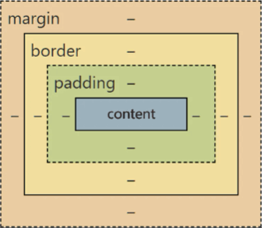

# CSS专题之盒模型

## 前言

> 石匠敲击石头的第 6 次

CSS 盒模型是前端面试常问的知识点，所以打算写一篇文章来好好梳理一下，如果哪里写的有问题欢迎指出。

## 什么是盒模型

CSS 盒模型用于描述 HTML 元素尺寸的计算方式和布局规则，决定了浏览器如何计算元素总大小和其在页面中的位置，网页中的任何元素都可以看做是一个盒子。

一个盒模型的大小主要由以下四个属性来决定：

- **content（内容）：** 元素的实际内容，如元素中的文本、图像或其他媒体内容。
- **padding（内边距）：** 盒子内容与边框之间的空白区域。
- **border（边框）：** 盒子的边框大小。
- **margin（外边距）：** 盒子边框外部的空白区域，与其他盒子之间的距离。

## 盒模型的类型

盒模型分为两种，分别是标准盒模型和怪异盒模型。

### 标准盒模型

W3C 规范制定的标准盒模型，如果不指定元素是什么盒模型，**默认就是标准盒模型（`box-sizing: content-box`）。**

在标准盒模型中，**`width` 和 `height` 设置的是盒子内容区域（content）的大小**，盒子最终的的总大小需要加上内边距（padding）和边框（border）的大小

