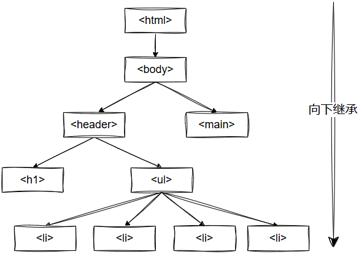

# CSS专题之继承


## 前言

> 石匠敲击石头的第 5 次

上一篇文章我们讲的是层叠，但在 CSS 中还有一种添加样式的方式总是和层叠搞混，那就是**继承**，所以就有了这篇文章，如果哪里写的有问题欢迎指出。


## 什么是继承

如果一个元素某些属性没有设置值，那么就可能会继承祖先元素的值。

例如 `font-family` 属性可以被继承，那我们可以利用这个特性，给页面所有元素的祖先元素 `<body>` 添加 `font-family` 属性，这样就可以不用给页面每个元素都明确指定字体了。



上图展示了继承如何沿着 DOM 树向下传递。


## 继承的作用

CSS 继承主要有以下两个作用

1. **减少重复代码：** 从前面的例子可以看出，少写了很多 `font-family` 属性，就可以为页面所有元素设置相同的字体。
2. **提高代码可维护性：** 还是拿前面的例子来说，假如甲方或者老板要求替换网页字体，那么这时也只需要改动祖先元素 `<body>` 上的 `font-family` 属性即可。


## 哪些属性可以被继承

**并不是所有的属性都可以被继承**，可以想象，如果像 `border` 这种属性可以被继承的话，所有子元素都存在边框那就可太糟糕了。

有以下几类属性可以被继承

- 文本相关的属性： `color`、`font-size`、`font-family`、`font-weight`、`line-height`、`text-align` 等。

- 列表相关的属性：`list-style`、`list-style-type`、`list-style-position`、`list-style-image` 等。

- 表格边框相关的属性：`border-collapse` 和 `border-spacing` 等。


## 强制继承

在一些特殊情况下，就需要属性继承父元素的值时，可以使用 `inherit` 特殊值。

```css
a:link {
  color: blue;
}

.footer {
  color: #666;
}

.footer a {
  /* 该属性值会继承父元素的值，此处继承的层叠值为#666 */
  color: inherit;
}
```

**⚠️ 注意：** `inherit` 特殊值可以**让任何属性强制继承父元素**的值，例如可以用 `margin: inherit` 继承父元素外边距的值，但是**很少这样使用**


## 取消继承

当某些属性不想让它使用继承的值时，可以使用 `initial` 特殊值。

```css
a:link {
  color: blue;
}

.footer a {
  /* 这个会恢复浏览器默认值，通常是黑色 */
  color: initial;
}
```

**⚠️ 注意：** 

- `width` 属性的初始值为 `auto`，但并非所有属性都支持 `auto`，**推荐使用 `initial`**
- `display` 属性的初始值为 `inline`，而**不是根据元素类型来确定 `display` 属性的初始值**


## 继承和层叠的区别

| 对比     | 继承                                                         | 层叠                                                         |
| :------- | ------------------------------------------------------------ | ------------------------------------------------------------ |
| 概念     | 子元素自动获取某些父元素的样式                               | 当多个规则作用于同一元素时，确定最终生效的样式               |
| 作用     | 减少重复代码，统一样式                                       | 解决样式冲突，决定哪个规则生效                               |
| 适用属性 | 主要适用于文本、列表、表格边框相关属性，如 `color`、`font-family` 等 | 适用于所有 CSS 属性                                          |
| 控制方法 | `inherit`（强制继承）、`initial`（默认值）                   | `!important`（最高优先级）、选择器权重、来源优先级（用户代理、用户、作者） |
| 优先级   | 继承的样式权重较低，可被直接定义的样式或更高权重的规则覆盖   | 依据层叠规则，优先级高的样式会覆盖低优先级的样式             |


## 总结

- **继承是子元素自动获取某些父元素样式的机制**，其主要特点如下：
  1. **默认继承**：文本、列表、表格边框相关属性（如 `color`、`font-family`）会自动继承。
  2. **强制继承**：使用 `inherit` 让任何属性继承父元素的值。
  3. **取消继承**：使用 `initial` 让属性回归默认值，使用 `unset` 根据情况选择继承或默认值。
- **作用**
  1. **利用继承减少重复代码**，例如在 `<body>` 上设置 `font-family` 影响整个页面。
  2. **提高代码可维护性**。


## 参考文章

- [《深入解析CSS》Keith J.Grant 1.2 章节](https://book.douban.com/subject/35021471/)
