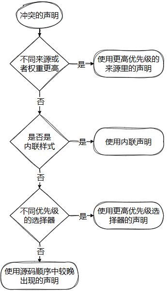
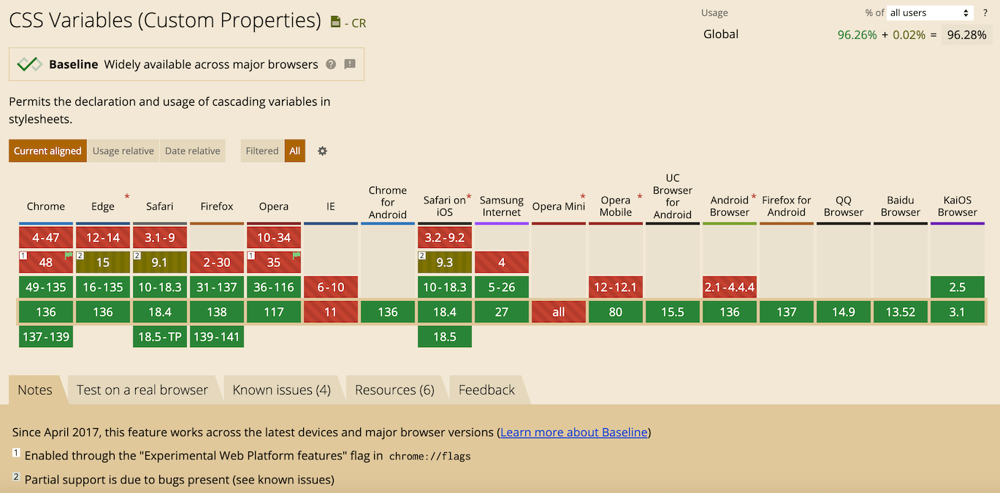

# CSS专题之自定义属性


## 前言

> 石匠敲击石头的第 12 次

CSS 自定义属性是现代 CSS 的一个强大特性，可以说是前端开发需知、必会的知识点，本篇文章就来好好梳理一下，如果哪里写的有问题欢迎指出。


## 什么是 CSS 自定义属性

CSS 自定义属性英文全称是 **CSS Custom Properties**，简称自定义属性，也被称为 **CSS 变量**，是允许开发者样式表中定义和重复使用值的一种机制，类似于其它编程语言（如 JavaScript 等）中的变量。


## 为什么需要 CSS 自定义属性

CSS 语言是一种声明式语言，不像其它语言有变量、条件和逻辑等特性，导致在**维护、复用、动态控制**方面存在不少局限。

正因如此，社区中诞生了各种 CSS 预处理器，如 Sass（Scss）、Less、Stylus 等。它们通过引入变量、运算、条件语句等机制，弥补了原生 CSS 的不足，大大提高了样式开发的效率与可维护性。

其中，**变量**功能尤其重要，它让我们可以在多个地方复用相同的值，一旦需要修改，只需改一处，大幅降低了维护成本，但预处理器的变量是在**编译阶段**生效的，无法在浏览器中运行时动态更新，也不能与 DOM 或 JavaScript 交互。

为了解决这一问题，CSS 自定义属性应运而生。


## 基础语法


### 变量声明

CSS 变量的声明由 `--` 开头，便于浏览器区分**自定义属性**和**原生属性**。

```css
.box {
  --color: red;
  color: red;
}
```

上述代码中 `color` 是原生属性，`--color` 则是自定义属性。

自定义属性支持各种值。

```css
:root {
  --link: 'link';
  --color: #f00;
  --back-ground: red;
  --height: 68px;
  --padding: 10px 20px;
  --line-height: 1.5;
  --transition-duration: 0.5s;
  --margin-top: calc(2vh + 20px);
}
```

**⚠️ 注意：** 

- 变量名命名规则比较松散，可以是任何有效的字符，比如：`中文`、`大写字母`、`驼峰命名`、`中距线`、`emoji` 和`HTML` 实体等

  ```css
  :root {
    --COLOR: #f00;
    --color: #f00;
    --内边距: 10px;
    --backGround: red;
    --calc: 10px;
    --🤪: '哈哈哈';
    --©: '版权';
  }
  ```

- **变量名大小写敏感**，`--color` 和 `--COLOR` 是两个不同的变量

- **变量是和选择器是强绑定的，只能在声明块或者元素的内联样式中声明变量**

  ```css
  --color: red; /* 无效声明 */
  
  :root {
    --color: red; /* 有效声明 */
  }
  ```

  ```html
  <!-- 在元素的内联样式中声明变量 -->
  <div style="--color: red;">文字</div>
  ```

  **⚠️ 注意：** 在元素的内联样式中声明自定义属性可以通过 JavaScript 动态控制。


### 变量使用

通过使用 `var()` 函数来使用变量。

```css
.box {
  color: var(--color);
}
```

`var()` 函数**可以接受两个值**，第一个值是 CSS 自定义属性，第二个值是一个**回退值**，回退值在第一个值（CSS 自定义属性）无效时保证 `var()` 函数有值。

```css
.box {
  color: var(--color, #fff);
}
```

上述代码中如果 `--color` 不存在，则使用回退值 `#fff`。

**⚠️ 注意：** 

- **`var()` 函数第二个参数不处理内部的逗号或空格**，都视为参数的一部分

  ```css
  .box {
    padding: var(--pad, 10px 15px 20px);
  }
  ```

- 变量值只能用作属性值，**不能用作属性名**

  ```css
  .box {
    var(--margin): 20px; /* 无效 */
  }
  ```

- 如果变量值是字符串，可以与其它字符串拼接

  ```css
  .box {
    --string: 'hello';
    --string2: var(--string)' world';
  }
  ```

- 如果变量值是数值，不能与数值单位拼接使用

  ```css
  .box {
    --height: 20;
    height: var(--height)px; /* 无效 */
  }
  ```

  **必须使用 `calc()` 函数**将它们连接起来。

  ```css
  .box {
    --height: 20;
    height: calc(var(--height) * 1px); /* 有效 */
  }
  ```

- 如果变量值带单位，则不能写成字符串

  ```js
  /* 无效 */
  .box {
    --height: '20px';
    height: var(--height); 
  }
  
  /* 有效 */
  .box {
    --height: 20px;
    height: var(--height); 
  }
  ```

- 如果变量值对于 CSS 属性来说是一个无效值时，会做降级处理

  ```css
  .box {
    --height: 20px;
    color: var(--height);
  }
  ```

  上述代码中，`color` 属性不支持 `20px`，会被降级为 `initial`（在 Chrome 浏览器中是一个 `#000` 的颜色值），如果 `var()` 函数中有第二个参数，并且第二个参数值是有效值，则降级为第二个参数值。

  ```css
  .box {
    --height: 20px;
    color: var(--height, red); /* 等同于 color: red; */ 
  }
  ```

- CSS 变量不能循环使用

  ```css
  :root {
    --color: red;
    --color: var(--red); /* 无效 */
  }
  
  .box {
    /* 降级为 initial，在 Chrome 浏览器中等同于 color: #000; */
    color: var(--color); 
  }
  ```

  上述代码中，在同一个选择器块内重复声明了 `--color`，后者把前者覆盖，所以引用的是自身。


### 变量作用域

同一个 CSS 变量，可以在多个不同的选择器中声明，读取的时候依照层叠优先级规则判断的流程，关于这块知识点具体的内容，可以看我之前写的这篇文章。



举个例子

```html
<style>
  :root {
    --color: blue;
  }
  
  div { 
    --color: green; 
  }
  
  #alert { 
    --color: red;
  }
  
  * { 
    color: var(--color); 
  }
</style>

<p>蓝色</p>
<div>绿色</div>
<div id="alert">红色</div>
```

在这个示例中，`--color` 变量被分别定义在 `:root`、`div`、`#alert` 这三个不同的选择器中。由于 CSS 遵循**“就近优先”** 的规则，每个元素会使用作用于自己**最近的变量定义**，因此三段文字最终呈现出不同的颜色。

由此可见，**CSS 变量的作用域就是它所定义的选择器的作用范围**。具体来说：

- `:root` 选择器中的 `--color` 定义在 `<html>` 元素上，会被其所有后代元素继承（除非被更具体的选择器覆盖），**适合定义全局变量**
- `p` 选择器中的 `--color` 只影响 `<p>` 元素及其后代
- `.class` 选择器中的 `--color` 仅作用于类名为 `.class` 的元素及其后代
- `#id` 选择器中的 `--color` 只作用于指定 `id` 的元素及其后代

之所以变量能传递到后代，是因为 **CSS 自定义属性是支持继承的**，这点类似 `color`、`font-family` 等属性。如果你对继承机制感兴趣，可以参考我写过的另一篇文章。


### 在 @ 规则中的使用

CSS 自定义属性支持 `@media`、`@keyframes` 等规则中使用。

```css
.box {
  --color: red;
  --background: green;
  --from-color: red;
  --to-color: lime;
  animation: animation 1s infinite;
}

/* 在 @media 中使用 */
@media screen and (min-width: 768px) {
  .box {
    --color: black;
    --background: #fff;
  }
}

/* 在 @keyframes 中使用 */
@keyframes animation {
  from {
    background-color: var(--from-color);
  }
  
  to {
    background-color: var(--to-color);
  }
}
```

**⚠️ 注意：** CSS 自定义属性（变量）**不能用于媒体查询或选择器中**，包括像 `:nth-child()` 这样的结构性伪类选择器。

```css
:root {
  --num: 2;
  --breakpoint: 30em;
}

div:nth-child(var(--num)) { /* 无效：变量不能用于选择器中 */
  color: var(--color)
}

@media screen and (min-width: var(--breakpoint)) { /* 无效：变量不能用于媒体查询 */
  :root {
    --color: green;
  }
}
```


## 兼容性处理

CSS 自定义属性在现代浏览器中已经有了较好的支持，具体可以参考[CSS Variables (Custom Properties)](https://caniuse.com/css-variables)。



对于不支持的浏览器，可以使用下面的写法。

```css
:root {
  --primary-color: #f00;
}

.box {
  color: #f00; /* 回退值 */
  color: var(--primary-color); /* 优先使用变量 */
}
```

也可以使用 `@support` 进行特性检测。

```css
:root {
  --primary-color: #f00;
}

/* 支持 CSS 变量 */
@supports (--primary-color: #f00) {
  .box {
    color: var(--primary-color);
  }
}

/* 不支持，执行降级处理 */
@supports not (--primary-color: #f00) {
  .box {
    color: #f00;
  }
}
```

也可以通过 JavaScript 来检测浏览器是否支持 CSS 变量。

```js
const isSupported =
  window.CSS &&
  window.CSS.supports &&
  window.CSS.supports('--primary-color', #f00);

if (isSupported) {
  // 支持 CSS 变量，执行相关逻辑
} else {
  // 不支持，执行降级处理 
}
```

**⚠️ 注意：** 如果你的项目使用构建工具，推荐使用 [postcss-custom-properties](https://github.com/csstools/postcss-plugins/tree/main/plugins/postcss-custom-properties) 插件，自动将 CSS 变量编译为静态值，生成兼容所有浏览器的 CSS。


## 使用 JavaScript 操作变量

CSS 自定义属性和其它 CSS 属性一样，可以通过 CSSOM 中的一些 API 来操作：

- **从内联样式中读取变量**

  ```js
  document.body.style.getPropertyValue('--color').trim();
  ```

- **将变量设置在内联样式中**

  ```js
  document.body.style.setProperty('--color', '#f00');
  ```

- **从计算样式中获取变量（包含继承和外部样式）**

  ```js
  window.getComputedStyle(document.body).getPropertyValue('--color').trim();
  ```


## CSS 变量和 CSS 预处理器变量的对比

从表面上看，CSS 自定义属性和 CSS 预处理器中的变量有点类似，但事实上它们之间有很大的差别，以下是两者的对比。

| 特性                           | CSS 变量 (`--color`)                     | CSS 预处理器变量（如 `$color`）             |
| ------------------------------ | ---------------------------------------- | ------------------------------------------- |
| **语法标准**                   | 原生 CSS 标准，受 W3C 支持               | 编译时语法，不属于 CSS 标准                 |
| **运行时机**                   | **运行时**，浏览器解析样式时生效         | **编译时**，在构建阶段由工具转换成静态值    |
| **作用域**                     | 作用于**DOM 结构**，遵循层叠和继承规则   | 作用于**代码结构**（嵌套/模块），无层叠概念 |
| **是否可以被 JS 操作**         | ✅ 可以动态读取和修改                     | ❌ 不行，编译后变量信息已不存在              |
| **是否可以继承**               | ✅ 可以被继承（像 `color` 一样）          | ❌ 不具备继承机制                            |
| **是否可用于媒体查询等结构中** | ❌ 不行，不能用于选择器、媒体查询等       | ✅ 可以在任何位置使用，包括条件、循环等      |
| **动态响应能力**               | ✅ 可以根据状态变化（如主题切换）实时生效 | ❌ 编译时决定，无法响应 DOM 或用户交互       |
| **使用场景**                   | 主题切换、暗黑模式、组件 API、动态样式等 | 提高样式可维护性、模块化组织、函数/循环等   |


## 实践建议

1. **使用命名规范区分变量作用域**

   - 全局作用域变量：使用**大写字母**命名
   - 局部作用域变量：使用**小写字母**命名

   ```css
   :root {
     --PRIMARY-COLOR: #f00; /* 全局变量 */
   }
   
   .box {
     --color: #fff; /* 局部变量 */
     --button-primary: var(--PRIMARY-COLOR);
   }
   ```

   这样做有助于在开发时区分变量的来源。

   

2. **避免直接重写全局变量，优先使用中间变量扩展**

   ```css
   :root {
     --PRIMARY-COLOR: #f00;
   }
   
   .box {
      --PRIMARY-COLOR: green;
     background-color: var(--PRIMARY-COLOR);
   }
   ```

   上述代码，语法上是对的，但是会有以下几个问题：

   - **破坏变量体系的一致性：** 你在 `.box` 中重写了 `--PRIMARY-COLOR`，导致它的含义发生改变，这种“同名变量局部重写”非常容易引起维护混乱
   - **主题切换时不可控**：如果你有个切换主题的机制想要统一更新 `--PRIMARY-COLOR`，这个 `.box` 里的值就会 “失控”，不会随主题变化
   - **变量来源不清晰**：团队协作时别人看到 `--PRIMARY-COLOR` 可能以为是全局值，其实是局部覆盖，容易出问题

   建议是**通过中间变量（注入点）扩展全局变量**。

   ```css
   :root {
     --PRIMARY-COLOR: var(--user-color, #f00);
   }
   
   .box {
     --user-color: green;
     background-color: var(--PRIMARY-COLOR);
   }
   ```

   这样做有以下几个好处：

   - **统一变量入口：** 所有使用 `--PRIMARY-COLOR` 的地方都遵循同一套逻辑
   -  **主题切换友好：** 只要全局改了 `--user-color`，所有地方都会同步响应
   - **变量继承清晰：** 任何定制化都是通过“注入”变量完成的，结构清晰、可控

   

3. **将变量声明和 CSS 属性声明分开**

   例如下面这段代码

   ```html
   <button type="button" class="btn btn-primary">Primary</button>
   <button type="button" class="btn btn-danger">Danger</button>
   ```

   `btn` 是按钮基本类名，`btn-primary` 和 `btn-danger` 是扩展类名

   

   我们对比两个扩展类名，可以发现不同的风格的按钮具有相同的 CSS 属性，只是值不同。

   这时最好的方式就是使用 CSS 变量将值抽离出来。

   ```css
   .btn {
     /* 其它基础样式... */
     color: var(--color);
     background-color: var(--background-color);
     border: 1px solid var(--border-color);
   }
   ```

   将扩展类名调整为 CSS 变量，这样在改变按钮风格的时候就简便很多。

   


##  总结

- CSS 变量是一种允许在样式表中定义和复用值的机制，类似于编程语言中的变量
- 相较于预处理器变量，CSS 变量支持运行时更新，可与 DOM 和 JavaScript 动态交互，更适合构建灵活的 UI
- 变量遵循作用域和继承规则，可实现主题切换、组件自定义等需求
- 建议使用统一命名规范，避免直接覆盖全局变量，优先通过中间变量扩展
- 将变量声明与样式声明分离，有助于提升样式复用性和可维护性


## 参考文章

- [浅谈原生CSS变量（自定义属性）在CSS中使用变量并不是一个稀罕事，早在2007年Sass的诞生，就可以通过预处理的方式 - 掘金](https://juejin.cn/post/6993182909108584484?searchId=202505110641156E9708EDCC14B58A8D0F#heading-1)
- [CSS 变量教程 - 阮一峰的网络日志](https://www.ruanyifeng.com/blog/2017/05/css-variables.html)
- [【实战技巧】CSS自定义属性以及在VUE3中的使用官方称之为自定义属性 ,但我比较习惯叫它变量 ,简单点说就是一种开发者 - 掘金](https://juejin.cn/post/6979418897061511198?searchId=202505110641156E9708EDCC14B58A8D0F#heading-1)
- [图解CSS：CSS自定义属性 - 前端开发者学堂 (fedev.cn) - 前端开发社区](https://fedev.cn/css/css-custom-property.html)