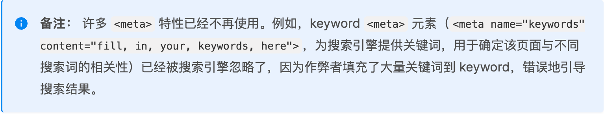
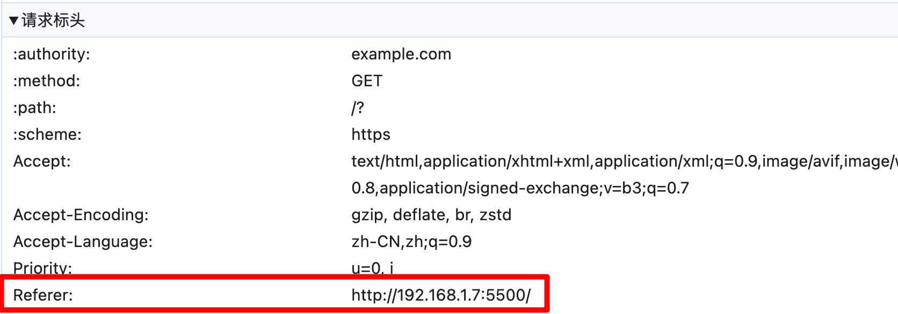

# HTML专题之meta标签


## 前言
>  石匠敲击石头的第 2 次

之前在公司做文档管理的项目时，发现文档中外部粘贴的图片无法正常显示，最后是通过在 `<head>` 标签内部添加这行代码才解决的。

```html
<meta name="referrer" content="no-referrer" />
```

我发现自己对 `<meta>` 标签所知甚少，所以才有了这篇文章来整理相关的知识点，如果哪里写的有问题欢迎指出。


## meta 标签是什么

`<meta>` 标签用于表示 HTML 相关的元数据信息。页面上不会显示这些信息。

何为元数据？MDN 上给出的解释：**元数据就是用来描述数据的数据**，HTML 文件也是一种数据，所以 `<meta>` 标签可以说是用来描述 HTML 文件的数据。

`<meta>` 标签可以描述 HTML 文档的作者、日期时间、网页描述、关键词、页面刷新等。


## meta 标签的结构

`<meta>` 标签有以下四种属性：

- `chartset`
- `content`
- `http-equiv`
- `name`

**其中 `content` 属性无法单独使用**，`content` 属性中的内容用于对应 `name`、`http-equiv` 属性的具体描述，只是单独使用 `content` 属性没有实际作用，例如：

```html
<meta content="Hello World" />
```


## 为什么要有 meta 标签

`<meta>` 标签大致有如下四个重要的作用：

- 搜索引擎优化(SEO)
- 页面性能优化
- 用户体验优化
- 提高安全性

下面从这四个作用来具体讲讲


### 搜索引擎优化(SEO)

#### keywords

作用：告诉搜索引擎网页的关键字，帮助搜索引擎理解网页的主题内容。

具体格式如下：

```html
<meta name="keywords" content="关键词1,关键词2,关键词3" />
```

淘宝的 `keywords` 如下：

```html
<meta name="keywords" content="淘宝,掏宝,网上购物,C2C,在线交易,交易市场,网上交易,交易市场,网上买,网上卖,购物网站,团购,网上贸易,安全购物,电子商务,放心买,供应,买卖信息,网店,一口价,拍卖,网上开店,网络购物,打折,免费开店,网购,频道,店铺" />
```

**⚠️ 注意：** 在搜索资料的时候发现 MDN 里有这样一段描述，[描述地址](https://developer.mozilla.org/zh-CN/docs/Learn_web_development/Core/Structuring_content/Webpage_metadata)



这里的搜索引擎虽然没有明说是哪个，不过我猜测大概率指的是 Google 搜索引擎。**平常开发的时候还是加上 `keywords` 比较好，毕竟有总比没有好。**


#### description

作用：告诉搜索引擎网页的主要内容。

```html
<meta name="description" content="内容描述" />
```

淘宝的 `description` 如下：

```html
<meta name="description" content="淘宝网 - 亚洲较大的网上交易平台，提供各类服饰、美容、家居、数码、话费/点卡充值… 数亿优质商品，同时提供担保交易(先收货后付款)等安全交易保障服务，并由商家提供退货承诺、破损补寄等消费者保障服务，让你安心享受网上购物乐趣！" />
```


#### robots

作用：告诉搜索引擎爬虫网页如何抓取和索引网页。

具体格式如下：

```html
<meta name="robots" content="指令1,指令2" />
```

例如：

```html
<meta name="robots" content="noindex,nofollow" />
```

上述代码参数的含义：

- `noindex`：告诉搜索引擎爬虫不要在搜索结果中显示该网页
- `nofollow`：告诉搜索引擎爬虫不要追踪该网页上的链接

默认情况下 `content` 参数的值为 `all`，表示对搜索引擎爬虫没有任何限制，还有更多的其它的参数可以参考[有效的索引编制规则和内容显示规则](https://developers.google.com/search/docs/crawling-indexing/robots-meta-tag#directives)

**⚠️ 注意：** 如果规则比较复杂的话，直接在站点根目录使用 robots.txt 文件来描述规则会更好。


### 页面性能优化

#### renderer

作用：指定双核浏览器默认以哪种方式渲染页面。

```html
<!-- 默认使用Webkit内核渲染 -->
<meta name="renderer" content="webkit" />

<!-- 默认使用IE兼容模式渲染 -->
<meta name="renderer" content="ie-comp" />

<!-- 默认使用IE标准模式渲染 -->
<meta name="renderer" content="ie-stand" />
```


#### X-UA-Compatible

作用：指定 IE 的渲染模式，用于处理 IE 不同版本之间的兼容性问题，**只对 IE 有效。**

```html
<meta http-equiv="X-UA-Compatible" content="IE=edge,chrome=1" />
```

上述代码的作用：如果当前 IE 浏览器安装了 `Google Chrome Frame` 插件(可以让 IE 浏览器使用 Chrome 引擎和相关功能)，则优先使用 WebKit 内核，反之使用浏览器支持的最新渲染模式。

| 参数值     | 含义                                                         |
| ---------- | ------------------------------------------------------------ |
| `IE=edge`  | 使用浏览器支持的最新渲染模式（建议使用）                     |
| `IE=10`    | 强制使用 IE10 的渲染模式                                     |
| `IE=9`     | 强制使用 IE9 的渲染模式                                      |
| `IE=8`     | 强制使用 IE8 的渲染模式                                      |
| `IE=7`     | 强制使用 IE7 的渲染模式（兼容模式，常用于老旧系统或网页）    |
| `IE=5`     | 强制使用 IE5 的渲染模式（非常老旧，不推荐使用）              |
| `chrome=1` | 启用双核浏览器中的 WebKit 内核（仅适用于某些双核浏览器，如 360 浏览器、搜狗浏览器等） |

**⚠️ 注意：** 如果在 HTTP 响应头中也设置了这个属性，并且值与 `<meta>` 标签中设置的冲突，**优先使用 HTTP 响应头中配置的属性。**


### 用户体验优化

#### viewport

作用：针对移动设备上网页的显示优化

```html
<meta name="viewport" content="width=device-width, initial-scale=1.0" />
```

`content` 属性内有以下参数：

- `width`：表示视口宽度，可以是具体数值或 `device-width`（表示设备的宽度）
- `height`：表示视口的高度，可以是具体是的数值或 `device-height`（表示设备的高度）
- `initial-scale`：表示初始化缩放比例，取值为浮点数，`1.0` 表示 100% 缩放(默认缩放)，`0.5` 表示 50% 缩放(页面缩小一半)
- `minimum-scale`：表示用户可以缩放的最小比例，取值为浮点数
- `maximum-scale`：表示用户可以缩放的最大比例，取值为浮点数
- `user-scalable`：表示是否允许用户手动缩放页面，取值为 `no` 或 `yes`，默认是 `yes` 


#### 禁止百度自动转码

```html
<!-- 禁止百度将网页转换为百度轻应用 -->
<meta http-equiv="Cache-Control" content="no-siteapp" />

<!-- 禁止转百度对网页内容进行格式化处理适配移动端 -->
<meta http-equiv="Cache-Control" content="no-transform" /> 
```

为什么百度会有转码问题可以参考[百度移动搜索优化与百度网页转码](https://zzz.buzz/zh/2017/04/10/baidu-mobile-seo-and-baidu-siteapp/)


#### UC 浏览器

```html
<!-- 将屏幕锁定在特定的方向 -->
<meta name="screen-orientation" content="landscape/portrait" />

<!-- 全屏显示页面 -->
<meta name="full-screen" content="yes" />

<!-- 强制图片显示，即使是 text mode -->
<meta name="imagemode" content="force" />

<!-- 应用模式，默认将全屏，禁止长按菜单，禁止手势，标准排版，强制图片显示。 -->
<meta name="browsermode" content="application" />

<!-- 禁止夜间模式显示 -->
<meta name="nightmode" content="disable" />

<!-- 使用适屏模式显示 -->
<meta name="layoutmode" content="fitscreen" />

<!-- 当页面有太多文字时禁止缩放 -->
<meta name="wap-font-scale" content="no" />
```


#### QQ 浏览器

```html
<!-- 锁定屏幕在特定方向 -->
<meta name="x5-orientation" content="landscape/portrait" />

<!-- 全屏显示 -->
<meta name="x5-fullscreen" content="true" />

<!-- 页面将以应用模式显示 -->
<meta name="x5-page-mode" content="app" />
```


#### 360 浏览器

```html
<!-- 选择使用的浏览器解析内核 -->
<meta name="renderer" content="webkit|ie-comp|ie-stand" />
```


### 提高安全性

#### Content Security Policy

作用：配置网页的安全策略(CSP)，有助于防止 XSS 攻击

```html
<meta http-equiv="Content-Security-Policy" content="script-src 'self'; object-src 'none'; style-src cdn.example.org third-party.org; child-src https:" />
```

上述代码的参数解释如下：

- `script-src 'self';`：表示限制脚本的来源，`'self'` 表示只允许加载同源的脚本文件
- `object-src 'none';`：表示禁止加载任何 `<object>`、`<embed>` 元素，`'none'` 表示完全禁止这些类型的资源
- `style-src cdn.example.org third-party.orgl;`：表示限制样式的来源，`cdn.example.org third-party.org` 表示只允许从 `cdn.example.org` 和 `third-party.org` 加载样式资源
- `child-src https:`：表示只限制嵌套浏览上下文(如 `<iframe>` )的来源，`https:` 表示只允许加载 HTTPS 协议的子资源(如 `<iframe>` 内容)

关于 CSP 相关的内容可以看阮一峰前辈的 [Content Security Policy 入门教程](https://www.ruanyifeng.com/blog/2016/09/csp.html)


#### referrer

作用：控制 HTTP 请求头中 `Referer` 参数的行为

```html
<meta name="referrer" content="no-referrer" />
```

默认情况在我们发送网络请求的时候，请求头中会携带 `Referer` 参数，它的值为当前网站的域名，用来标识来源。



服务器可能用以下三种策略通过 `Referer` 参数的值进行处理：

- **防盗链策略**：有些服务器会检查 `Referer` 头，以确保所有外部资源（如图像、视频、字体等）的请求都来自同一站点或一组授权站点。如果 `Referer` 头缺失或不符合预设的规则，服务器可能会拒绝请求。
- **安全策略**：服务器可能配置了安全策略，仅允许来自特定来源的请求。如果请求的 `Referer` 头显示请求来自一个不在白名单上的源，服务器将拒绝请求。
- **隐私政策**：有些服务器可能有隐私政策，不允许从未经允许的源引用其资源，以保护用户隐私。

当使用 `<meta name="referrer" content="no-referrer" />` 时，**浏览器不会在请求头中发送 `Referer` 信息**，服务器也就无法通过 `Referer` 参数进行判断和处理。这也解释了为什么文章开头的问题。

**⚠️ 注意：** 如果后台配置 `Referer` 只允许特定地址，其余的、空白的 `Referer` 参数一律拒绝，那么即使使用了 `no-referrer` 也还是无法请求成功。

完整的 `content` 值如下：

| 值                                | **描述**                                                     |
| --------------------------------- | ------------------------------------------------------------ |
| `no-referrer`                     | 不发送任何 `Referer` 头部信息                                |
| `no-referrer-when-downgrade`      | 只在从 HTTPS 降级到 HTTP 请求时，不发送 `Referer`；否则发送完整的 URL（默认行为） |
| `origin`                          | 只发送起源信息（协议、主机名和端口号），不包括路径和查询参数 |
| `origin-when-cross-origin`        | 对跨域请求发送起源信息，对同源请求发送完整 URL               |
| `same-origin`                     | 仅对同源请求发送完整 URL，跨域请求不发送 `Referer`           |
| `strict-origin-when-cross-origin` | 对同源请求发送完整 URL，对跨域请求发送起源信息，HTTPS 降级到 HTTP 时不发送 `Referer` |
| `unsafe-url`                      | 始终发送完整的 URL，包括路径和查询参数，即使请求是跨域的     |


#### x-dns-prefetch-control

作用：控制浏览器 DNS 预解析功能

有以下两种值：

- `on`：启用 DNS 预解析，默认行为，适用于需要加速资源加载的场景。

  ```html
  <meta http-equiv="x-dns-prefetch-control" content="on" />
  ```

- `off`：禁用 DNS 预解析，适用于隐私保护或避免多余的 DNS 请求的场景。

  ```html
  <meta http-equiv="x-dns-prefetch-control" content="off" />
  ```

**⚠️ 注意：** 一般情况下，在 HTML 页面中，`<a>` 标签的 DNS 预解析在默认情况下是自动启用的。但是在 HTTPS 协议中为了安全和隐私原因会禁用 DNS 预解析，此时可以手动使用 `<meta http-equiv="x-dns-prefetch-control" content="on" />` 来开启 DNS 预解析。


### 其它

#### charset

作用：指定网页的字符编码方式

```html
<meta charset="UTF-8" />
```

该属性是 HTML5 新增的，等价于过去的写法

```html
<meta http-equiv="content-type" content="text/html; charset=UTF-8" />
```

一般来说从服务器发送 HTML 网页时，会通过 HTTP 响应头信息声明网页的编码方式，如下：

```
Content-Type: text/html; charset=UTF-8
```

- `text/html` 是文件类型，表示 HTML 网页
- `charset=UTF-8` 是指定网页的字符编码方式为 `UTF-8`

网页内部通过 `<meta>` 标签再次声明网页文字的编码方式。

```html
<meta charset="UTF-8" />
```

**⚠️ 注意：**

- 如果 HTTP 响应头信息里的编码方式和网页内部的编码方式不一致，则**优先使用 HTTP 响应头信息里的编码方式**
- 如果 HTTP 响应头信息里没有编码方式则使用网页内部的编码方式
- 建议 HTTP 响应头信息里的编码方式和网页内部的编码方式始终保持一致


#### author

作用：声明网页作者信息，对搜索引擎优化(SEO)没有直接影响。

具体格式如下：

```html
<meta name="author" content="作者名" />
```

例如：

```html
<meta name="author" content="zhangsan" />
```

也可以把联系方式写在里面

```html
<meta name="author" content="zhangsan,zhangsan@example.com" />
```


#### generator

作用：表示当前 HTML 是使用什么工具写的，对搜索引擎优化(SEO)没有直接影响。

```html
<meta name="generator" content="vscode" />
```


## 总结

- `<meta>` 标签用于表示 HTML 相关的元数据信息，元数据信息不会在页面中显示
- `<meta>` 标签可以用于搜索引擎优化(SEO)、页面性能优化、用户体验优化和提高安全性


## 参考文章

- [作为前端，你必须要知道的meta标签知识](https://juejin.cn/post/7089271039842058253)
- [合适的meta，你选对了吗?](https://juejin.cn/post/6844903732421853191)
- [meta标签到底是做什么的|我竟一无所知](https://juejin.cn/post/6987919006468407309)
- [HTML meta标签总结与属性使用介绍](https://juejin.cn/post/6844903971308617736)
- [那些你不知道的meta标签](https://juejin.cn/post/6844903750239272973)
- [meta标签的作用及整理](https://juejin.cn/post/6844904083296370702)
- [浅谈之 - HTML 的 meta 标签有多少种](https://kebingzao.com/2020/09/04/meta/)
- [\<meta\>：元数据元素](https://developer.mozilla.org/zh-CN/docs/Web/HTML/Element/meta)
- [巧用 meta 标签，设置 referrer 解决 403 Forbidden 问题](https://juejin.cn/post/7388072384349650959)
